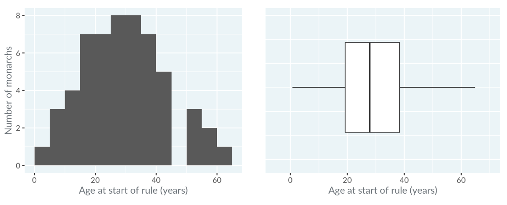

```{r setup, include=FALSE}
library(knitr)
library(tidyverse)
library(formatR)
library(kableExtra)
library(corrplot)
library(GGally)

knitr::opts_chunk$set(
  fig.width=2,   # Set width (in inches)
  fig.height=2,  # Set height (in inches)
  out.width="50%",  # Scale output width
  comment=NA,
  error=TRUE, 
  warning=TRUE,
  tidy=TRUE, 
  fig.align = 'center',
  message=FALSE, 
  warning=FALSE,
  tidy.opts=list(width.cutoff=60),
  fig.path='Figs/')
```

# Visualizing distributions

## A plot tells a thousand words

What you'll learn today?

  - How do you choose an appropriate plot? 

  - How do you interpret common plot types? 
  
  - What are best practices for drawing plots?
  

## Three ways of getting insights

There are three main ways of getting insight from a dataset.

**Calculating summary statistics**

mean, median, standard deviation. 


## Three ways of getting insights

**Running statistical models** 

linear regression and logistic regression


## Three ways of getting insights

**Drawing plots**

scatter, bar, histogram


## The Datasaurus Dozen


  - The **Datasaurus dozen** is a collection of 13 datasets, with names like **away** and **bullseye**. 
  

## The Datasaurus Dozen


## The Datasaurus Dozen

  - Each dataset has two variables: the **x** and the **y** coordinates. 
  
  - "Variable" is just statistics jargon for a column of data.


## Mean of x for each dataset

If you calculate the mean of the **x** values in each dataset, you can see that it's more or less the same value.


## Mean of x and y for each dataset

  - It's the same situation for the means of the **y** coordinates. 


## Standard deviations for each dataset

  - Similarly, we can look at the variation of the **x** and **y** values by calculating the standard deviation for each dataset. 
  
  - Variation describes how spread out values are. 
  
  - Each dataset has the same standard deviation for **x** and **y**.


## Standard deviations for each dataset


## Plotting dino


Here is a scatter plot of each dataset, and even a quick glance shows what the calculations failed to. 


## Plotting dino


  - That is, every dataset is completely different. 
  
  - Until you physically look at the datasets, it's hard to tell that you have lines and circles and a star and a dinosaur. 
  
  - The datasets are artificial, but I hope this example has convinced you of the importance of plotting your datasets.

## Continuous and categorical variables

  - Before diving deeper into plotting, it's important to acknowledge that there are different types of data. 
  
  - Choosing a type of plot depends on whether your variables are **continuous** or **categorical**. 
  

## Continuous and categorical variables

  - **Continuous: usually numbers**
  
heights, temperatures, revenues

You can do arithmetic on continuous variables, like adding two temperatures together.

## Continuous and categorical variables

  - **Categorical: usually text**
  
eye color, country, industry

## Continuous and categorical variables

Some things can either be **continuous** or **categorical**. 

  - **Age** is a number, so by default it's a **continuous** variable. 
  
  - **age groups** like 25 to 30  are **categories**. 
 

## Let's practice!

It's time for your first set of exercises!


## Exercise 1 : Bitcoin price by date

  - To get an insight from a dataset, you can calculate summary statistics or run statistical models, but often it's easier to draw a plot.

  - In this exercise, you can see the price of the Bitcoin cryptocurrency from the start of 2016 to the start of 2020. 
  
  - Look at the Bitcoin prices on January the first each year. Which year began with the highest Bitcoin price?
  
  
## Exercise 1 : Bitcoin price by date

  
  
You can filter and sort the data in the table, but it will be easier to solve if you see results in a plot.


## Exercise 1 : Bitcoin price by date


## Exercise 2 : Continuous vs. categorical variables

Was the exam passed or failed?

## Exercise 2 : Continuous vs. categorical variables

Categorical


## Exercise 2 : Continuous vs. categorical variables

Population of towns in Albania

## Exercise 2 : Continuous vs. categorical variables

Continuous


## Exercise 2 : Continuous vs. categorical variables


Job title of employees


## Exercise 2 : Continuous vs. categorical variables

Categorical


## Exercise 2 : Continuous vs. categorical variables

Salary of employees

## Exercise 2 : Continuous vs. categorical variables


Continuous


## Exercise 2 : Continuous vs. categorical variables

Provinces of towns in Albania


## Exercise 2 : Continuous vs. categorical variables


Categorical


## Exercise 2 : Continuous vs. categorical variables


Mass of products


## Exercise 2 : Continuous vs. categorical variables

Continuous


## Histograms

Let's explore histograms.

## When should you use a histogram?

  - Histograms are a type of plot that takes one continuous variable as its input. 
  
  - It allows you to answer questions about the shape of that variable's distribution. 
  
  - For example, you might want to know the lowest and highest values, and which values are most common.

## Kings and Queens of England & Britain

Here's a dataset on the kings and queens of England, and more recently Britain. 


## Kings and Queens of England & Britain

  - It stretches from the current monarch back in time to the first king of England, Aethelstan. 
  
  - Let's take a look at the distribution of the ages when they ascended to the throne.

## Histogram of age at start of rule


## Histogram of age at start of rule

  - The x-axis is the variable that we are interested in - the **ages**. 
  
  - These ages are grouped into "bins", that is, intervals. 
  
  
## Histogram of age at start of rule

  - In this case, the bins are zero to five years, five to ten years, and so on up to sixty to sixty five years. 
  
  - The y-axis is the count of monarchs who began ruling when they were in each age bin. 
  
  - For example, four monarchs began ruling when they were between ten and fifteen years old. 
  
  - Straight away, you can see that there have been no monarchs who started ruling when they were between the ages of forty five and fifty.


## Choosing binwidth: 1 year

The appearance of a histogram is strongly influenced by the choice of binwidth. 


## Choosing binwidth: 1 year

  - This is the same histogram as before, but with the binwidth changed from five years to one year. 
  
  - It's difficult to get much insight into the distribution, because the counts are very noisy. 
  
  - Choosing a binwidth that is too wide also causes problems.

## Choosing binwidth: 25 years


## Choosing binwidth: 25 years

  - By changing the binwidth to twenty five years, you don't see any detail in the distribution, and again it is hard to get much insight. 
  
  - In general, it is difficult to know the best binwidth before you draw the plot, so you'll need to experiment with several values.

## Modality: how many peaks?

  - When interpreting histograms, the first thing to look at is the **modality** of the distribution. 
  
  - That is, how many peaks there are. 
  

## Modality: how many peaks?


## Modality: how many peaks?

  - A distribution with one peak is called **unimodal**
  
  - A distribution with two peaks is called **bimodal**, and so on.

## Modality: how many peaks?

Here, the distribution of ages is unimodal because there is one peak from twenty five to thirty five years.


## Skewness: is it symmetric?

  - The second thing to look at is the skewness of the distribution. 
  
  - That's statistical jargon for whether or not it is symmetric. 
  
  
## Skewness: is it symmetric?  
  
  

## Skewness: is it symmetric?  

  - A **left-skewed distribution** has outliers, that is, the extreme values, on the **left**
  
  - A **right-skewed distribution** has outliers on the **right**. 
  
## Skewness: is it symmetric?  

Here, the distribution is more or less symmetric.


  

## Kurtosis: how many extreme values?

  - One more advanced thing you can look at is the **kurtosis** of the distribution, which affects the number of outliers. 


  


## Kurtosis: how many extreme values?

  - A **mesokurtic** distribution is something that looks like the bell curve from a normal distribution. 
  
  - A **leptokurtic** distribution has a narrow peak and lots of extreme values. Leptokurtic distributions are important in finance, because weird stuff happens in stock markets more often than the normal distribution would predict. 
  
  - A **platykurtic** distribution has a broad peak and few extreme values.

## Kurtosis: how many extreme values?


Here, the distribution of ages is slightly platykurtic.


  

## Practice: Interpreting histograms

Here is a histogram of salaries for various jobs in Australia. Each row of the dataset is the average salary for that job, so the counts are counts of jobs.


  

## Practice: Interpreting histograms

TRUE or FALSE?

*The most popular salary bracket is 40k to 60k*


## Practice: Interpreting histograms

TRUE 


## Practice: Interpreting histograms

TRUE or FALSE?

*The histogram is unimodal*


## Practice: Interpreting histograms

TRUE 


## Practice: Interpreting histograms

TRUE or FALSE?

*The histogram is right-skewed*


## Practice: Interpreting histograms

TRUE


## Practice: Interpreting histograms

TRUE or FALSE?

*The most popular salary bracket is 560k to 580k*


## Practice: Interpreting histograms

FALSE


## Practice: Interpreting histograms

TRUE or FALSE?

*The histogram is bimodal*


## Practice: Interpreting histograms

FALSE


## Practice: Interpreting histograms

TRUE or FALSE?

*The histogram is left-skewed*


## Practice: Interpreting histograms

FALSE


## Box plots

Individual histograms are great, but there is a problem if you want to draw lots of them.

## You can't just color in histograms

  - Let's revisit the kings and queens dataset. 
  
  - Suppose we want to see the distribution of ages for each royal house. 
  
  
## You can't just color in histograms

  A naive solution might be to draw the same histogram, but using different colors for each house. Sadly, this is a horrible muddled mess.

  


## Draw each histogram in its own panel

  - In many cases, the only sensible way to draw lots of histograms is to draw them in their own panel. 
  
    
  
  
## Draw each histogram in its own panel  
  
  - This approach still has problems.

  - It's quite easy to compare distributions for panels that are in the same column. 
  
  
## Draw each histogram in its own panel 

  
You can see that monarchs from the Wessex family were typically much younger when they began ruling than those from the Windsor family, since you can look down the column and see that the Wessex distribution is to the left of Windsor's. 


  


## Draw each histogram in its own panel 

By contrast, it's harder to compare distributions between panels that are in different columns.


## Draw each histogram in its own panel 

To compare the ages of monarchs in the rival York and Lancaster houses, you have to do a lot of looking back and forth and staring at numbers on the x-axis, which isn't ideal.


 


## Draw each histogram in its own panel 

  - You could align all the panels in a single column, but that often means running out of space. 


## Draw each histogram in its own panel 

Here, the text on the plot is almost unreadable. Fortunately, box plots can solve our problems.


##  When should you use a box plot?


  - Box plots split a **continuous** variable - like **age** - by a **categorical** variable - like **royal house** 

  - This allows us to compare the resulting distributions in a space-efficient way.

##  Histogram vs. box plot

Here's a comparison of the histogram you saw before with a box plot.



## Histogram vs. box plot: mid-line

The line in the middle shows the median of the distribution. 


That is, half the monarchs started ruling before this age, and half after this age.

## Histograms vs. box plot: the box

The box in the box plot extends from the lower quartile to the upper quartile. 


## Histograms vs. box plot: the box

  - The lower quartile is the point where one quarter of the values are below it. 
  
  - That is, one quarter of the monarchs started ruling before this age, and three quarters after it. 
  
  
## Histograms vs. box plot: the box

  - Likewise, the upper quartile is the age where three quarters of the monarchs started ruling below this age. 
  
  - The difference between the upper quartile and the lower quartile is called the inter-quartile range.

## Histograms vs. box plots: the whiskers


## Histograms vs. box plots: the whiskers

  - The horizontal lines, known as "whiskers", have a more complicated definition. 
  
  - Each bar extends to one and a half times the interquartile range, but then they are limited to reaching actual data points. 
  
  - The technical definition is shown in the slide, but in practice, you can think of the whiskers as extending far enough that anything outside of them is an extreme value.

## Monarchs by house

As mentioned before, the power of box plots is that you can compare many distributions at once. 


## Monarchs by house

  - Here, the royal houses are ordered from oldest at the top to newest at the bottom. 


  - A trend is visible: since the Plantagenets in the fourteenth century, the boxes gradually move right showing that the ages when new monarchs ascend to       the throne have been increasing. 
  
## Monarchs by house

  - Godwin and Blois appear as a single line because there was only one king from each house. 


  - The Anjou house only had three kings, and forms a box with one whisker, not two. 
  
  
## Monarchs by house

  - Notice that the box plot for the house of Denmark shows a point. 


  - Points are extreme values, that is, values that are outside the range of the whiskers. Denmark's right-most outlier is Sweyn who ascended at age 53, which was exceptionally high for the 11th century.

## Practice: Interpreting box plots


  - Here are box plots of cigarette consumption per person in the USA from 1985 to 1995 (Alaska and Hawaii are not included). 


## Practice: Interpreting box plots


  - Each observation in the dataset is the average number of packets of cigarette smoked per person in one state in one year. 


## Practice: Interpreting box plots


  - Thus each box plot represents the distribution of 48 data points (because there are 48 US states included in the dataset).


## Practice: Interpreting box plots

TRUE or FALSE?

*The lower quartile number of packets of cigarettes smoked per capita decreased every year from 1985 to 1995.*


## Practice: Interpreting histograms

TRUE 


## Practice: Interpreting histograms

TRUE or FALSE?

*The upper quartile number of packets of cigarettes smoked per capita decreased every year from 1985 to 1995.*


## Practice: Interpreting histograms

FALSE 


## Practice: Interpreting histograms

TRUE or FALSE?

*The median number of packets of cigarettes smoked per capita was below 100 from 1991 onwards.*


## Practice: Interpreting histograms

TRUE


## Practice: Interpreting histograms

TRUE or FALSE?

*The inter-quartile range of the number of packets of cigarettes smoked per capita was smallest in 1992.*


## Practice: Interpreting histograms

FALSE


## Practice: Interpreting histograms

TRUE or FALSE?

*The inter-quartile range of the number of packets of cigarettes smoked per capita decreased every year from 1985 to 1995.*


## Practice: Interpreting histograms

FALSE


## Practice: Interpreting histograms

TRUE or FALSE?

*In 1990, three states were considered to have extreme values in the number of packets of cigarettes smoked per capita.*


## Practice: Interpreting histograms

TRUE


# Visualizing two variables

## Scatter plots

  - Far now we focused on visualizing one variable. 
  
  - Now, we'll move on to two variables, beginning with scatter plots.

## When should you use a scatter plot?

  - When you have two continuous variables, and you want to know about their relationship. 
  
  - For example, if one variable increases, does the other one increase too, or does it decrease?

## Los Angeles County home prices

  - Here's a dataset on home prices in four cities in Los Angeles County in 2012. 
  
  
  
## Los Angeles County home prices  
  
  
The dataset includes the number of bedrooms, the sale price in millions of dollars, and the area in square feet.

## Prices vs. area

Here's a scatter plot with the price on the y-axis and the area on the x-axis. 


 


## Prices vs. area

  - We'd say it's a scatter plot of "price versus area". 
  
  - It's OK, but all the points are clustered in the bottom left, making it hard to read. 
  
  
## Prices vs. area

  Let's use a logarithmic scale for each axis. 
  
   
  
## Prices vs. area  
  
  On the logarithmic plot, notice that moving right one grid line doubles the area, or moving up one grid line multiples the price by a factor of ten. Now the points are more evenly spread throughout the plot.


     
  


## Correlation

  - One important concept when interpreting scatter plots is the idea of correlation. 
  
  - Roughly speaking, correlation is a measure of how well you can draw a straight line through the points. 
  
  
 
## Correlation 
  
If that straight line goes upwards as you move to the right, it's called a positive correlation. 
  
   
  

## Correlation 

If the line goes down as you go to the right, it's called negative correlation. 
  
  
 


## Correlation 

Here are five theoretical datasets. 

 


## Correlation 

The red line in each panel shows what perfect negative correlation would look like.

 


## Correlation 

The green lines show perfect positive correlation.

 


## Correlation 

In the left-most panel, you can see an example of strong negative correlation.

 


## Correlation 

In the left-most panel, you can see an example of strong negative correlation.

 


## Correlation 

In the left-most panel, you can see an example of strong negative correlation. That means that as the x values increase, the y values decrease.

 


## Correlation 

In the right-most panel, you can see strong positive correlation, meaning that as x increases, so does y.

 


## Correlation 

The middle panels show intermediate states. In the third panel, showing no correlation, the values of y are completely unrelated to the values of x.

 


##  Sometimes correlation isn't helpful

Here's the Datasaurus Dozen again. 

 

##  Sometimes correlation isn't helpful

  - Recall that each dataset had the same correlation, despite looking very different. 

  - Correlation makes the most sense if there is a straight line relationship between the x and y values. 
  
  
##  Sometimes correlation isn't helpful

  - If you have a more complicated shape, you'll need to be more creative in how you describe the relationship. 
  
  - For example, "x and y have a slight negative correlation" is not as good a description as "the plot looks like a dinosaur".

## Adding trend lines

  - Adding a straight line to a scatter plot is a great way to see you if you really do have a linear relationship between the x and y variables. 
  
  
  
  
## Adding trend lines

  - Here, with the logarithmic scales, the trend line has a close fit to the points, suggesting that as the logarithm of the area increases, you get a linear increase in the logarithm of the price.

##  Adding smooth trend lines


  - Sometimes a straight line might be a terrible fit. 
  
  
##  Adding smooth trend lines  
  
Here, in the price versus area plot using a linear scale, the line completely misses the more expensive homes. 

 

##  Adding smooth trend lines  

  - When a straight trend line is a poor fit, one alternative is to use a curve. 
  
  
   
  
  Having a curve like this can help you find a way to describe the relationship. Here, by seeing the trend line curve upwards, you can say "as area increases, the price increases faster than linearly".

## Practice: Interpreting scatter plots

Scatter plots let you explore the relationship between two continuous variables.


## Practice: Interpreting scatter plots

   

Here you can see a scatter plot of average life expectancy (on the y-axis) versus average length of schooling (on the x-axis) for countries around the world. 

## Practice: Interpreting scatter plots

  - Each point in the plot represents one country. 

  - A straight trend line from a linear regression model is shown.


## Question 1: True or False?

There is a positive correlation between the life expectancy and the length of schooling.

 

## Answer to Question 1

**TRUE**


## Question 2: True or False?

As the average length of schooling increases, the average life expectancy typically increases too.

 

## Answer to Question 2

**TRUE**


## Question 3: True or False?

Every country with an average life expectancy of less than 60 years has an average length of schooling less than 7 years.

 

## Answer to Question 3

**TRUE**


## Question 4: True or False?

If one country has a longer average length of schooling than another country, that country will also have a greater average life expectancy.

 

## Answer to Question 4

**FALSE**


## Question 5: True or False?

No countries have an average length of schooling less than 6 years and an average life expectancy of more than 75 years.

 

## Answer to Question 5

**FALSE**


## Question 6: True or False?

There is a negative correlation between the life expectancy and the length of schooling.

 

## Answer to Question 6

**FALSE**


## Worldwide COVID-19 coronavirus cases

Here is a mildly terrifying scatter plot of the cumulative number of cases of COVID-19 coronavirus throughout the world in early 2020. 

 

## Worldwide COVID-19 coronavirus cases


  - It's OK, but we can make a better plot. 
  
  - Since the x-axis consists of dates, consecutive data points are connected. 
  
  - That means that the plot is easier to understand if we connect those data points. 
  
  - That is, using a line is preferable to points here.


  

## When Should You Use a Line Plot?

- Line plots are similar to scatter plots but connect consecutive data points to show trends.

- Key requirements:

  - You have two continuous variables.

  - Consecutive observations are connected conceptually (e.g., dates or times).

- Example: Tracking COVID-19 cases over time.


## Comparing Multiple Lines

Line plots allow the comparison of multiple series within the same graph.

 

## Comparing Multiple Lines

- Example:

  - In February 2020, most COVID-19 cases were reported in **China**.
  
  - By March, cases outside of China overtook the number in China.
  
- This provides a clear view of how trends differ across groups.


## Trend Lines

- Trend lines show patterns in the data, such as linear relationships.

 

## Trend Lines

- Example:

  - Data from March 2020 in China shows that the number of cases grew linearly after quarantine measures were implemented.

- Overlaying trend lines helps compare data behavior to theoretical models.


## Trend Lines with Logarithmic Scales

- Linear trend lines may not always fit the data.


 

## Trend Lines with Logarithmic Scales

- Example:

  - Cases outside of China grew exponentially, making a linear trend line inappropriate.

  - Applying a **logarithmic scale** to the y-axis reveals exponential growth clearly.

- Logarithmic scales are useful for rapid growth or varying orders of magnitude.


## Trend Lines with Logarithmic Scales


 


## Time on the X-Axis Doesn’t Always Mean Line Plots

- Just because the x-axis represents time, a **line plot** isn't always the best choice.

 
## Time on the X-Axis Doesn’t Always Mean Line Plots

- Example:

  - A scatter plot of hip-hop song ratings (x-axis = date, y-axis = critic’s score).
  
  - Songs are independent, so connecting them with lines would be misleading.
  
- Always assess whether consecutive points are conceptually connected.


## Lines Aren’t Always Necessary for Time

- Example:

  - Plot of juvenile offenders in Switzerland (x-axis = time, y-axis = number of offenders).
  
   
  
## Lines Aren’t Always Necessary for Time

Each line represents an age group.

- Problem:

  - The line plot may not provide clear insights.


## Practice: Interpreting line plots

  - Line plots are excellent for comparing two continuous variables, where consecutive observations are connected somehow. 
  
  - A common type of line plot is to have dates or times on the x-axis, and a numeric quantity on the y-axis. 
  
## Practice: Interpreting line plots

  - In this case, "consecutive observations" means values on successive dates, like today and tomorrow. 
  
  - By drawing multiple lines on the same plot, you can compare values.
  
  
## Practice: Interpreting line plots

The following line plot shows the percentage of households in the United States that adopted each of four technologies (automobiles, refrigerators, stoves, and vacuums) from 1930 to 1970.

 
 


## Question 1: True or False?

After 1940, adoption of refrigerators was always higher than adoption of stoves.

 

## Answer to Question 1

**TRUE**


## Question 2: True or False?

In 1945, two out of the four technologies had lower adoption than in 1940.

 

## Answer to Question 2

**TRUE**


## Question 3: True or False?

In 1930, adoption of automobiles was greater than 50%.

 

## Answer to Question 3

**TRUE**


## Question 4: True or False?

It took longer for refrigerators to go from 50% adoption to 75% adoption than it took vacuums.

 

## Answer to Question 4

**FALSE**


## Question 5: True or False?

In 1940, adoption of stoves was greater than adoption of automobiles.

 

## Answer to Question 5

**FALSE**


## Question 6: True or False?

After 1940, adoption of automobiles was always higher than adoption of vacuums.

 

## Answer to Question 6

**FALSE**


## Bar plots

Bar plots are a close relative of box plots.

## When should you use a bar plot?

  - They are usually used when you want counts or percentages of a categorical variable. 
  
  - Though less common, it is possible to calculate a different number for each category. 
  
  - An important constraint is that the value zero should be important in some way, since the bars extend to zero.


## ESPN 100 most famous athletes from 2017

Let's take a look at a dataset of the world's most famous athletes from 2017, as judged by ESPN, a US TV channel. 


## ESPN 100 most famous athletes from 2017

  - The athletes were ranked according to things like how many social media followers they have, how much money they make from endorsing products, and internet search popularity.


## Bar plot of counts by country

Here's a bar plot of the number of athletes on the list from each country. 


## Bar plot of counts by country

The categories, that is the countries, are on the y-axis, and the x-axis shows the counts.

## Vertical bars

It's possible to swap the axes to show categories on the x-axis and counts on the y-axis. 
  
  
  
That makes the countries harder to read because you have to tilt your head to read the vertical writing, so horizontal bars are preferable here.

## Sorting by count

Usually, you'll want to sort the bars by the count. 

  

This makes it easier to see that, for example, Spain and India are tied for fifth place, with four athletes each.

## Children's fruit and veg consumption

Here's a dataset from the Health Survey for England in 2018. 

  

## Children's fruit and veg consumption

  - The survey asks many health-related questions, and this particular dataset focuses on a question about how many portions of fruit and vegetables children eat per day. 


  - We have two categorical variables; the number of portions eaten and the year. The metric is a percentage rather than a count.


## Stacking bars

Since the percentages of children for each year always add up to 100%, it's helpful to stack the bars on top of each other. 


  

## Stacking bars

  - In 2001, for example, you can see that the bottom two blocks reach 25\%, meaning that 25\% of children ate at least four pieces of fruit and veg per day     in that year. 
  
  - In 2003, the UK government started a campaign to encourage people to eat five portions of fruit and veggies per day. 
  
  - Look at the bottom blocks, and notice that the percentage of children eating five portions increased each year from 2003 to 2006, and stayed roughly constant until 2014. 
  
## Stacking bars  
  
  - Similarly, the pale blocks at the top of the plot show that the percentage of children eating zero portions per day decreased from 2003 to 2006 then stayed constant. 
  
  - It looks like the campaign was a success.

## Bar plots vs. box plots

  - Let's consider the relationship between box plots and bar plots. 
  
## Bar plots vs. box plots  
  
  - Here are the box plots of the age that English and British monarchs started ruling, split by royal house. 
  
    
  
## Bar plots vs. box plots 

  - A bar plot of counts by house has a similar form: the categories are on the y-axis, and the x-axis is numeric. 
  
  - The difference is that the box plot is designed to answer questions about the spread of a variable, and the bar plot is designed to answer questions about a single metric relative to zero, in this case count.

## Other metrics than counts

  - As mentioned earlier, count is not the only metric you could show on a bar plot. 
  
  - Here, the mean age at the start of rule is shown instead. It's a perfectly valid plot, but since it only shows one value per bar, it feels less exciting than the box plot on the left.
  

   
  

## Practice: Interpreting stacked bar plots

  - If you care about percentages rather than counts, then stacked bar plots are often a good choice of plot.

  - The dataset for this exercise relates to another question from the Health Survey for England. 
  
## Practice: Interpreting stacked bar plots

  Adults aged 65 or more were asked how many "activities of daily living" (day-to-day tasks) they needed assistance with.

   


## Practice: Interpreting stacked bar plots

**Which statement is true?**

1. Less than half the women aged 80+ needed assistance for two or more activities.
2. The group with the smallest percentage of people needing assistance for exactly one activity was men aged 75–79.
3. The group with the largest percentage of people needing no assistance was men aged 70–74.
4. More than half the men aged 80+ needed assistance for at least one activity.


## Correct Answer

**Correct Answer: Option 3**

  - The group with the largest percentage of people needing no assistance was men aged 70-74.
  
  

## Dot plots

Let's look at dot plots, a close relative of bar plots.

## When should you use a dot plot?

  1. You have a categorical variable
  
  2. You want to display numeric scores for each category on a log scale
  
  3. You want to display multiple numeric scores for each category
  
  
## Nearby stars and brown dwarfs

Here is a dataset on the stars nearest to Earth. 


 


The distance from Earth is measured in light years, and the mass is measured in solar masses, that is, multiples of the mass of The Sun.

## Bar plot vs. dot plot

  - Here's a bar plot of the star masses, ordered from nearest star at the top to furthest star at the bottom. 
  
   
  
  - There is a huge range in bar lengths, and some of the bars are barely visible. 
  
## Bar plot vs. dot plot  
  
  - This would look better on a logarithmic scale. 
  
  - Unfortunately, the logarithm of zero is minus infinity, and bars in a bar plot must always begin at zero. 
  
  
## Bar plot vs. dot plot

  - This means that a logarithmic scale isn't possible for a bar plot. 
  
  - The workaround is to display a point instead. 
  
  
## Bar plot vs. dot plot  
  
  - This is called a dot plot. 
  
   
  
  Here, the scale is linear, so you can see that each point lies where the top of the bar would have been.

## Log scales

Using a logarithmic scale helps to answer question about how many times heavier one star is compared to another.

  

## Sorting rows

As with bar plots, the order of the rows matters. 


  

By sorting rows from heaviest star to lightest, it's easier to answer questions about which is the heaviest or lightest star nearest to Earth.

## Practice: Interpreting dot plots

  - Dot plots are similar to bar plots in that they show a numeric metric for each category of a categorical variable. 
  
  - They have two advantages over bar plots: you can use a log scale for the metric, and you can display more than one metric per category.


## Practice: Interpreting dot plots


  - Here is a dot plot of the social media followings of the ESPN 2017 top 100 famous athletes, with one row per athlete. 
  
    
## Practice: Interpreting dot plots  
  
  - Three metrics are shown for each athlete: the number of followers on Facebook, Instagram, and Twitter. 
  
  - Only the athletes for Basketball, Cricket, Soccer, and Tennis who had accounts on each platform are shown. 
  
  - Rows are sorted alphabetically for each sport.


  
## Practice: Interpreting dot plots  

**Which statement is true?**

1. Basketball: Russell Westbrook has more Instagram followers than Carmelo Anthony.
2. Cricket: Virat Kohli has more followers on Facebook than the other platforms.
3. Soccer: Cristiano Ronaldo has more Twitter followers than Marcelo Viera.
4. More than half the men aged 80+ needed assistance for at least one activity.


## Correct Answer

**Correct Answer: Option 3**

  - Soccer: Cristiano Ronaldo has more Twitter followers than Marcelo Viera.
  
  
# The color and the shape

## Higher dimensions

So far, you've seen how to visualize one or two variables. But what happens with more than two variables?

## The UN life expectancy scatter plots

Here are the plots of life expectancy using the UN dataset. 

   

## The UN life expectancy scatter plots

  - You visualized life expectancy against length of schooling and GNI per capita separately. 
  
  - What if you wanted to see the effect of both variables on life expectancy together?

## 3D scatter plots

  - The obvious answer is to draw a 3D scatter plot. 
  
  - Unfortunately, that's a terrible idea. 


## 3D scatter plots  
  
  With a three-dimensional object on a two-dimensional screen, you lose all sense of perspective, and it's difficult to interpret. 
  
   
  
Sometimes, drawing the plot at different angles can assist interpretation, but most angles are unhelpful.

## x and y are not the only dimensions

  - Fortunately, there are other ways of drawing more than two dimensions on a flat screen. 
  
  - For points in a scatter plot, you can represent values using different colors, sizes, levels of transparency, and shape.

## Color

Here, length of schooling and GNI are shown on the x and y axes, then life expectancy is represented on a color axis. 

   

## Color

  - Shorter life expectancies are shown in blue, moving through green to yellow for longer life expectancies. 
  
  - The yellow dots are in the top right, meaning that countries with the longest life expectancies have both long schooling times and high GNI. 
  
  
## Color

  - As a bonus, you can see the positive correlation between schooling and GNI. One downside is that you can't see precise values for life expectancy. 
  
  - You can estimate give or take five years, but you couldn't say for definite whether a color corresponds to 64 years or 65 years.

## Size

  - A second option is to change the size of the points, with larger points representing larger numbers. 
  
    
  
This is OK, but has more problems. 
  
  
## Size

  - Firstly, larger points can seem more important. 
  
  - Sometimes that might be acceptable, but if you want people to concentrate on countries with a low life expectancy, it's a bad choice. 
  
  - Secondly, it's harder to judge precise life expectancies than with color. 
  
  - Thirdly, the large points tend to overlap, making it difficult to distinguish individual countries.

## Transparency

Transparency has similar problems to size.


We're naturally drawn towards points with less transparency, and it's difficult to determine precise values.

## Shape

Using different shapes is a fourth possibility. 


## Shape

  - This requires cutting the range of life expectancies into groups. 
  
  - One shape corresponds to life expectancies between 50 and 60, another shape to life expectancies between 60 and 70, and so on. 
  
  - This isn't ideal because shapes have no natural ordering from smallest to largest. 
  
  
## Shape

  - For example, a square isn't implicitly greater than a circle. 
  
  - To interpret this plot, you have to memorize which shape corresponds to which age range. 
  
  - This is a big mental burden.

##  Lots of panels

  - One final option is to draw panels for different subsets of the dataset. 
  

  
##  Lots of panels

  - Like shape, you need to cut the life expectancies into categories. 
  
  - This is nice for determining trends across groups. In the top row, you see that the points in the 60 to 70 group are further right than the 50 to 60 group, indicating more schooling.
  
  - Comparing the top and bottom rows, you see that as well as moving right, the points also move upwards, indicating more income.

## Even more panels

In this variation, each panel contains data for an age range of five years rather than ten. 


 

## Even more panels

  - This gives you more precision for life expectancy, but it takes up more space, and you spend more time having to move your eyes between panels, making interpreting harder.

##  Other dimensions for line plots

  - Line plots also have a choice of aesthetics to use as additional dimensions. 
  
  - Color is most common, but line thickness and the transparency level are options as well. 
  
  - These behave similarly to points. One new aesthetic is linetype. For example, you can draw lines with dashes or dots.

## Color

Here's the plot of technology adoption in the USA, which uses color to distinguish lines.

 

## Linetype

Here's an alternative version using linetype to distinguish the lines. 

 

Unfortunately, even with just four lines, it's difficult to distinguish the different types of dashes.


## Practice : Another Dimension for Scatter Plots

- If you have a scatter plot but want to distinguish the points based on another variable, you can:
  - Change the color, size, transparency, or shape of the points.
  - Split the plot into multiple panels.
- Avoid 3D plots on 2D screens—they're often hard to interpret.
  


## Question

**Which statement is FALSE?**

1. Using different sizes or transparencies makes it hard to distinguish points that overlap.
2. Using separate panels provides the best way to distinguish points from each city, but makes it harder to see if there is a single trend across the whole dataset.
3. Using different shapes provides the best way to distinguish points from each city, but makes it harder to see if there is a single trend across the whole dataset.
4. Using different colors provides a good way to distinguish points from each city, but lighter colors can be hard to see against a white background.


## Correct Answer

**Correct Answer: Statement 3 is FALSE.**

- Explanation:
  - Using **different shapes** is an effective way to distinguish points, but it doesn’t necessarily obscure trends in the dataset.
  - Transparency, panels, and color are alternative techniques, but each has its own limitations.


## Correct Answer

 