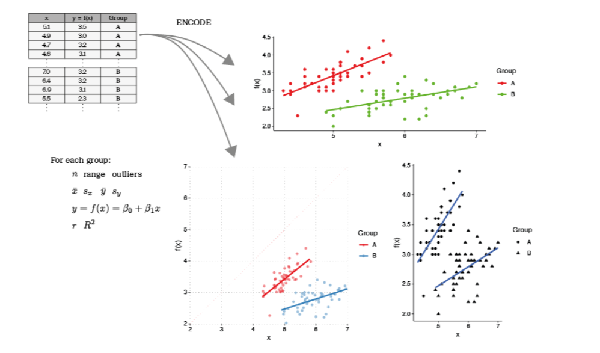
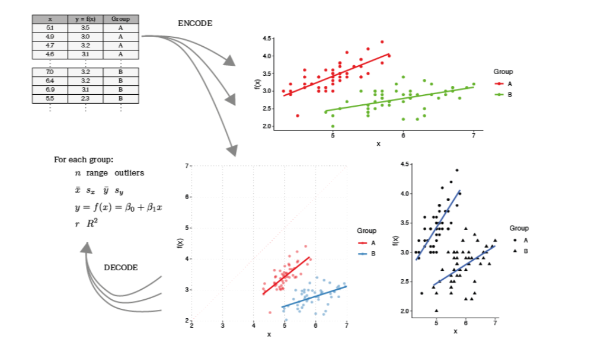
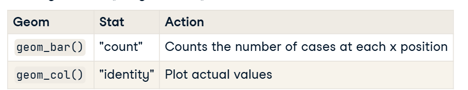
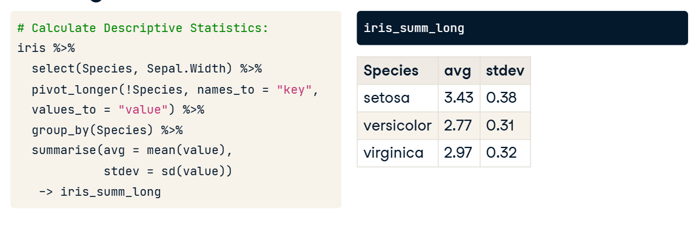
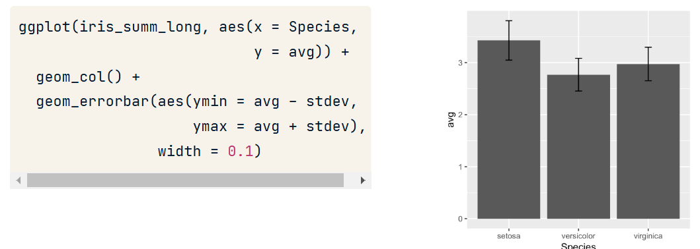
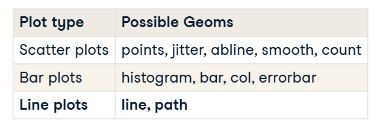
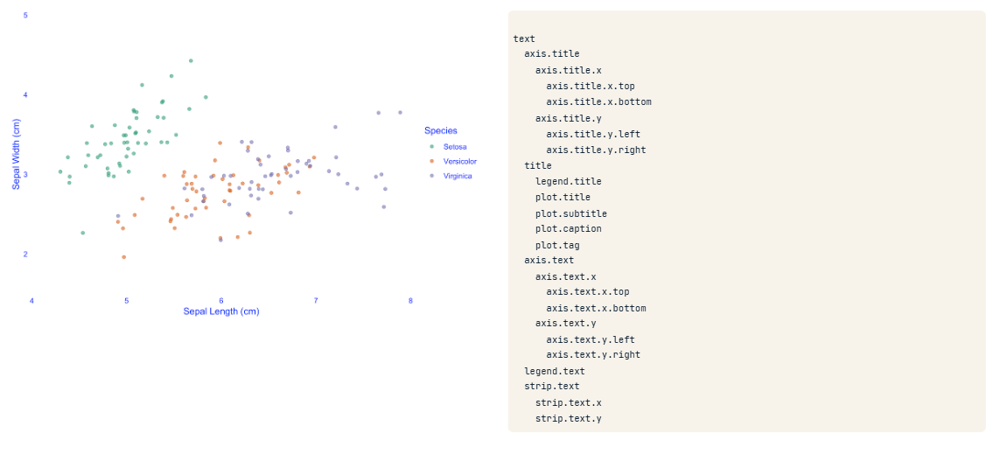
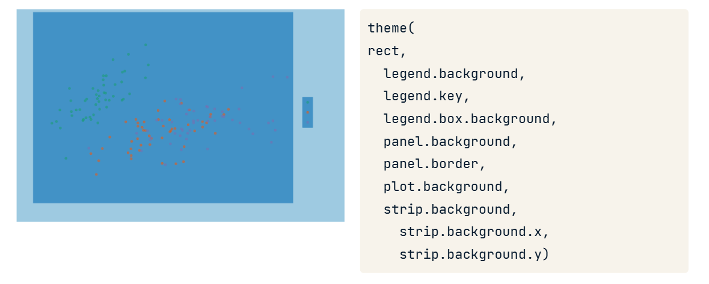
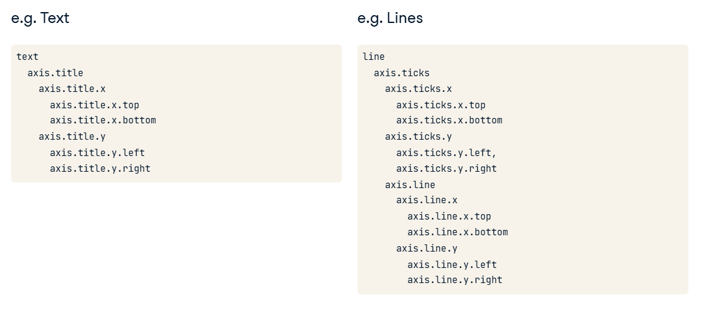
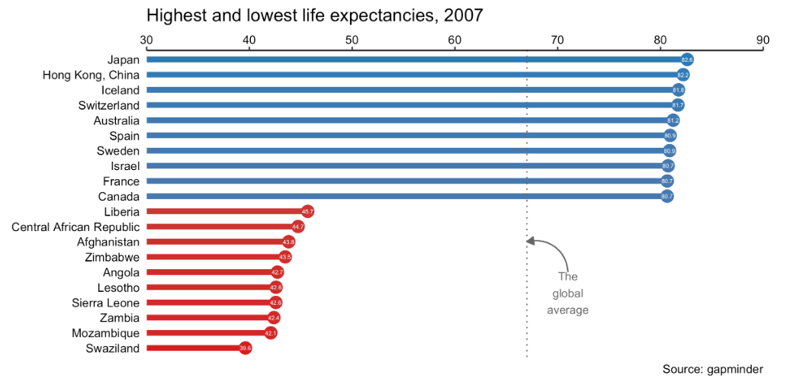

```{r setup, include=FALSE}
library(knitr)
library(tidyverse)
library(formatR)
library(kableExtra)
library(corrplot)
library(GGally)

knitr::opts_chunk$set(
  fig.width=2,   # Set width (in inches)
  fig.height=2,  # Set height (in inches)
  out.width="50%",  # Scale output width
  comment=NA,
  error=FALSE, 
  warning=FALSE,
  tidy=TRUE, 
  fig.align = 'center',
  message=FALSE, 
  tidy.opts=list(width.cutoff=60),
  fig.path='Figs/')
```


# Introduction

## The grammar of graphics

The first step in thinking creatively about data visualization is to appreciate that graphics are built upon an underlying grammar.

## The quick brown fox jumps over the lazy dog

  - To begin, let's consider one of the most well-known sentences in English. 
    
  - The quick brown fox jumps over the lazy dog.

## The quick brown fox jumps over the lazy dog

  - Every word in the sentence has a clear grammatical definition and when we write text, we take great care to choose the grammatical elements so that we communicate a very specific message. 


    
    

## Grammar of graphics

  - If we changed any of the grammatical elements of this sentence it would change the meaning, sometimes subtly, sometimes dramatically.

  - The same concept holds true for data visualization - graphics are built on an underlying grammar. 

## Grammar of graphics    

  - The grammar of graphics is a plotting framework developed by Leland Wilkinson and published in his 1999 book, *The Grammar of Graphics*. 
    
    


## Grammar of graphics

There are two key things to note about the grammar of graphics. 
    
  - First, graphics are made up of distinct layers of grammatical elements, 
    
  - Second, meaningful plots are built around appropriate aesthetic mappings. 
    
## Grammar of graphics

  - To continue our analogy to written grammar, the layers are like the adjectives and nouns and the aesthetic mappings are like the grammatical rules for how to assemble that vocabulary.

## The three essential grammatical elements

Let's explore grammatical elements first. 


## The three essential grammatical elements

There are three essential grammatical elements: data, aesthetics, and geometries. 

    


## The three essential grammatical elements

  - The data is obviously the data which we want to plot. 

   


## The three essential grammatical elements

  - The aesthetics layer refers to the scales onto which we will map our data, and the geom layer refers to the actual shape the data will take in the plot.

  


 
## The three essential grammatical elements

  - The geom layer refers to the actual shape the data will take in the plot.

  

## Core competency

The rest are optional layers. 

 

This includes the theme layer, which controls all the non-data ink. In this lecture, we'll cover these first four layers which will comprise your core competency.

## The seven grammatical elements

In the next lecture we'll explore the remaining grammatical elements: the statistics, coordinates and facets layers.

 


## Jargon for each element

This diagram gives an example of some of the terms we'll encounter in each element. 


## Jargon for each element

  - Whenever we make a plot we are choosing among these options and many others not displayed. 
    
  - By the end of this lecture you'll be able to generate meaningful and publication-quality exploratory plots using       the first four layers.
    

## ggplot2 layers

Now that we have some idea about the different grammatical elements of graphics, let's see how this works in practice.

## ggplot2 package

  - The grammar of graphic is implemented in R using the ggplot2 package. 
  
  - There are two key functions that ggplot2 serves. 

## ggplot2 package

  - First, we construct plots by layering grammatical elements on top of each other. 
  
  - Second, we use aesthetic mappings to bridge the link between data and it's visual interpretation. 
  
## ggplot2 package  
  
  - We are going to go through each grammatical element in depth in this and the next lecture. 
  
  - Here I'll introduce a data set which will be used throughout the videos and we'll go over some simple examples.

## Data

The bottom layer is the data element. 


## Data

  - Obviously we need some data to plot. 
  
  - I'm going to use several different data sets in the course videos,

## Iris dataset

One of which is the classic iris data set collected by Edgar Anderson in the 1930s and thereafter popularized by Ronald Fisher. 


## Iris dataset

  - The data set contains information on three iris species, setosa, versicolor, and virginica. 
  
  - Four measurements were taken from each plant - the petal length and width and the sepal length and width. 
  
  
## Iris dataset

  - You're probably amiliar with petals, they're the colorful part of a flower. 
  
  - Sepals are the outer leaves of the flower, they are typically green, but in this case they're also colorful. 
  
  - There are 50 specimens of each species.


## Iris dataset

The data is stored in an object called **iris**, there are five variables: the species and one for each of the properties which were measured.


## Aesthetics

The next layer we'll add is the aesthetics element, which tells us which scales we should map our data onto. 


## Aesthetics

  - This is where the second main component of the grammar of graphics comes into play. 

  - On top of layering the grammatical elements, it's here that we establish our aesthetic mappings.

## Iris aesthetics

In this case we are going to make a scatter plot so we're going to map Sepal-dot-Length onto the X aesthetic and Sepal-dot-Width onto the Y aesthetic.


## Geometries

The next element is the geometry element. 


This allows us to choose how the plot will look.

## Iris geometries

After we've established our three essential layers, we have enough instructions to make a basic scatter plot. 


It's pretty rough, so to get a more meaningful and cleaner visualization, we'll have to use the other layers.

## Themes

The next layer we'll look at is the themes element. 


## Themes
It controls all the non-data ink on our plot.

## Iris themes

Which allows us to get a nice looking, meaningful and publication-quality plot directly in R.


## Practice: Introduction to Geometries in ggplot2

- In this exercise, we'll work with the **diamonds** dataset.
- The goal is to explore and plot the data using ggplot2.


## Practice: The diamonds dataset

- The **diamonds** dataset contains information on 1,000 diamonds.
- Some key variables include:
  - `carat`: A measurement of the diamond's size.
  - `price`: The price of the diamond in dollars.

---

## Step 1: Explore the dataset

Use the `str()` function to inspect the structure of the **diamonds** dataset.

\AddToHookNext{env/Highlighting/begin}{\tiny}   

```{r, cache = TRUE} 
# Load ggplot2 package
library(ggplot2)

# Explore the structure of the diamonds dataset
str(diamonds)
```


## Step 2: Create a basic plot

Use ggplot() to create a basic plot of carat (x-axis) vs. price (y-axis).

\AddToHookNext{env/Highlighting/begin}{\tiny}   

```{r, cache = TRUE} 
# Basic ggplot setup
ggplot(data = diamonds, aes(x = carat, y = price))
```


## Step 3: Add points to the plot

Use the geom_point() function to add a scatter plot layer.

\AddToHookNext{env/Highlighting/begin}{\tiny}   

```{r, cache = TRUE} 
# Add points to the plot
ggplot(data = diamonds, aes(x = carat, y = price)) +
  geom_point()
```


## Step 4: Add a smooth trend line

Use the geom_smooth() function to add a smooth trend curve to the plot.

\AddToHookNext{env/Highlighting/begin}{\tiny}   

```{r, cache = TRUE} 
# Add points and a smooth trend line
ggplot(data = diamonds, aes(x = carat, y = price)) +
  geom_point() +
  geom_smooth()
```


## Customizing ggplot2 Geometries

- Learn how to customize **ggplot2** geometries.
- Modify aesthetics such as `color` and `alpha`.


## Practice 2: Map `color` to `clarity`

- **Objective**: Map the `color` aesthetic to the `clarity` variable.
- This will create a color-coded scatter plot based on diamond clarity.


## Practice 2: Map `color` to `clarity`

\AddToHookNext{env/Highlighting/begin}{\tiny}   

```{r, cache = TRUE} 
# Create a plot with color mapped to clarity
ggplot(data = diamonds, aes(x = carat, y = price, color = clarity)) +
  geom_point() +
  geom_smooth()
```


## Practice 2: Adjust Transparency with alpha

  - **Objective**: Make points partially transparent.
  - Use the alpha argument in geom_point() to set transparency.


## Practice 2: Adjust Transparency with alpha

\AddToHookNext{env/Highlighting/begin}{\tiny}   

```{r, cache = TRUE} 
# Add transparency to points
ggplot(data = diamonds, aes(x = carat, y = price, color = clarity)) +
  geom_point(alpha = 0.4) +
  geom_smooth()
```    
    
    
## Practice 3:  Saving Plots as Variables in ggplot2

- In ggplot2, plots can be saved as variables.
- This allows reusing a base plot and adding layers incrementally.


## Practice 3: Create and Save a Basic Plot

- Plot `price` (y-axis) vs. `carat` (x-axis) using the diamonds dataset.
- Save the plot to a variable named `plt_price_vs_carat`.


## Practice 3: Create and Save a Basic Plot

\AddToHookNext{env/Highlighting/begin}{\tiny}   

```{r, cache = TRUE} 
# Load ggplot2
library(ggplot2)

# Save a basic ggplot as a variable
plt_price_vs_carat <- ggplot(
  data = diamonds,
  aes(x = carat, y = price)
)
```


## Practice 3: Add Layers to the Saved Plot

Add a point layer to the plot using geom_point().


\AddToHookNext{env/Highlighting/begin}{\tiny}   

```{r, cache = TRUE} 
# Add points to the saved plot
plt_price_vs_carat <- plt_price_vs_carat + geom_point()
```


## Practice 3: Add Layers to the Saved Plot

Display the updated plot stored in plt_price_vs_carat.


\AddToHookNext{env/Highlighting/begin}{\tiny}   

```{r, cache = TRUE} 
# Display the updated plot
plt_price_vs_carat
```    

# Aesthetics

## Visible aesthetics

In this section we'll explore aesthetics, and understand how they are distinct from attributes.

## Mapping onto the X and Y axes

  - In ggplot2, the mapping of aesthetics elements is a key concept to master. 

  - So what do we mean by mapping? 
  
## Mapping onto the X and Y axes

  This becomes clear when we understand that our beloved X and Y axes on a straightforward scatter plot are aesthetics. 
  


## Mapping onto the X and Y axes

  - They define the position of dots on a common scale, like this example we saw in the previous part. 
  
  - The sepal length is mapped onto the X axis and the sepal width is mapped onto the Y axis. 
  
## Mapping onto the X and Y axes  
  
Here, we'll focus on the most common visual aesthetics and but we'll encounter more throughout the courses.

  

When making multivariate plots we'll use aesthetics appropriately to maximize the number of variables we can add to a plot.


## Mapping onto color

For example, the variable Species can be mapped onto the color aesthetic, which colors the points according to the species from which they came.


## Mapping onto the color aesthetic

That is, we map a variable from our dataframe onto one of the visible aesthetics. 


We call a column in our dataframe to be mapped onto a visible aesthetic. 


## Mapping onto the color aesthetic

That's why we made such a big deal about data structure earlier.


Each mapped variable is its own column variable in the data frame.

## Mapping onto the color aesthetic in geom

Importantly, we call aesthetics in the aes function. We could have also called aesthetics in the geom layer as shown here, and get the same result. 


## Mapping onto the color aesthetic in geom

  - This is typically only done if we don't want all layers to inherit the same aesthetics or we're mixing different data sources. 

  - In general, try to keep your data and aesthetics layer in the same ggplot function definition.

## Typical visible aesthetics

In addition to the X and Y axes and color, typical visible aesthetics include


## Typical visible aesthetics

fill, which is distinct from


## Typical visible aesthetics

color in that color usually, but not always, refers to the outline of a shape.


## Typical visible aesthetics

Size adjusts the area or radius of points, the thickness of lines and the font size of text.


## Typical visible aesthetics

alpha refers to alpha-blending, which adjusts the transparency of a shape.


## Typical visible aesthetics

line type refers to the dash pattern of a line and


## Typical visible aesthetics

labels are direct labels of an item, directly on the plot. Like printing an item's name on a scatter plot instead of just drawing a point. 


## Typical visible aesthetics

Direct labeling of points is an extension of axis labels for categorical data in that they are unambiguous, and

## Typical visible aesthetics

Shape refers to the shape of a point. 


## Typical visible aesthetics

Many of these aesthetics function as both aesthetic mappings as well as attributes, and one of the most common mistakes beginners make is confusing the two or overwriting aesthetic mappings with fixed attributes. 

## Typical visible aesthetics

Our goal here is to not only show you how to use them correctly but appropriately for the plot's type and purpose.

## Typical visible aesthetics

Just like our two main variable types, there are visible aesthetics for continuous and categorical data which we'll explore in the next video,


## Practice 1: Introduction to Aesthetics in ggplot2

- Aesthetics are visual properties that can be mapped to data variables.
- Examples include `x`, `y`, `color`, `size`, and `shape`.


## Practice 1: Map Variables to Aesthetics

- **Objective**: Map `mpg` to the x-axis and `cyl` to the y-axis.
- Use `aes()` to define mappings.

## Practice 1:

\AddToHookNext{env/Highlighting/begin}{\tiny}   

```{r, cache = TRUE} 
# Load ggplot2 package
library(ggplot2)
# Map mpg to x and cyl to y
ggplot(mtcars, aes(x = mpg, y = cyl)) +
  geom_point()
```


## Practice 1: Swap Aesthetic Mappings

Objective: Map cyl to the x-axis and mpg to the y-axis.

\AddToHookNext{env/Highlighting/begin}{\tiny}   

```{r, cache = TRUE} 
# Swap x and y aesthetics
ggplot(mtcars, aes(x = cyl, y = mpg)) +
  geom_point()
```


## Practice 1: Add More Aesthetics

Objective: Map wt to x, mpg to y, and cyl to color.


\AddToHookNext{env/Highlighting/begin}{\tiny}   

```{r, cache = TRUE} 
# Add more aesthetics: color
ggplot(mtcars, aes(x = wt, y = mpg, color = cyl)) +
  geom_point()
```


## Practice 1: Customize Shape and Size

Objective: Modify the plot by changing shape to 1 and increasing size to 4.

\AddToHookNext{env/Highlighting/begin}{\tiny}   

```{r, cache = TRUE} 
# Customize shape and size
ggplot(mtcars, aes(x = wt, y = mpg, color = cyl)) +
  geom_point(shape = 1, size = 4)
```


## Understanding Color and Fill in ggplot2

- The `color` aesthetic changes the **outline** of a geometry.
- The `fill` aesthetic changes the **inside** of a geometry.
- Certain shapes allow both `color` and `fill` to be mapped.


## Practice 2: Map `cyl` to `fill`

- **Objective**: Map `wt` to the x-axis, `mpg` to the y-axis, and `cyl` to the `fill` aesthetic.


## Practice 2: Map `cyl` to `fill`

\AddToHookNext{env/Highlighting/begin}{\tiny}   

```{r, cache = TRUE} 
# Load ggplot2 package
library(ggplot2)

# Map cyl to fill
ggplot(mtcars, aes(x = wt, y = mpg, fill = cyl)) +
  geom_point(shape = 21, size = 4)
```


## Practice 2:  Customize Shape and Transparency

  - Objective: Use shape = 21 to allow both fill and color mapping.

  - Add alpha = 0.6 for partial transparency.

## Practice 2: Customize Shape and Transparency


\AddToHookNext{env/Highlighting/begin}{\tiny}   


```{r, cache = TRUE} 
# Customize shape and transparency
ggplot(mtcars, aes(x = wt, y = mpg, fill = cyl)) +
  geom_point(shape = 21, size = 4, alpha = 0.6)
```


## Practice 3: Map gear to color

Objective: Add gear as a color aesthetic for outlines.


\AddToHookNext{env/Highlighting/begin}{\tiny}   

```{r, cache = TRUE} 
# Map gear to color
ggplot(mtcars, aes(x = wt, y = mpg, fill = cyl, color = gear)) +
  geom_point(shape = 21, size = 4, alpha = 0.6)
```


## Practice 4: Comparing Aesthetics in ggplot2

- ggplot2 aesthetics control visual elements like size, shape, alpha, and labels.
- Care must be taken to avoid overriding aesthetics unintentionally.

## Practice 4: Base Plot with Size Mapping

- **Objective**: Create a base plot and map `cyl` to the `size` aesthetic.


```{r, cache=TRUE}
# Establish the base layer
plt_mpg_vs_wt <- ggplot(mtcars, aes(x = wt, y = mpg))

# Map cyl to size
plt_mpg_vs_wt +
  geom_point(aes(size = cyl))
```


## Practice 4:  Map cyl to Alpha


Objective: Map the cyl variable to the alpha aesthetic.

```{r, cache=TRUE}
# Map cyl to alpha
plt_mpg_vs_wt +
  geom_point(aes(alpha = cyl))
```


## Practice 4: Map cyl to Shape

Objective: Map cyl to the shape aesthetic.


```{r, cache=TRUE}
# Map cyl to shape
plt_mpg_vs_wt +
  geom_point(aes(shape = factor(cyl)))
```


## Practice 4:  Map cyl to Label

Objective: Map cyl to the label aesthetic and switch to geom_text().

```{r, cache=TRUE}
# Map cyl to label and use geom_text
plt_mpg_vs_wt +
  geom_text(aes(label = cyl))
```

## Using attributes

  - In the last exercises you learned a fundamental concept of ggplot2: aesthetic mappings. 
  
  - Colloquially, when we say aesthetics we're describing how something looks, but now you know that in ggplot2, we're talking about aesthetic mappings.
  
## Using attributes  
  
  - If we talk about how something looks, we refer to its attributes. 
  
  - One of the most confusing parts of ggplot2 is that all our visible aesthetics also exist as attributes.

## Aesthetics? Attributes!

  so it's easy to mix up the two! Attributes are always called in the geom layer (which we'll discuss in more detail in the next part). 
  


  For example, to change the color of these points to red, we'd just set the plot's attribute using the color argument in the geom layer.

## Aesthetics? Attributes!

For example, it's color attribute is set by the color argument, its size by the size argument


## Aesthetics? Attributes!

and its shape by the shape argument. 


The distinction between aesthetics and attributes is subtle but important. Mixing the two is a very common mistake.


## Practice 1: Set Color and Alpha

- Use fixed values for the point `color` and `alpha`.

\AddToHookNext{env/Highlighting/begin}{\tiny}   

```{r, cache = TRUE} 
# Define a hexadecimal color
my_blue <- "#4ABEFF"

# Create a plot with fixed color and transparency
ggplot(mtcars, aes(x = wt, y = mpg)) +
  geom_point(color = my_blue, alpha = 0.6)
```


## Practice 1: Conflicts Between Attributes and Aesthetics

Transparency can be controlled using alpha.

\AddToHookNext{env/Highlighting/begin}{\tiny}   

```{r, cache = TRUE} 
# Add a point layer with alpha transparency
ggplot(mtcars, aes(x = wt, y = mpg, color = cyl)) +
  geom_point(alpha = 0.5)
```


## Practice 1: Add Labels to Points

Use geom_text() to label points with the row names.

\AddToHookNext{env/Highlighting/begin}{\tiny}   


```{r, cache = TRUE} 
# Add text labels
ggplot(mtcars, aes(x = wt, y = mpg)) +
  geom_text(aes(label = rownames(mtcars)), color = "red")
```

## Practice 1:  Customize Shape and Color

Change the shape and color of points.

\AddToHookNext{env/Highlighting/begin}{\tiny}   

```{r, cache = TRUE} 
# Customize points with shape and color
ggplot(mtcars, aes(x = wt, y = mpg)) +
  geom_point(shape = 24, color = "yellow")
```

## Practice 1: Complex Aesthetic Mapping

Map qsec to the y-axis, mpg to the x-axis, and cyl to color.

\AddToHookNext{env/Highlighting/begin}{\tiny}   

```{r, cache = TRUE} 
# Map multiple aesthetics
ggplot(mtcars, aes(x = mpg, y = qsec, color = cyl)) +
  geom_point()
```


## Practice 1: Add More Aesthetics

Map gear (factor version of am) to shape.

\AddToHookNext{env/Highlighting/begin}{\tiny}   


```{r, cache = TRUE} 
# Add shape mapping
ggplot(mtcars, aes(x = mpg, y = qsec, color = cyl, shape = factor(gear))) +
  geom_point()
```

## Practice 1: Map to Size

Map hp divided by wt to size.

\AddToHookNext{env/Highlighting/begin}{\tiny}   


```{r, cache = TRUE} 
# Add size mapping
ggplot(mtcars, aes(x = mpg, y = qsec, color = cyl, shape = factor(gear), size = hp / wt)) +
  geom_point()
```


## Modifying Aesthetics

Now that we know what aesthetics are and have some idea about choosing them appropriately, let's explore how to modify them.

##  Positions

A common adjustment is the position. 


##  Positions

  - Position specifies how ggplot will adjust for overlapping bars or points on a single layer. 
  
  - For example, we have identity, dodge, stack, fill, jitter, jitterdodge, and nudge. Let's take a look.

## position = "identity" (default)

The most straightforward position is identity, which we've actually already seen. 


It's the default position for our scatter plots. 

## position = "identity" (default)

"Identity" means that the value in the data frame is exactly where the value will be positioned in the plot. 


This basically means, don't do anything, just put the information where the data says to put the information.

## position = "identity" (default)

We could have written it explicitly, but it's not necessary. 


There is an issue with the precision in this data set. 


## position = "identity" (default)

Our sepals were measured to the nearest millimeter. So although we only have 150 points, there is too much overplotting to distinguish them. 

To solve this, we need to add some random noise on both the x and y axes to see regions of high density - which is referred to as "jittering".

## position = "jitter"

"jitter" can be used as an argument, but each position type can also be accessed as a function. For example,


## position_jitter()

position jitter can be defined in a function before we call our plot, as shown here. 


This has two advantages.

## position_jitter()

Now we can set specific arguments for the position, such as the width, which defines how much random noise should be added, and it allows us to use this parameter throughout our plotting functions so that we can maintain consistency across plots. 


This is available for all position attributes. We'll explore the other positions in the exercises.

## Scale functions

  - Recall that each of the aesthetics is a scale which we mapped data onto, so color is just a scale, like x and y are scales. 
  
  
  
## Scale functions

  Appropriately enough, we can access all the scales with the scale underscore functions. 
  
    
  The second part of the function defines which scale we want to modify. 
  
  
## Scale functions

  All the aesthetics we saw earlier have an associated scale function. 
  
  
  
  
  The third part must match the type of data we are using. Here discrete means we are working with categorical data.

## Scale functions

That means we have to choose our axis dependent on the type of data we have. 

  

Here, we'll consider the continuous x aesthetic and the categorical color aesthetic. 


## Scale functions


Just as an aside, before we move on - don't let the naming conventions confuse you. 

 

Categorical variables are also called factors, discrete and qualitative depending on their context and who you're talking to.

## scale_*_*()

There are many arguments for the scale functions. 

 

The first argument is always the name of the scale, after that most common are limits, breaks, expand and labels.

## The limits argument

limits describe the scale's range.

 


## The breaks argument

breaks control the tick mark positions.

 


## The expand argument

expand is a numeric vector of length two, giving a multiplicative and additive constant used to expand the range of the scales so that there is a small gap between the data and the axes.

 


## The labels argument

and labels adjust the category names.


 

## labs()

Note that if we just want to quickly change the axis labels, we can do this with the labs function.

 


## Practice 1: Updating Aesthetic Labels

## Step 1: Add Axis Labels

- Use the `labs()` function to set x and y-axis labels.

\AddToHookNext{env/Highlighting/begin}{\tiny}   

```{r, cache = TRUE} 
palette <- c(automatic = "#377EB8", manual = "#E41A1C")

ggplot(mtcars, aes(x = cyl, fill = factor(gear))) +
  geom_bar() +
  labs(x = "Number of Cylinders", y = "Count", fill = "Gear")

```


## Step 2: Customize Fill Colors

Use scale_fill_manual() to define custom colors and a legend title.


\AddToHookNext{env/Highlighting/begin}{\tiny}   

```{r, cache = TRUE} 
# Define custom colors for gear levels
palette <- c("3" = "#377EB8", "4" = "#E41A1C", "5" = "#4DAF4A")

ggplot(mtcars, aes(x = cyl, fill = factor(gear))) +
  geom_bar() +
  labs(x = "Number of Cylinders", y = "Count", fill = "Gear") +
  scale_fill_manual(name = "Gear", values = palette)

```

## Step 3: Adjust Bar Position

Set the bar position to dodge for a side-by-side comparison.

\AddToHookNext{env/Highlighting/begin}{\tiny}   

```{r, cache = TRUE}  
# Define custom colors for gear levels
palette <- c("3" = "#377EB8", "4" = "#E41A1C", "5" = "#4DAF4A")

ggplot(mtcars, aes(x = cyl, fill = factor(gear))) +
  geom_bar(position = "dodge") +
  labs(x = "Number of Cylinders", y = "Count", fill = "Gear") +
  scale_fill_manual(name = "Gear", values = palette)

```


## Step 1: Create a Scatter Plot with Jitter

Map mpg to the x-axis and use a dummy y-axis (set to 0).


\AddToHookNext{env/Highlighting/begin}{\tiny}   

```{r, cache = TRUE} 
# Scatter plot with jitter
ggplot(mtcars, aes(x = mpg, y = 0)) +
  geom_point(position = "jitter")
```


## Step 2: Add y-axis Limits


Restrict the y-axis using ylim() to improve focus.

\AddToHookNext{env/Highlighting/begin}{\tiny}   

```{r, cache = TRUE} 
# Add y-axis limits
ggplot(mtcars, aes(x = mpg, y = 0)) +
  geom_point(position = "jitter") +
  ylim(-2, 2)
```

## Aesthetics Best Practices

Now that we know what visual aesthetics are, how do we choose the right one?

## Which Aesthetics?

There is some creativity involved, but there are some helpful guidelines.  

This part is informed by the seminal work of cartographer Jacques Bertin, who published *The Semiology of Graphics* in 1967, and William Cleveland, whose research on perception was summarized in two books.

## Form Follows Function

The best data visualization serves a purpose – that is, form follows function. 

 

## Form Follows Function

What is the function in data visualization?  

It depends on your audience.  

You may just want to confirm expectations and begin analyzing your data, or you may want to inform a specific reader and persuade them with your results.

## Form Follows Function (continued)

First and foremost, our function is the accurate and efficient representation of data.  

 

## Form Follows Function (continued)

Beautiful is nice, but it's a secondary priority.  

 

If data is not accurately and efficiently presented, it's junk.  


## Form Follows Function (continued)

The function is never to misrepresent or obscure our data.  

 

We can avoid this by always considering the intended audience and purpose of our plots.

## Calculating Statistics

Let's look at a simple example.  

 
## Calculating Statistics

In this dataset, I have two continuous variables, x & y, where y is a function of x.  

There are two groups, A and B.

## Calculating Statistics (continued)

It's pretty difficult to obtain summary statistics just by looking at the data.


## Extracting Information from Data


## Extracting Information from Data

We have two choices:

- **Numeric summaries**: Precise but offer a poor overview.
- **Data visualization**: Imprecise but great for overviews.

## Encoding Numbers into Plots

To make a plot, we encode data in numbers and text into a visual medium.  


This is done using **aesthetic mappings**.

## Various Aesthetic Mappings

These plots differ in their aesthetic mappings and other values that we'll explore throughout the course.



## Decoding to Data

These visuals are then decoded to form an image of the original data.  



This process is inherently imprecise – like translating between two languages.

## The Best Choices for Aesthetics

The best choices are those that are:

- **Efficient**: Faster than numeric summaries.
- **Accurate**: Minimize information loss.

## Aesthetics - Continuous Variables

The choice of aesthetic mapping depends on the type of variable.  


The scatter plot is easy to understand because it maps data as **position on a common scale**.

## Aesthetics - Continuous Variables (continued)

Imagine if we switch the aesthetic mappings for x and color.  


## Aesthetics - Continuous Variables (continued)

- This is possible but **neither accurate nor efficient**.  
- In the worst case, there is no way to see the relationship between the three variables.
- In the best case, the reader may misinterpret the plot.

## Efficiency of Decoding

There are many choices for mapping continuous variables, such as:

- **Position on unaligned scales**: Multiple plots with different scales but the same data type.


## Three Iris Scatter Plots

Example: Three plots from the *iris* dataset, one for each species.


## Three Iris Scatter Plots (Unaligned Y-Axes)

Using unaligned y-axes is **less efficient** and makes comparisons difficult.


## Single Faceted Plot (Common Y-Axis)

An **aligned scale** is better for comparisons.


## Decoding Categorical Data

There are also various choices for categorical data.


## Aesthetics - Categorical Variables

Color is often effective for categorical variables.  


However, efficiency and accuracy depend on **aesthetic mappings**.

## Aesthetics - Categorical Variables (continued)

This plot suffers from **overplotting**, meaning not every point is visible.  


Overplotting is a concern in scatter plots.

## Handling Overplotting

We can adjust:

- **Position**: Add random noise.

- **Attributes**: Adjust point size, transparency, or jittering.


# Geometries

## Scatter plots

  - The third essential layer is the geometry layer. 

  - This determines how the plot actually looks. We've already seen many geometries in action - so let's take a closer look.

## 48 geometries

  - At present there are almost 50 different geometries to choose from, although there are some redundancies. 
  
  
  
They can all be accessed using its own geom_ function. As the domain specialist, it's your job to choose the best geom, but there are some useful guidelines.

## Common plot types

Let's begin with scatter plots.

## Scatter plots

Each geom is associated with specific aesthetic mappings, some of which are essential. To use geom_point, we need the x and y aesthetics.

  
  
## Scatter plots

In addition to the essential aesthetics, we can also choose optional aesthetics, like alpha, color, fill, shape, size or stroke. 

  

These are all also attribute settings, as we discussed earlier.

## Geom-specific aesthetic mappings

We can specify both geom-specific data and aesthetics.

  

This allows us to control the information for each layer independently.

## iris demo

Imagine I have a data frame which contains summary statistics, such as the mean, for each of my variables. 

  

In this case it's the average sepal width and length for each of the three iris species. 


## iris demo

ggplot2 can actually take care of the statistics for us, we don't need to calculate it ourselves beforehand, but let's see how to use it if we have. 

  

To show all the individual points and have the mean of the x and y plotted on top, I could add another geom_point layer accessing this data set.

## iris plot

In this plot one geom_point layer inherits the data and aesthetics from the parent ggplot function, and in the other I specify a different data set. 

  

## iris plot

Note that the aesthetics are inherited, as per the first geom function. 


I've changed the shape and the size attributes of the points so that they are distinguishable from the background points.

## Shape attribute values

The possible values are shown here. 15 is a solid square. 


Numbers 21 - 25 are not simply repeats of earlier codes, these shapes have both fill and color, which can be controlled independently.

## Example

For example, I can have a black fill and use a stroke of 2 for a thick outline. 


The color aesthetic is still inherited from the parental layer. Imagine I wanted to have crosshairs marking where each mean value appears on the plot.

## On-the-fly stats by ggplot2

It's not fair to plot the mean without some measure of spread, like the standard deviation. 


We'll get into that in the next course when we discuss the stats layer.

## position = "jitter"

Recall that in the last chapter we used the position argument to change the position from identity to jitter.


## geom_jitter()

We could have also done this with the geom_jitter function directly. 


geom_jitter is just a wrapper for geom_points with position set to jitter.

## Don't forget to adjust alpha

On top of jittering, we would also need to deal with overplotting of points by adjusting the alpha-blending, which works great as an attribute. 


This helps us to see regions of high density.

## Hollow circles also help

Yet another way to deal with overplotting is to change the symbol to a hollow circle, which is shape 1. 


Both of these options help with visual communication because they aid in perception. 


## Hollow circles also help

We can more accurately and quickly see what the data is actually showing, even if the jittering adds some random noise to both axes! 

It's always recommended to optimize the shape, size and alpha blending of points in a scatter plot.


## Practice 1: Overplotting with Large Datasets

**Scatter plots** are intuitive and widely used, but they can suffer from overplotting.  
Consider the `diamonds` dataset:  
- Add transparency (`alpha`) to avoid clutter.
- Use small points (`shape = "."`) for dense areas.


## Practice 1: Overplotting with Large Datasets

\AddToHookNext{env/Highlighting/begin}{\tiny}   


```{r, cache = TRUE} 
# Plot price vs. carat, colored by clarity
ggplot(diamonds, aes(carat, price, color = clarity)) +
  geom_point(alpha = 0.5, shape = ".")
```


## Practice 2: Overplotting with Aligned Values

Aligned values on a single axis can lead to overlapping points.

Consider the mtcars dataset:

## Practice 2: Overplotting with Aligned Values

Add jitter (position_jitter) to spread the points.

Adjust jitter width and dodge position for clarity.


## Practice 2: Overplotting with Aligned Values

\AddToHookNext{env/Highlighting/begin}{\tiny}   

```{r, cache = TRUE} 
# Base plot for aligned values
ggplot(mtcars, aes(cyl, mpg, color = gear)) +
  geom_point(position = position_jitter(width = 0.3))
```


## Practice 3:  Overplotting with Low-Precision Data

Low-resolution measurements, such as in the iris dataset, can create overlapping points.

Use geom_jitter() with a custom width.

Add transparency (alpha) to reveal overlaps.

## Practice 3:  Overplotting with Low-Precision Data

\AddToHookNext{env/Highlighting/begin}{\tiny}   

```{r, cache = TRUE} 
# Scatter plot with jitter for low-precision data
ggplot(iris, aes(Sepal.Length, Sepal.Width, color = Species)) +
  geom_jitter(alpha = 0.5, width = 0.1)
```


## Practice 4: Overplotting with Integer Data

When dealing with integer data:

Combine jitter and transparency to handle overlapping points.

Try it with the Vocab dataset, visualizing vocabulary vs. education.


## Practice 4: Overplotting with Integer Data

Use the labs() function to set x and y-axis labels.

\AddToHookNext{env/Highlighting/begin}{\tiny}   

```{r, cache = TRUE} 
library(carData)
# Plot vocabulary vs. education
ggplot(Vocab, aes(education, vocabulary)) +
  geom_jitter(alpha = 0.2, width = 0.1)
```


## Histograms

In this section we'll take a look at the typical uses of bar plots and their associated geoms.

## Common plot types

A histogram is a special type of bar plot that shows the binned distribution of a continuous variable.


## Histograms

Here, we only need a single aesthetic: X, a continuous variable. geom_histogram plots a a binned version of our data. 


A message lets you know what happened. 


## Histograms

This geom is associated with a specific statistic, stat_bin. 


The bin argument took the default value of 30.

## Default of 30 even bins

This is a good starting point, but we don't need to settle for defaults! 


Let's change it and see what happens.

## Intuitive and meaningful bin widths

Changing the binwidth argument to 0-point-1 gives us a more intuitive impression of our data. 


Note that there is no space between the bars. That emphasizes that this is a representation of an underlying continuous distribution.

## Re-position tick marks

That's also why the labels on the x axis shouldn't fall directly on the bars, but between the bars. 


## Re-position tick marks

They represent intervals and not actual values. 

Setting the center argument to half that of the binwidth does the trick.

## Different Species

Remember that we have three species in our data set? 


## Different Species

We can fill the bars according to each species. 


This makes it clear that we have three histograms in the same plotting space. 


## Different Species


There is a perceptual problem here, because it is not immediately clear if the bars are overlapping or if they are stacked on top of each other.

## Default position is "stack"

The default position is stack. 


In some cases, this may not be clear, so don't risk confusing your viewer with stacked bars. We have some alternative positions we can use.

## position = "dodge"

We can "dodge" our bars, which is a data viz term that simply means to off-set set each data point in a given category. 


That works but the number of categories really makes it difficult to see what's happening. 

## position = "dodge"

We'll encounter dodging again in several situations throughout these courses where it can be used to good effect.

## position = "fill"

The fill position normalizes each bin to represent the proportion of all observations in each bin. 


The y axis label didn't change, but it should say proportion, not count.

## Practice 1: Create a Basic Histogram

- Plot the `mpg` variable as a histogram.

\AddToHookNext{env/Highlighting/begin}{\tiny} 

```{r, cache = TRUE}
# Basic histogram of mpg
ggplot(mtcars, aes(x = mpg)) +
  geom_histogram()
```


## Practice 1: Adjust Binwidth

Set the histogram binwidth to 1 for finer detail.

\AddToHookNext{env/Highlighting/begin}{\tiny} 

```{r, cache = TRUE}
# Adjust histogram binwidth
ggplot(mtcars, aes(x = mpg)) +
  geom_histogram(binwidth = 1)
```


## Practice 1: Map y to Density

Show frequency densities instead of counts using ..density...


\AddToHookNext{env/Highlighting/begin}{\tiny} 

```{r, cache = TRUE}
# Histogram with density on the y-axis
ggplot(mtcars, aes(x = mpg, y = ..density..)) +
  geom_histogram(binwidth = 1)
```

## Practice 1: Customize Fill Color

Set the histogram bars' fill color to datacamp_light_blue.

\AddToHookNext{env/Highlighting/begin}{\tiny} 

```{r, cache = TRUE}
# Define a custom color
datacamp_light_blue <- "#1F77B4"

# Customize histogram fill color
ggplot(mtcars, aes(x = mpg)) +
  geom_histogram(binwidth = 1, fill = datacamp_light_blue)
```


## Practice 2: Exploring Positions in Histograms

Step 1: Map Fill to a Variable

Map the fill aesthetic to gear (factor version of gear).

## Practice 2: Exploring Positions in Histograms


\AddToHookNext{env/Highlighting/begin}{\tiny} 

```{r, cache = TRUE}
# Map fill to a variable
ggplot(mtcars, aes(x = mpg, fill = factor(gear))) +
  geom_histogram(binwidth = 1) +
  labs(fill = "Gear")
```


## Bar Plots in R

- Histograms are a specialized version of bar plots for continuous data.
- Classic bar plots have a categorical X-axis.
- `{ggplot2}` provides `geom_bar()` and `geom_col()`.


## Bar Plots with Categorical X-axis



- `geom_bar()` counts occurrences per category.
- `geom_col()` directly uses values from the dataset.


## Difference Between geom_bar and geom_col

- `geom_col()` maps `y` to actual data values.
- Useful when working with summary statistics.


## Bar Plots for Mammal Habits

We'll use a dataset on the REM sleep time and eating habits of mammals.

```{r, cache = TRUE}
str(msleep)
```


## Bar plot

```{r, cache = TRUE}
ggplot(msleep, aes(vore)) + geom_bar()
```


## Bar plot

  - In this bar plot, we've split our data set according to eating behavior and simply asked how many observations we have in each category.

  - Notice that something very similar to what happened with geom_histogram has happened here. 
  
  
## Bar plot  
  
The data was counted and that count was plotted, so once again there were some statistics which occurred under the hood, in this case there was a default value of "bin" set for the stat argument. 

## Bar plot

  - These kind of plots are useful in getting a quick visual output, but we often see another type of bar plot, one which tries to depict the distribution     of a data set. 
  
  - Let's consider a scenario similar to what we saw with the point geom - that we have a data set with the summary values already calculated.

## Plotting distributions instead of absolute counts

Often times this is the case - you will have descriptive statistics already calculated, but remember that we can make ggplot do this on the fly.



## Plotting distributions

  - If we want to plot the average sepal width for each species, we can map the avg column in our dataset onto the y aesthetic. 
  
  
  
  - In this case we need to use $geom\_col$. If we want to add error bars, there is another geom for that, appropriately called $geom\_errorbar$. 
  
## Plotting distributions


  - Here we again need to specify some aesthetics specific to this geom, namely **ymin** and **ymax**. 
  
    
  
  - On top of that I've set the width of the error bar tips to be narrow and I've made the fill of the bars themselves gray, so that we can see the error     bars. 
  
## Plotting distributions

  - This is the kind of plot that you'll typically see in scientific publications, but it's pretty terrible. 
  
    
  
  - There is a special name in the data vis community for these types of plots - they're called dynamite plots.
  
  
## Plotting distributions

  They are strongly discouraged for many reasons, which we'll explore in the data vis best practices chapter at the end of the second course.


## Practice Exercise: Position in Bar and Col Plots

Let's see how the `position` argument changes `geom_bar()`.

We have three position options:
- `stack`: The default
- `dodge`: Preferred
- `fill`: To show proportions

## Instructions

1. **Using `mtcars`**, plot `cyl`, filled by `am`.
   - Add a bar layer using `geom_bar()`.

```{r, cache = TRUE}
# Plot cyl, filled by am
ggplot(mtcars, aes(cyl, fill = am)) +
  geom_bar()
```


## Instructions

2. **Set the bar `position` argument to "fill".**

\AddToHookNext{env/Highlighting/begin}{\tiny} 

```{r, cache = TRUE}
ggplot(mtcars, aes(cyl, fill = am)) +
  geom_bar(position = "fill")
```

## Instructions

3. **Change the bar `position` argument to "dodge".**

\AddToHookNext{env/Highlighting/begin}{\tiny} 

```{r, cache = TRUE}
ggplot(mtcars, aes(cyl, fill = am)) +
  geom_bar(position = "dodge")
```

Try running these commands in RStudio and observe how the bar plot changes.


## Practice Exercise: Position in Bar and Col Plots

Let's see how the `position` argument changes `geom_bar()`.

We have three position options:
- `stack`: The default
- `dodge`: Preferred
- `fill`: To show proportions

## Instructions

1. **Using `mtcars`**, plot `cyl`, filled by `am`.
   - Add a bar layer using `geom_bar()`.
   
\AddToHookNext{env/Highlighting/begin}{\tiny}    

```{r, cache = TRUE}
# Plot cyl, filled by am
ggplot(mtcars, aes(cyl, fill = am)) +
  geom_bar()
```

## Instructions

2. **Set the bar `position` argument to "fill".**

\AddToHookNext{env/Highlighting/begin}{\tiny} 

```{r, cache = TRUE}
ggplot(mtcars, aes(cyl, fill = am)) +
  geom_bar(position = "fill")
```


## Instructions

3. **Change the bar `position` argument to "dodge".**

\AddToHookNext{env/Highlighting/begin}{\tiny} 

```{r, cache = TRUE}
ggplot(mtcars, aes(cyl, fill = am)) +
  geom_bar(position = "dodge")
```

## Instructions


4. **Modify the `dodge` width to 0.2 for overlapping bars.**

\AddToHookNext{env/Highlighting/begin}{\tiny} 

```{r, cache = TRUE}
ggplot(mtcars, aes(cyl, fill = am)) +
  geom_bar(position = position_dodge(width = 0.2))
```

## Instructions

5. **Set the bar transparency level to `0.6` (alpha blending).**

\AddToHookNext{env/Highlighting/begin}{\tiny} 

```{r, cache = TRUE}
ggplot(mtcars, aes(cyl, fill = am)) +
  geom_bar(position = position_dodge(width = 0.2), alpha = 0.6)
```

Try running these commands in RStudio and observe how the bar plot changes.

## Practice Exercise: Sequential Color Palette in Bar Plots

We'll use a sequential color palette to fill segments based on an ordinal variable.

## Instructions

1. **Using the `Vocab` dataset**, plot `education`, filled by `vocabulary`.
   - Add a bar layer using `geom_bar()`.

```{r, cache = TRUE}
# Plot education, filled by vocabulary
ggplot(Vocab, aes(education, fill = vocabulary)) +
  geom_bar()
```


## Instructions

2. **Apply a sequential color palette using `scale_fill_brewer()`.**

```{r, cache = TRUE}
ggplot(Vocab, aes(education, fill = vocabulary)) +
  geom_bar() +
  scale_fill_brewer(palette = "Set1")
```

## Instructions

3. **Try different color palettes from `RColorBrewer`.**

```{r, cache = TRUE}
library(RColorBrewer)

ggplot(Vocab, aes(education, fill = vocabulary)) +
  geom_bar() +
  scale_fill_brewer(palette = "Blues")
```

Try running these commands in RStudio and observe how the color changes based on the ordinal variable.

## Line plots

Line plots are another very common plot type.

## Common plot types

We'll take a look at two examples of lines plots in situations in which they are very well-suited - time series.

 

## Introduction to Line Plots with ggplot2

- **Line plots** are essential for visualizing trends over time.
- In `ggplot2`, they are created using `geom_line()`.
- Used extensively for **time series analysis** and **trend visualization**.


## Data Preparation

```{r, cache = TRUE}
# Load necessary libraries
library(tidyverse)

# Create an example dataset
data <- data.frame(
  year = 2000:2020,
  value = cumsum(runif(21, min=-5, max=5))
)

# Preview data
head(data)
```


## Basic Line Plot

\AddToHookNext{env/Highlighting/begin}{\tiny} 

```{r, cache = TRUE}
# Create a simple line plot
ggplot(data, aes(x = year, y = value)) +
  geom_line(color = "blue") +
  labs(title = "Trend Over Time",
       x = "Year",
       y = "Value")
```


## Adding Points to the Line Plot

\AddToHookNext{env/Highlighting/begin}{\tiny} 

```{r, cache = TRUE}
# Line plot with points
ggplot(data, aes(x = year, y = value)) +
  geom_line(color = "blue") +
  geom_point(color = "red") +
  labs(title = "Trend with Data Points",
       x = "Year",
       y = "Value")
```


## Customizing Line Types and Colors

\AddToHookNext{env/Highlighting/begin}{\tiny} 

```{r, cache = TRUE}
# Customize line type and size
ggplot(data, aes(x = year, y = value)) +
  geom_line(color = "darkgreen", linetype = "dashed", size = 1) +
  labs(title = "Customized Line Plot",
       x = "Year",
       y = "Value")
```


## Plotting Multiple Lines

\AddToHookNext{env/Highlighting/begin}{\tiny} 

```{r, cache = TRUE}
# Creating a dataset with multiple groups
data_multi <- data.frame(
  year = rep(2000:2020, times = 2),
  value = c(cumsum(runif(21, min=-5, max=5)),
            cumsum(runif(21, min=-5, max=5))),
  group = rep(c("Series A", "Series B"), each = 21)
)
```


## Plotting Multiple Lines

\AddToHookNext{env/Highlighting/begin}{\tiny} 

```{r, cache = TRUE}
# Plot multiple lines
ggplot(data_multi, aes(x = year, y = value, color = group)) +
  geom_line(size = 1) +
  labs(title = "Multiple Line Plot",
       x = "Year",
       y = "Value")
```


## Smoothing the Line with `geom_smooth()`

\AddToHookNext{env/Highlighting/begin}{\tiny} 

```{r, cache = TRUE}
# Line plot with smoothing
ggplot(data, aes(x = year, y = value)) +
  geom_line(color = "blue") +
  geom_smooth(method = "loess", color = "red") +
  labs(title = "Smoothed Line Plot",
       x = "Year",
       y = "Value")
```

## Practice Exercises

1. **Modify the line color and thickness** in the basic line plot.
2. **Change the point shape** in the line plot with points.
3. **Use different line types** for the multi-line plot.
4. **Apply `geom_smooth()` with different methods** (`lm`, `loess`).


# Themes


## Themes from scratch

The themes layer controls all the non-data ink on your plot.

## The themes layer

Which are all the visual elements that are not actually part of the data.

## The themes layer

Visual elements can be classified as one of three different types - text, line or rectangle.

## The themes layer

Each type can be modified by using the appropriate function, which all begin with $element\_$ followed by text, line, or rect, respectively.

## A starting plot...

For example, consider this plot that we've already encounter a few times. 

\AddToHookNext{env/Highlighting/begin}{\tiny} 

```{r, cache = TRUE}
ggplot(iris, aes(x = Sepal.Length, y = Sepal.Width, color = Species)) + 
geom_jitter(alpha = 0.6)
```

## A starting plot...
  
  - It's composed out of a combination of data and lots of non-data embellishments. 
  
  - For example, these are all the text elements on our plot

## The text elements

  - Each element has it's own unique name. 

  - We can access all the text in general, all titles in general but also more and more specific items, such as the plot, legend and axis titles, or the text on specific axes. 
  
## The text elements  
  
  All these items are arguments of the theme function.




## The text elements

This is used like all other layers in ggplot, by adding a plus to our plot.

## Adjusting theme elements

To modify an element, just call its argument in the theme function and use the appropriate $element\_$ function to specify what we want to change, in this case we need to use an $element\_text$ call. 

\AddToHookNext{env/Highlighting/begin}{\tiny} 

```{r, cache = TRUE}
ggplot(iris, aes(x = Sepal.Length, y = Sepal.Width, color = Species)) + 
geom_jitter(alpha = 0.6) + 
theme(axis.title = element_text(color = "blue"))
```

## Adjusting theme elements

It's within this function that we manipulate things like size, color, alignment and angle of the text.

## A starting plot...

Lines include the tick marks on the axes, the axis lines themselves and all grid lines, both major and minor.

\AddToHookNext{env/Highlighting/begin}{\tiny} 

```{r, cache = TRUE}
ggplot(iris, aes(x = Sepal.Length, y = Sepal.Width, color = Species)) + 
geom_jitter(alpha = 0.6)
```


## Line elements

These are also all just arguments within the theme function and are modified by the $element\_line$ argument.


## A starting plot...

The remaining non-data ink on our plot are all rectangles of various sizes.

\AddToHookNext{env/Highlighting/begin}{\tiny} 

```{r, cache = TRUE}
ggplot(iris, aes(x = Sepal.Length, y = Sepal.Width, color = Species)) + 
geom_jitter(alpha = 0.6)
```

## Rect elements

Access rectangles using arguments in the theme function and modify them using $element\_rect$.



## Hierarchical naming reflects inheritance rules

Although we have access to every item, we don't need to modify them individually. 




## Hierarchical naming reflects inheritance rules

They inherent from each other in a hierarchy. 


## Hierarchical naming reflects inheritance rules

All text elements inherit from text, so if we changed that argument, all downstream arguments would be affected. 

The same goes for line and rectangle. 


## Hierarchical naming reflects inheritance rules

The naming convention is pretty intuitive. 

In practice you will call a small combination of arguments that you want to change.

## element_blank()

There is one other element function that we haven't discussed yet: $element\_blank$. 

We can use this in a plot to remove any item. 


## element_blank()

\AddToHookNext{env/Highlighting/begin}{\tiny} 

```{r, cache = TRUE}
ggplot(iris, aes(x = Sepal.Length, y = Sepal.Width, color = Species)) + 
geom_jitter(alpha = 0.6) + 
theme(line = element_blank(),
      rect = element_blank(),
      text = element_blank())
```


## element_blank()

That is, it won't be drawn at all. 

In this example we set all lines, text and rectangles to blank, so we are left with just the data. 

Notice that the legend keys themselves are part of the data, if you want to modify these elements refer back to the chapter aesthetics and the exercises on scales.

## Let's practice!

Here, we saw how the theme layer allows us to modify visual attributes of non-data ink, including text lines and rectangles. 

But in addition to that, we can also modify a plot's margins and legend position. 

Let's head over to the exercises and see how this in action.


## Practice


  - In this exercise, we will explore how to modify legend positions in **ggplot2**.  
  - Legends help communicate information about different elements in a plot, but sometimes we need to adjust their placement for better visualization.

## Learning Objectives:

- Remove the legend from a plot.
- Change the legend position to the bottom.
- Place the legend inside the plot at specific coordinates.


## Sample data

\AddToHookNext{env/Highlighting/begin}{\tiny}  

```{r, cache=TRUE}
# Sample data
data <- data.frame(
  year = seq(2000, 2020, by = 1),
  unemployed = c(4.0, 4.2, 4.3, 4.7, 5.0, 5.3, 5.5, 5.7, 6.1, 6.3, 
                 6.5, 6.7, 7.0, 7.3, 7.5, 7.8, 8.0, 8.2, 8.5, 8.7, 9.0)
)
```


## Practice

\AddToHookNext{env/Highlighting/begin}{\tiny}  

```{r, cache=TRUE}
# We use ggplot() to plot the data with a line chart.
plt_prop_unemployed_over_time <- ggplot(data, aes(x = year, y = unemployed)) +
  geom_line(color = "blue", size = 1) +
  labs(title = "Unemployment Rate Over Time", x = "Year", y = "Unemployment Rate (%)") +
theme_minimal()
  # The theme_minimal() function is used to apply a clean and simple theme.
# Display the default plot
plt_prop_unemployed_over_time
```    


## Practice

\AddToHookNext{env/Highlighting/begin}{\tiny}  

```{r, cache=TRUE}
# Remove legend entirely
plt_prop_unemployed_over_time +
  theme(legend.position = "none")
```


## Practice

\AddToHookNext{env/Highlighting/begin}{\tiny}  

```{r, cache=TRUE}
plt_prop_unemployed_over_time +
  theme(
    # For all rectangles, set the fill color to grey92
    rect = element_rect(fill = "grey92"),
    # For the legend key, turn off the outline
    legend.key = element_rect(color = NA)
  )
```


## Practice

\AddToHookNext{env/Highlighting/begin}{\tiny}  

```{r, cache=TRUE}
# Load necessary libraries
library(ggplot2)
library(grid)  # Required for unit()

# Create a scatter plot of MPG vs Weight, colored by Cylinders
plt_mpg_vs_wt_by_cyl <- ggplot(mtcars, aes(x = mpg, y = wt, color = factor(cyl))) +
  geom_point(size = 3, alpha = 0.7) + 
  labs(
    title = "MPG vs Weight by Cylinder Count",
    x = "Miles Per Gallon (MPG)",
    y = "Weight (1000 lbs)",
    color = "Cylinders"
  ) +
  theme_minimal()
```


\AddToHookNext{env/Highlighting/begin}{\tiny}  

```{r, cache=TRUE}
# View the original plot
plt_mpg_vs_wt_by_cyl
plt_mpg_vs_wt_by_cyl +
  theme(
    # Set the axis tick length to 2 lines
    axis.ticks.length = unit(2, "lines")
  )
```


## Theme flexibility

We saw how to fine-tune every part of our plot using the theme layer.

## Ways to use themes

  - There are a few other ways of changing theme elements, so let's take a look. 
   - We'll begin with defining our own theme layer object.

## Defining theme objects

  - If you're using many plots within a presentation or publication, you'll want to have consistency in your style. 
  
\AddToHookNext{env/Highlighting/begin}{\tiny}    
  
```{r, cache=TRUE}
z <- ggplot(iris, aes(x = Sepal.Length, y = Sepal.Width, color = Species)) +
  geom_jitter(alpha = 0.6) +
  scale_x_continuous("Sepal Length (cm)", limits = c(4,8), expand = c(0,0)) +
  scale_y_continuous("Sepal Width (cm)", limits = c(1.5,5), expand = c(0,0)) +
  scale_color_brewer("Species", palette = "Dark2", labels = c("Setosa", "Versicolor", "Virginica"))

```
  
So, once you settle on a a specific theme, you'll want to apply it to all plots of the same type. 

## Defining theme objects

Creating a theme from scratch is a detailed process, that we don't want to repeat for every plot we make. 
  
\AddToHookNext{env/Highlighting/begin}{\tiny}    
  
```{r, cache=TRUE}
z <- ggplot(iris, aes(x = Sepal.Length, y = Sepal.Width, color = Species)) +
  geom_jitter(alpha = 0.6) +
  scale_x_continuous("Sepal Length (cm)", limits = c(4,8), expand = c(0,0)) +
  scale_y_continuous("Sepal Width (cm)", limits = c(1.5,5), expand = c(0,0)) +
  scale_color_brewer("Species", palette = "Dark2", labels = c("Setosa", "Versicolor", "Virginica"))

```

That's where defining a theme layer object comes into play.

## Defining theme objects

To see how this works let's return to a plot we've already seen. 

\AddToHookNext{env/Highlighting/begin}{\tiny}    

```{r, cache=TRUE}
z + theme(text = element_text(family = "serif", size = 14),
          rect = element_blank(),
          panel.grid = element_blank(),
          title = element_text(color = "#8b0000"),
          axis.line = element_line(color = "black"))

```


For convenience, we're going to save this plot as an object called Z.

6. Defining theme objects

We can adjust specific theme arguments to get the desired plot style. Here, I've changed the font family, size and title color.


\AddToHookNext{env/Highlighting/begin}{\tiny}    

```{r, cache=TRUE}
theme_iris <- theme(text = element_text(family = "serif", size = 14),
                    rect = element_blank(),
                    panel.grid = element_blank(),
                    title = element_text(color = "#8b0000"),
                    axis.line = element_line(color = "black"))

```


## Defining theme objects

The first method in automating this process is to save our layer as an object. Here we're just going to call it theme iris.

## Reusing theme objects

Just as we've seen throughout the course, we can add individual layers to any ggplot object. 

```{r, cache = TRUE}
z + theme_iris
```


## Reusing theme objects

This means we can reuse this style over and over. 

Let's see what happens when we try to apply our new theme object on another plot.

## Reusing theme objects

Remember this histogram of the iris Sepal widths?

\AddToHookNext{env/Highlighting/begin}{\tiny}    

```{r, cache=TRUE}
m <- ggplot(iris, aes(x = Sepal.Width)) +
  geom_histogram(binwidth = 0.1,
                 center = 0.05)

m
```


## Reusing theme objects

Now it has the same style as our scatter plot, without having to retype the whole theme layer.

```{r, cache=TRUE}
m + theme_iris
```


## Reusing theme objects

But let's say that on occasion I wanted to modify some other specific elements of a plot.

\AddToHookNext{env/Highlighting/begin}{\tiny}  

```{r, cache=TRUE}
m + theme_iris +
  theme(axis.line.x = element_blank())
```

Not a problem, we can just add a another theme layer which will override any previous settings. In this example, I've removed the x axis line.

## Ways to use themes

So far we just used our theme as an object itself. 

This is a pretty flexible way of working with theme, but a third way of working with themes is accessing the built-in theme templates.

## Using built-in themes

Built-in theme functions begin with $theme\_\star$. 

theme classic is my go-to template for great publication-quality plots.

```{r, cache=TRUE}
z + theme_classic()
```


## Using built-in themes

Of course we can always modify any specific element, as we've already seen.

\AddToHookNext{env/Highlighting/begin}{\tiny}  

```{r, cache=TRUE}
z + theme_classic() +
theme(text  = element_text(family = "serif"))
```

## Ways to use themes

There are also packages with pre-defined themes, like the ggthemes package.

## The ggthemes package

The tufte theme mimics Tufte's classic style, which removes all non-data ink and sets the font to a serif typeface.


```{r, cache=TRUE}
library(ggthemes)

z + theme_tufte()
```

## Ways to use themes

Finally, we can update and set the default theme

## Updating themes

Updating is done with the theme_update function. 

\AddToHookNext{env/Highlighting/begin}{\tiny}  

```{r, cache=TRUE}
original <- theme_update(text = element_text(family = "serif", size = 14),
                         rect = element_blank(),
                         panel.grid = element_blank(),
                         title = element_text(color = "#8b0000"),
                         axis.line = element_line(color = "black"))

```


This function behaves differently from a typical function. This command updates the default theme and saves the current default to the object "original".

## Updating themes

```{r, cache = TRUE}
z
```

Now, all plots will automatically have the same theme.

## Setting themes

```{r, cache = TRUE}
theme_set(original)

# Alternatively

theme_set(theme_grey())
```

We can set a complete theme object, like original, using the theme_set function.

## Practice

\AddToHookNext{env/Highlighting/begin}{\tiny}  

```{r, cache = TRUE}
# Add a black and white theme
plt_prop_unemployed_over_time +
  theme_bw()
```


## Practice

\AddToHookNext{env/Highlighting/begin}{\tiny}  

```{r, cache = TRUE}
# Use the fivethirtyeight theme
plt_prop_unemployed_over_time +
  theme_fivethirtyeight()
```

## Practice

\AddToHookNext{env/Highlighting/begin}{\tiny}  

```{r, cache = TRUE}
# Theme layer saved as an object, theme_recession
theme_recession <- theme(
  rect = element_rect(fill = "grey92"),
  legend.key = element_rect(color = NA),
  axis.ticks = element_blank(),
  panel.grid = element_blank(),
  panel.grid.major.y = element_line(color = "white", size = 0.5, linetype = "dotted"),
  axis.text = element_text(color = "grey25"),
  plot.title = element_text(face = "italic", size = 16),
  legend.position = c(0.6, 0.1)
)
```

## Practice

\AddToHookNext{env/Highlighting/begin}{\tiny}  

```{r, cache = TRUE}
# Combine the Tufte theme with theme_recession
theme_tufte_recession <- theme_tufte() + theme_recession

# Add the recession theme to the plot
plt_prop_unemployed_over_time + theme_tufte_recession
```


## Effective explanatory plots

For our last exercises, I want to go through an example of producing explanatory plots in an info viz style, something that you'd see in a magazine or website for a mostly lay audience.

## Our goal, an effective explanatory plot

These plots tend to have both a small number of observations and variables, have embellishments and typically make a clear or dramatic statement.



## Our goal, an effective explanatory plot

  - Our example comes from the gapminder data set and plots the countries with the highest and lowest life expectancies in 2007. 
  
  - The global mean is plotted for comparison. Here we focus on the large gap between the highest and lowest life expectancies, which is about 40 years!

## Complete data

We would begin with our complete data set, which contains three variables for 142 countries.

\AddToHookNext{env/Highlighting/begin}{\tiny} 

```{r, cache=TRUE}
# Load necessary libraries
library(gapminder)    # Load the gapminder dataset
library(RColorBrewer) # For color palettes
library(tidyverse)    # Includes dplyr, ggplot2, tidyr, etc.
# Filter and process the gapminder dataset
gm2007 <- gapminder %>%
  dplyr::filter(year == 2007) %>%                   # Select data for the year 2007
  dplyr::select(country, lifeExp, continent) %>%     # Keep only relevant columns
  dplyr::filter(lifeExp > 80.6 | lifeExp < 46) %>%   # Filter countries with extreme life expectancy
  arrange(lifeExp)                            # Arrange in ascending order

# View the processed dataset
glimpse(gm2007)  # Check the structure
head(gm2007)     # Preview the first few rows

```


## First exploratory plots - distributions

Our first exploratory plot would probably be a histogram, which isn't a bad choice. 

\AddToHookNext{env/Highlighting/begin}{\tiny} 

```{r, cache=TRUE}
ggplot(gm2007, aes(lifeExp)) +
geom_histogram()  
```

Recall that we have already applied a binning statistic here.


## Add a geom_segment() layer

\AddToHookNext{env/Highlighting/begin}{\tiny} 

```{r, cache = TRUE, eval=FALSE}
# Add a geom_segment() layer
ggplot(gm2007, aes(x = lifeExp, y = country, color = lifeExp)) +
  geom_point(size = 4) +
  geom_segment(aes(xend = 30, yend = country), size = 2)
```

## Add a geom_segment() layer

\AddToHookNext{env/Highlighting/begin}{\tiny} 

```{r, cache = TRUE, echo=FALSE}
# Add a geom_segment() layer
ggplot(gm2007, aes(x = lifeExp, y = country, color = lifeExp)) +
  geom_point(size = 4) +
  geom_segment(aes(xend = 30, yend = country), size = 2)
```


## Add a geom_text() layer

\AddToHookNext{env/Highlighting/begin}{\tiny} 

```{r, cache = TRUE, eval=FALSE}
# Add a geom_text() layer
ggplot(gm2007, aes(x = lifeExp, y = country, color = lifeExp)) +
  geom_point(size = 4) +
  geom_segment(aes(xend = 30, yend = country), size = 2) +
  geom_text(aes(label = lifeExp), color = "white", size = 1.5)
```

## Add a geom_text() layer

\AddToHookNext{env/Highlighting/begin}{\tiny} 

```{r, cache = TRUE, echo=FALSE}
# Add a geom_text() layer
ggplot(gm2007, aes(x = lifeExp, y = country, color = lifeExp)) +
  geom_point(size = 4) +
  geom_segment(aes(xend = 30, yend = country), size = 2) +
  geom_text(aes(label = lifeExp), color = "white", size = 1.5)
```


## Set the color scale

\AddToHookNext{env/Highlighting/begin}{\tiny} 

```{r, cache = TRUE}
# Set the color scale
palette <- brewer.pal(5, "RdYlBu")[-(2:4)]
```


## Modify the scales

\AddToHookNext{env/Highlighting/begin}{\tiny} 

```{r, cache = TRUE, eval=FALSE}
# Modify the scales
ggplot(gm2007, aes(x = lifeExp, y = country, color = lifeExp)) +
  geom_point(size = 4) +
  geom_segment(aes(xend = 30, yend = country), size = 2) +
  geom_text(aes(label = round(lifeExp,1)), color = "white", size = 1.5) +
  scale_x_continuous("", expand = c(0,0), limits = c(30,90), position = "top") +
  scale_color_gradientn(colors = palette)
```

## Modify the scales

\AddToHookNext{env/Highlighting/begin}{\tiny} 

```{r, cache = TRUE, echo=FALSE}
# Modify the scales
ggplot(gm2007, aes(x = lifeExp, y = country, color = lifeExp)) +
  geom_point(size = 4) +
  geom_segment(aes(xend = 30, yend = country), size = 2) +
  geom_text(aes(label = round(lifeExp,1)), color = "white", size = 1.5) +
  scale_x_continuous("", expand = c(0,0), limits = c(30,90), position = "top") +
  scale_color_gradientn(colors = palette)
```


## Set the color scale


\AddToHookNext{env/Highlighting/begin}{\tiny} 


```{r, cache = TRUE}
# Set the color scale
palette <- brewer.pal(5, "RdYlBu")[-(2:4)]
```


## Add a title and caption

\AddToHookNext{env/Highlighting/begin}{\tiny} 

```{r, cache = TRUE}
# Add a title and caption
ggplot(gm2007, aes(x = lifeExp, y = country, color = lifeExp)) +
  geom_point(size = 4) +
  geom_segment(aes(xend = 30, yend = country), size = 2) +
  geom_text(aes(label = round(lifeExp,1)), color = "white", size = 1.5) +
  scale_x_continuous("", expand = c(0,0), limits = c(30,90), position = "top") +
  scale_color_gradientn(colors = palette) +
  labs(title = "Highest and lowest life expectancies, 2007", caption = "Source: gapminder")
```


## Using annotate for embellishments

In the previous exercise, we completed our basic plot. 

Now let’s polish it by playing with the theme and adding annotations. 

In this exercise, you’ll use annotate() to add text and a curve to the plot.


## Clean up the theme

  - Add a classic theme to the plot with theme_classic().
  - Set axis.line.y, axis.ticks.y, and axis.title to element_blank().
  - Set the axis.text color to "black".
  - Remove the legend by setting legend.position to "none".

## Clean up the theme

  - Use $geom\_vline()$ to add a vertical line. Set **xintercept** to global_mean, specify the color to be "grey40", and set linetype to 3.

  - $x\_start$ and $y\_start$ will be used as positions to place text and have been calculated for you.

## Add a "text" geom as an annotation.

  - For the annotation, set x to $x\_start$, y to $y\_start$, and label to "The global average".
  - Annotate the plot with an arrow connecting your text to the line.

## Use a "curve" geom.

  - Set the arrow ends xend to x_end and yend to y_end.
  - Set the length of the arrowhead to 0.2 cm and the type to "closed".

## Use a "curve" geom.

\AddToHookNext{env/Highlighting/begin}{\tiny} 

```{r, cache = TRUE}
# Select only the highest/lowest 10 life expectancies
gm2007_full <- gapminder %>%
  dplyr::filter(year == 2007) %>%
  dplyr::select(country, lifeExp, continent) %>%
  dplyr::arrange(lifeExp) %>% 
  dplyr::slice(c(1:10, (n()-9):n()))  # Keep only 10 lowest and 10 highest countries
```


## Calculate Global Mean & Define Annotations


The following values have been calculated for you to assist with adding embellishments to the plot:

\AddToHookNext{env/Highlighting/begin}{\tiny} 
 

```{r, cache = TRUE}
# Calculate global mean life expectancy
global_mean <- mean(gm2007_full$lifeExp)

# Define annotation points for the curve
x_start <- global_mean + 3   # Move text slightly right
y_start <- 8                 # Adjust y-position
x_end <- global_mean
y_end <- 10
```


## Define Color Palette

\AddToHookNext{env/Highlighting/begin}{\tiny} 

```{r, cache = TRUE}
# Define a color palette
palette <- brewer.pal(9, "YlGnBu")  # Yellow-Green-Blue gradient
```


## Create the Base Plot

\AddToHookNext{env/Highlighting/begin}{\tiny} 

```{r, cache = TRUE}
plt_country_vs_lifeExp <- ggplot(gm2007_full, aes(x = lifeExp, y = reorder(country, lifeExp), color = lifeExp)) +
  geom_point(size = 4) +  # Increase point size
  geom_segment(aes(x = 30, xend = lifeExp, y = country, yend = country), size = 0.8, color = "gray") +  # Reduce line size
  geom_text(aes(label = round(lifeExp, 1)), color = "white", size = 3, hjust = -0.5) +  # Improve label readability
  scale_x_continuous("", expand = c(0, 0), limits = c(30, 90), position = "top") +  # Adjust axis
  scale_color_gradientn(colors = palette) +  # Apply better color gradient
  labs(title = "Highest and Lowest Life Expectancies, 2007", 
       caption = "Source: Gapminder") +
  theme_minimal()
```


##  Add Theme Adjustments

\AddToHookNext{env/Highlighting/begin}{\tiny} 

```{r, cache = TRUE}
plt_country_vs_lifeExp <- plt_country_vs_lifeExp +
  theme_classic() +
  theme(axis.line.y = element_blank(),
        axis.ticks.y = element_blank(),
        axis.text = element_text(color = "black"),
        axis.title = element_blank(),
        legend.position = "none")
```


## Add Vertical Reference Line

\AddToHookNext{env/Highlighting/begin}{\tiny} 

```{r, cache = TRUE}
plt_country_vs_lifeExp <- plt_country_vs_lifeExp +
  geom_vline(xintercept = global_mean, color = "grey40", linetype = "dashed")
```


## Add Annotation Text


\AddToHookNext{env/Highlighting/begin}{\tiny} 

```{r, cache = TRUE}
plt_country_vs_lifeExp <- plt_country_vs_lifeExp +
  annotate(
    "text",
    x = x_start, y = y_start,
    label = "The\nglobal\naverage",
    vjust = 1, hjust = 0, size = 4, color = "black"
  )
```


## Add the Annotation Curve


\AddToHookNext{env/Highlighting/begin}{\tiny} 

```{r, cache = TRUE}
plt_country_vs_lifeExp <- plt_country_vs_lifeExp +
  annotate(
    "curve",
    x = x_start, y = y_start,
    xend = x_end, yend = y_end,
    curvature = 0.3, 
    arrow = arrow(length = unit(0.3, "cm"), type = "closed"),
    color = "black", size = 1
  )
```


## Final Visualization

\AddToHookNext{env/Highlighting/begin}{\tiny} 

```{r, cache = TRUE, eval=FALSE}
plt_country_vs_lifeExp
```

## Final Visualization

\AddToHookNext{env/Highlighting/begin}{\tiny} 

```{r, cache = TRUE, echo=FALSE}
plt_country_vs_lifeExp
```

