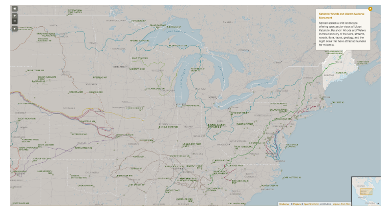
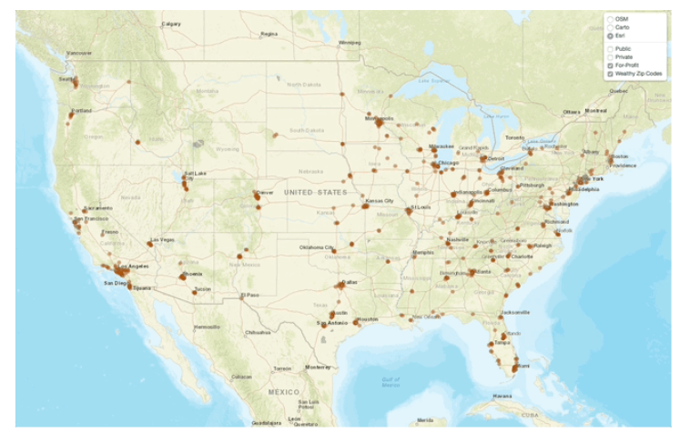
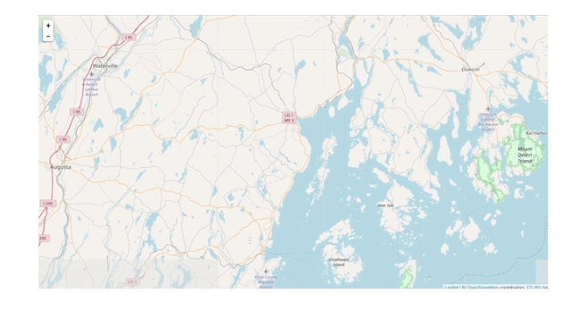
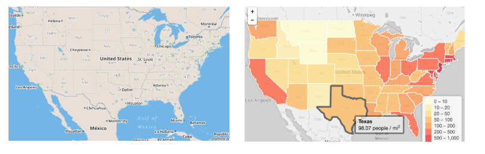

```{r setup, include=FALSE}
library(knitr)
library(tidyverse)
library(leaflet)  # Enables interactive maps
library(kableExtra)

knitr::opts_chunk$set(
  fig.width=8,   # Optimized for HTML slides
  fig.height=6,
  out.width="100%",  # Ensures proper rendering
  comment=NA,
  error=FALSE, 
  warning=FALSE,
  tidy=TRUE, 
  fig.align = 'center',
  message=FALSE, 
  tidy.opts=list(width.cutoff=80))

```


# Introduction

##  Introduction to leaflet

Welcome to this course on creating interactive maps using the **leaflet** package. 

## leaflet

  - Leaflet is a popular open-source JavaScript library for creating mobile-friendly, interactive maps. 
  
  - Thanks to the work of many leading R developers, we can create interactive maps with just a few lines of R code. 
  
  - You may already be familiar with leaflet maps, as they are used by leading technology companies, nonprofits, and government organizations to create informative and interactive maps.

## leaflet Example: National Parks Service

  - For example, the National Parks Service uses leaflet to create an interactive map of America's National Parks. 
  
  

## leaflet Example: National Parks Service

  - This map enables users to explore parks and monuments by state. 
  
  - For example, Maine, has one National Park, one International Park, and one National Monument. Clicking on any of these locations reveals a pop-up with additional information.

## What We are Working Toward

  - In this lecture, we will work towards building an interactive map like the one shown on this slide. 
  
   

## What We are Working Toward

  - This leaflet map plots all four-year colleges in America and color codes these institutions by sector to indicate if they are public, private, or            for-profit. 
  
  - Using the control panel in the upper right-hand corner, we can toggle the map between different base maps and we can select which sectors of colleges        appear on the map. 
  
## What We are Working Toward

  Later in the lecture, we will add a few pieces of flair to this map, such as labels that appear when hovering and the ability to search for a particular     college.

## Creating our First leaflet Map

  - But first we will learn about the core features of the leaflet library by mapping locations in Belgium and New York. 
  
  
## Creating our First leaflet Map  
  
  - **leaflet** builds maps using tiles. 
  
  - Tiled web maps join many map images together and when a user zooms or pans your interactive leaflet map, new tiles are fetched as needed to provide the     requested view of the map. 

## Creating our First leaflet Map  
  
Let's take a look at how this works in R. 
  
\AddToHookNext{env/Highlighting/begin}{\tiny}
```{r, cache=TRUE} 
library(leaflet)

leaflet() %>%
  addTiles()
```  
  
  First, we load the leaflet library. 
  

## Creating our First leaflet Map  
  
Then we initialize an html widget with the leaflet() function call. 
  
\AddToHookNext{env/Highlighting/begin}{\tiny}
```{r, cache=TRUE} 
library(leaflet)

leaflet() %>%
  addTiles()
```  
  
## Creating our First leaflet Map    
  
   - You'll notice that leaflet leverages the pipe operator that is common in the tidyverse. 
   
   - This allows us to chain a series of functions together. 
   
   
## Creating our First leaflet Map

   For example, we can pipe the result of our 'leaflet(); call into the 'addTiles()' function to create an interactive map with just two-lines of R code!
   
   

## Where We are Going 

  - For now, you will practice using different map tiles while working towards creating an interactive map that displays two of college's locations. 

  - Similar to adding a provider tile, you can add another layer to your map using the pipe operator to include markers that identify specific locations.

## Practice : Using Pipe Operators for Data Manipulation

 Filtering and selecting specific columns from the `mtcars` dataset.

\AddToHookNext{env/Highlighting/begin}{\tiny}
```{r, cache=TRUE} 
mtcars %>%
  mutate(car = rownames(.)) %>%
  select(car, mpg) %>%
  filter(mpg >= 25)
```  


## Practice : Creating a Basic Web Map in R

We will use the leaflet package to initialize an HTML widget and add a map tile using addTiles().

**Steps:**

  - Load the leaflet library.

  - Call the leaflet() function to initialize the map.

  - Pipe the output into addTiles() to add default map tiles.

  - Run and explore the interactive map.


## Practice : Using Pipe Operators for Data Manipulation


\AddToHookNext{env/Highlighting/begin}{\tiny}
```{r, cache=TRUE} 
# Load the leaflet library
library(leaflet)

# Create a leaflet map with a default map tile using addTiles()
leaflet() %>%
  addTiles()
```

## Interactive Map Features

  - Zooming: Scroll or use buttons to zoom in/out.
  - Panning: Click and drag to move the map.
  - Customization: You can add markers, polygons, and popups.
  
## Provider Tiles

  - The leaflet package comes with over 100 base maps you can use. 
  
     
  
  - Now, we will start to explore the various tiles that we can use as the foundation of our web maps.

## Selecting a Base Map

  - As you work through the exercises, I encourage you to experiment with different base maps to expand your awareness of the available options. 
  
  - When you are selecting a base map there are several important questions to consider.
  
## Selecting a Base Map

  - Perhaps, primary among them is "Why are you making this map in the first place?" 
  
  - Is this map just for your use or is it part of a larger project that should fit within an existing design framework? 
  
  
## Selecting a Base Map

  - Secondly, "what type of data will you be plotting?" 
  
  - Will the geographic and topographic features of the base map add to the information you are presenting or confuse your users?

## Selecting a Base Map

  - In my work, I tend to prefer grayscale maps when plotting data. 
  
  - I find that these maps make it easier for me to distinguish between the data that I am plotting and the data included with the base map. 
  
## Selecting a Base Map

  - For example, in the map on the left the points are similar in color to features of base map, like the lakes, whereas in the map on the right the data we are plotting is easily distinguishable from the features of the base map.

## leaflet Provider List

  - There are over 100 provider tiles included in the leaflet package.
  
  - Most of these tiles you can use by calling the $addProviderTiles()$ function. 
  
## leaflet Provider List  
  
  - However, there are a few, like mapbox, that you will need to register for prior to using them. 
  
  - You can access the names of the provider tiles included in the leaflet package by calling the **names()** function on the providers list.
  
  
## leaflet Provider List  
  
  For example, to see the first five provider tiles, we call names() on the providers list followed by 1 colon 5 in brackets.

\AddToHookNext{env/Highlighting/begin}{\tiny}
```{r, cache=TRUE} 
names(providers)[1:5]
```


## Exploring leaflet Provider Tiles

The first five tiles are all OpenStreetMap tiles, so it might be more useful to print all of the tiles provided by OpenStreetMap, which you can do by using the $str\_detect()$ function from the **stringr** package.

\AddToHookNext{env/Highlighting/begin}{\tiny}
```{r, cache=TRUE} 
names(providers)[str_detect(names(providers), "OpenStreetMap")]
```

## addProviderTiles()

  - We can swap the default base map out for any of the included provider tiles using the **addProviderTiles()** function. 
  

For example, to create a leaflet map that uses the black and white OpenStreetMap, we replace the $addTiles()$ with $addProviderTiles()$ and pass in the name of the desired tile to the function.

\AddToHookNext{env/Highlighting/begin}{\tiny}
```{r, cache=TRUE} 
leaflet() %>% 
  addProviderTiles("OpenStreetMap.BlackAndWhite")
```


## Practice : Provider Tiles in Leaflet

- In previous exercises, we used `addTiles()` to add the default OpenStreetMap (OSM) tile.
- Leaflet provides **more than 100** provider tiles stored in the `providers` list.
- These can be used with `addProviderTiles()` instead of `addTiles()`.


## View all available map tiles

\AddToHookNext{env/Highlighting/begin}{\tiny}

```{r, cache=TRUE} 
# Print the providers list included in the leaflet library
providers
```

## Print only provider tile names

\AddToHookNext{env/Highlighting/begin}{\tiny}

```{r, cache=TRUE}
# Print only the names of the map tiles in the providers list
names(providers)
```

## Filtering Provider Tiles

\AddToHookNext{env/Highlighting/begin}{\tiny}

```{r, cache=TRUE}
library(stringr)

# Use str_detect() to find provider names containing "CartoDB"
str_detect(names(providers), "CartoDB")
```

## Print the actual provider names

\AddToHookNext{env/Highlighting/begin}{\tiny}

```{r, cache=TRUE}}
library(stringr)
# Display provider tile names that include "CartoDB"
names(providers)[str_detect(names(providers), "CartoDB")]
```


## Adding a Custom Map Tile

Instead of the default OSM tile, we can use CartoDB or other tiles.

The function addProviderTiles() allows us to specify a provider from the list.

\AddToHookNext{env/Highlighting/begin}{\tiny}

```{r, cache=TRUE}
library(stringr)
library(leaflet)
# Change addTiles() to addProviderTiles() and set provider to "CartoDB"
leaflet() %>%
  addProviderTiles(provider = "CartoDB")
```

## Setting the Default Map View

  - We have created several maps, but you may have noticed that they are zoomed out. 
  
  - Rather than having to manually zoom the map to find the area that we are most interested in, we can load it centered on a particular point with a specific zoom level. Let's take a closer look.


## A Map with a View

  - You may have noticed that, by default, maps are zoomed out to the farthest level. 

  - Rather than manually zooming and panning, we can load the map centered on a particular point using the $setView()$ function.

  - The default zoom level is 0 and can reach upto 19. 0 being the zoomed out stage.

## A Map with a View

\AddToHookNext{env/Highlighting/begin}{\tiny}

```{r, cache=TRUE}
leaflet()  %>% 
    addProviderTiles("CartoDB")  %>% 
    setView(lat = 27.1751, lng = 78.0421, zoom = 16)
```

## A Map with a Narrower View

  - We can limit users’ ability to pan away from the map’s focus using the options argument in the $leaflet()$ function. 
  
  - By setting **minZoom** and dragging, we can create an interactive web map that will always be focused on a specific area. Although, user can zoom out using controls.


## A Map with a Narrower View

\AddToHookNext{env/Highlighting/begin}{\tiny}

```{r, cache=TRUE}
leaflet(options = 
        leafletOptions(minZoom = 14, dragging = FALSE))  %>% 
  addProviderTiles("CartoDB")  %>% 
  setView(lng = 78.0421, lat = 27.1751, zoom = 16) 
```

## A Map with a Narrower View

  - Alternatively, if we want our users to be able to drag the map while ensuring that they do not stray too far, we can set the maps maximum boundaries by specifying two diagonal corners of a rectangle.


## A Map with a Narrower View

\AddToHookNext{env/Highlighting/begin}{\tiny}

```{r, cache=TRUE}
## Warning: package 'tibble' was built under R version 4.0.5
library(tibble)

wonders <- tibble(
  place = c("Taj Mahal - India", "Petra - Jordan", "Christ the Redeemer - Brazil", "Colosseum - Italy"),
  lon = c(78.0421, 35.4444, 43.2105, 12.4922),
  lat = c(27.1751, 30.3285, 22.9519, 41.8902))


leaflet(options = leafletOptions(
                    # Set minZoom and dragging 
                    minZoom = 12, dragging = TRUE))  %>% 
  addProviderTiles("CartoDB")  %>% 
  
  # Set default zoom level 
  setView(lng = wonders$lon[2], lat = wonders$lat[2], zoom = 10) %>% 
  
  # Set max bounds of map 
  setMaxBounds(lng1 = wonders$lon[2] + .05, 
               lat1 = wonders$lat[2] + .05, 
               lng2 = wonders$lon[2] - .05, 
               lat2 = wonders$lat[2] - .05) 
```


## A Map with a Narrower View

  - Try, dragging this map. What do you notice. 
  
  - It cannot be dragged more than the max bounds we have set i.e. 0.05. So, the map stays in the focused mode and cannot be dragged further than set           limits.

## Adding Markers

  - So far we have been creating maps with a single layer: a base map. 
  
  - We can add layers to this base map similar to how you add layers to a plot in ggplot2. 
  
## Adding Markers

  - One of the most common layers to add to a leaflet map is location markers, which you can add by piping the result of $addTiles()$ or                        $addProviderTiles()$ into the add markers function.


## Adding Markers

  - For example, if we plot Taj Mahal by passing the coordinates to addMarkers() as numeric vectors with one element, 
  
  - our web map will place a blue drop pin at the coordinate.

## Adding Markers

\AddToHookNext{env/Highlighting/begin}{\tiny}

```{r, cache=TRUE}
leaflet() %>%
  addProviderTiles("OpenStreetMap") %>%
  addMarkers(lng = wonders$lon[2], lat = wonders$lat[2])
```

## Add maps and store map as a R object

  - To make our map more informative we can add popups. 

  - To add popups that appear when a marker is clicked we need to specify the popup argument in the $addMarkers()$ function. 
  
## Add maps and store map as a R object

  - Once we have a map we would like to preserve, we can store it in an object. 
  
  - Then we can pipe this object into functions to add or edit the map’s layers.

## Add maps and store map as a R object

\AddToHookNext{env/Highlighting/begin}{\tiny}

```{r, cache=TRUE}

wondersMap <- leaflet() %>%
  addTiles() %>%
  addMarkers(lng = wonders$lon, lat = wonders$lat,
             popup = wonders$place)

## We can add layers to the existing leaflet R object

map_zoom <- wondersMap %>%
  setView(lng = wonders$lon[4], lat = wonders$lat[4], zoom = 2)
```

## Cleaning up the Base Map

  - If you are storing leaflet maps in objects, there will come a time when you need to remove markers or reset the view. 
  
  - You can accomplish these tasks with the following functions.


  
