```{r setup, include=FALSE}
library(knitr)
library(tidyverse)
library(formatR)
library(kableExtra)
library(corrplot)
library(GGally)

knitr::opts_chunk$set(
  fig.width=2,   # Set width (in inches)
  fig.height=2,  # Set height (in inches)
  out.width="50%",  # Scale output width
  comment=NA,
  error=TRUE, 
  warning=TRUE,
  tidy=TRUE, 
  fig.align = 'center',
  message=FALSE, 
  warning=FALSE,
  tidy.opts=list(width.cutoff=60),
  fig.path='Figs/')
```


# Introduction

## Using the matplotlib.pyplot interface

There are many ways to use Matplotlib. 

In this lecture, we will focus on the **pyplot** interface, which provides the most flexibility in creating and customizing data visualizations.


## Using the matplotlib.pyplot interface

Initially, we will use the pyplot interface to create two kinds of objects: Figure objects and Axes objects.

This lecture introduces a lot of new concepts, so if you ever need a quick refresher, download the Matplotlib Cheat Sheet and keep it handy!


## Introduction to Google Colab

- Google Colab is a **cloud-based Jupyter Notebook** environment.
- It allows you to write and run **Python code** without installation.
- Colab provides **free access to GPUs and TPUs** for machine learning.
- **No setup required**—just log in with a Google account.


## Key Features of Colab

- **Runs in the cloud** (no local setup needed).
- **Supports Python 3** with pre-installed libraries.
- **Free GPUs and TPUs** for deep learning.
- **Collaborate in real-time** like Google Docs.
- **Supports LaTeX, Markdown, and interactive widgets.**


## Opening Google Colab

1. Go to [Google Colab](https://colab.research.google.com/).
2. Click **File → New Notebook**.
3. Start coding in the cells (Python code or Markdown text).


## Writing and Running Python Code

\AddToHookNext{env/Highlighting/begin}{\tiny}

```python
# Simple Python code in Colab
print("Hello, Google Colab!")
```

- Run the cell by clicking **Run** or pressing `Shift + Enter`.


## Writing and Running Python Code

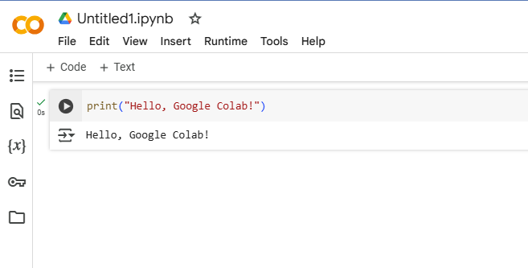

## Installing Packages

\AddToHookNext{env/Highlighting/begin}{\tiny}

```python
!pip install numpy pandas matplotlib
```

- Use `!pip install` to install Python packages.
- **Colab comes with pre-installed packages** like NumPy, Pandas, Matplotlib, and TensorFlow.


## Using Google Drive with Colab

\AddToHookNext{env/Highlighting/begin}{\tiny}

```python
from google.colab import drive
# Mount Google Drive to access files
drive.mount('/content/drive')
```

- This allows you to access files stored in **Google Drive** from Colab.


## Uploading and Downloading Files

\AddToHookNext{env/Highlighting/begin}{\tiny}

```python
from google.colab import files

# Upload a file
uploaded = files.upload()

# Download a file
files.download("example.csv")
```


## Creating and Plotting Data with Matplotlib

\AddToHookNext{env/Highlighting/begin}{\tiny}

```python
import numpy as np
import matplotlib.pyplot as plt

x = np.linspace(0, 10, 100)
y = np.sin(x)

plt.plot(x, y)
plt.title("Sine Wave")
plt.xlabel("X-axis")
plt.ylabel("Y-axis")
plt.show()
```

## Creating and Plotting Data with Matplotlib


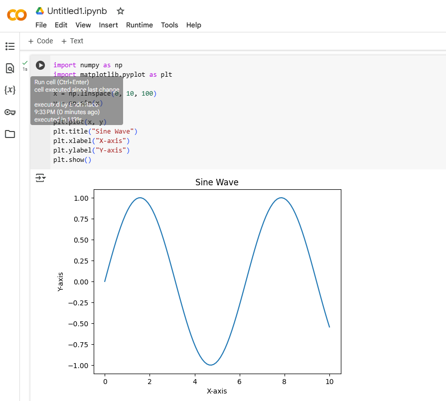


## Collaborating in Colab

- Click **Share** (top right) to invite collaborators.
- Multiple users can edit the same notebook in real-time.
- Version history is automatically saved.
## Exporting Notebooks

- Save notebooks in **Google Drive**.
- Download as **.ipynb** or **.py** (`File → Download`).
- Convert to **HTML, PDF, or Markdown** using:

```python
!jupyter nbconvert --to html notebook.ipynb
```

## Let's get started

- Import the **matplotlib.pyplot** API, using the conventional name plt.
- Create Figure and Axes objects using the **plt.subplots** function.
- Show the results, an empty set of axes, using the plt.show function.


## Let's get started

```python
# Import the matplotlib.pyplot submodule and name it plt
import matplotlib.pyplot as plt

# Create a Figure and an Axes with plt.subplots
fig, ax = plt.subplots()

# Call the show function to show the result
plt.show()
```

## Let's get started


## Adding data to an Axes object

- Adding data to a figure is done by calling methods of the **Axes** object. 
- In this exercise, we will use the plot method to add data about rainfall in two American cities: Seattle, WA and Austin, TX.


## Adding data to an Axes object

seattle_weather stores information about the weather in Seattle, and austin_weather stores information about the weather in Austin. 

\AddToHookNext{env/Highlighting/begin}{\tiny}

```python
import pandas as pd

# URLs for the datasets
seattle_url = "https://raw.githubusercontent.com/endri81/DataVisualization/refs/heads/main/data/seattle_weather.csv"
austin_url = "https://raw.githubusercontent.com/endri81/DataVisualization/refs/heads/main/data/austin_weather.csv"

# Load datasets
seattle_weather = pd.read_csv(seattle_url)
austin_weather = pd.read_csv(austin_url)
```

## Adding data to an Axes object

\AddToHookNext{env/Highlighting/begin}{\tiny}

```python
# Display first few rows
print("Seattle Weather:")
print(seattle_weather.head())
print("\nAustin Weather:")
print(austin_weather.head())
```

## Adding data to an Axes object

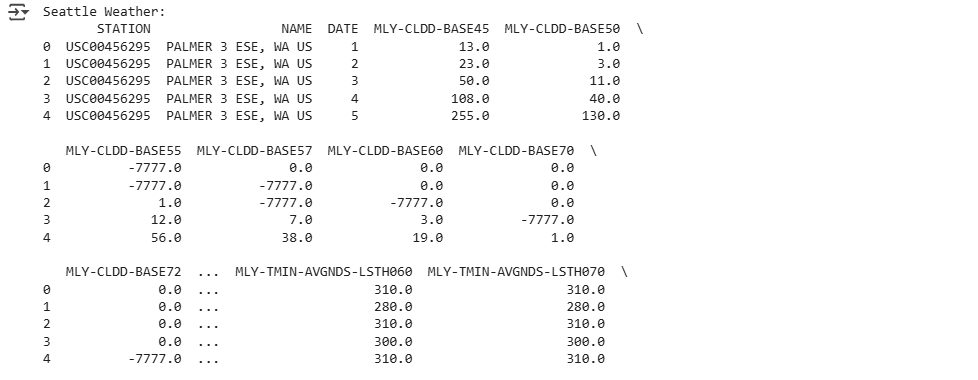

## Adding data to an Axes object

\AddToHookNext{env/Highlighting/begin}{\tiny}

```python
austin_weather["MONTH"] = austin_weather["DATE"]
seattle_weather = seattle_weather[seattle_weather["STATION"] == "USW00094290"]
seattle_weather["MONTH"] = seattle_weather["DATE"]
```


# Creating Basic Plots
## The Pyplot Interface

Matplotlib's pyplot module allows quick creation of plots. The basic structure involves:

- Creating a Figure and Axes.
- Adding data to the Axes.
- Displaying the plot.

## The Pyplot Interface

```python
import matplotlib.pyplot as plt
fig, ax = plt.subplots()
# Adding data to the plot
ax.plot(seattle_weather["MONTH"], seattle_weather["MLY-TAVG-NORMAL"])
# Display the plot
plt.show()
```


## Adding Data to Plots: Line Plots


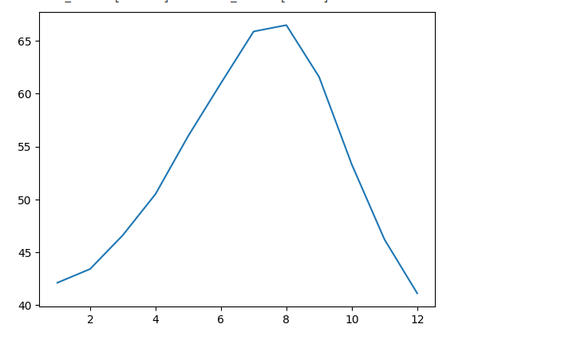


## Adding Multiple Lines

We can overlay multiple datasets by calling .plot() multiple times.


\AddToHookNext{env/Highlighting/begin}{\tiny}

```python
import matplotlib.pyplot as plt
# Create a blank figure and axes
fig, ax = plt.subplots()
ax.plot(seattle_weather["MONTH"], seattle_weather["MLY-TAVG-NORMAL"], label="Seattle")
# Plot Austin data
ax.plot(austin_weather["MONTH"], austin_weather["MLY-TAVG-NORMAL"], label="Austin")
# Add legend
ax.legend()
plt.show()
```

## Adding Multiple Lines


##  Customizing Plots:Adding Titles and Labels

We can customize our plots by setting labels and titles.

\AddToHookNext{env/Highlighting/begin}{\tiny}

```python
fig, ax = plt.subplots()
ax.plot(seattle_weather["MONTH"], seattle_weather["MLY-TAVG-NORMAL"])
```

##  Customizing Plots:Adding Titles and Labels

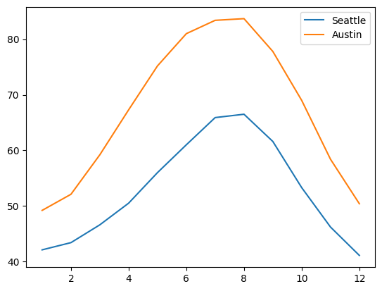


##  Customizing Plots:Adding Titles and Labels

\AddToHookNext{env/Highlighting/begin}{\tiny}

```python
import matplotlib.pyplot as plt
# Create a blank figure and axes
fig, ax = plt.subplots()
ax.plot(seattle_weather["MONTH"], seattle_weather["MLY-TAVG-NORMAL"], label="Seattle")
# Plot Austin data
ax.plot(austin_weather["MONTH"], austin_weather["MLY-TAVG-NORMAL"], label="Austin")
# Add legend
ax.legend()
# Adding labels and title
ax.set_xlabel("Time (months)")
ax.set_ylabel("Average Temperature (°F)")
ax.set_title("Seattle Monthly Average Temperature")
plt.show()
```

##  Customizing Plots:Adding Titles and Labels

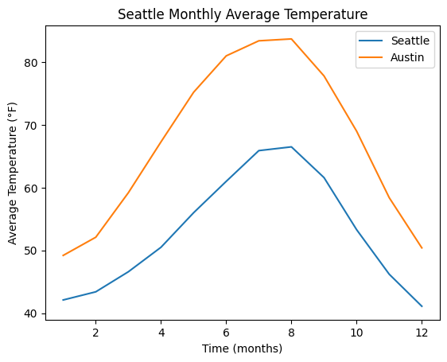

## Changing Line Styles and Markers

We can customize line styles (linestyle), colors (color), and markers (marker).

\AddToHookNext{env/Highlighting/begin}{\tiny}

```python
fig, ax = plt.subplots()
ax.plot(seattle_weather["MONTH"], seattle_weather["MLY-TAVG-NORMAL"], marker="o", linestyle="--", color="r")
plt.show()
```

## Changing Line Styles and Markers

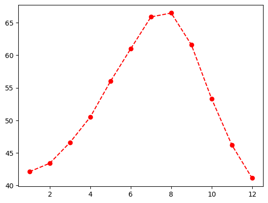

## Changing Line Styles and Markers

- marker="o" adds circular markers.
- linestyle="--" makes a dashed line.
- color="r" makes the line red.

## Using Subplots: Creating Multiple Subplots

We can create multiple smaller plots within a single figure.

\AddToHookNext{env/Highlighting/begin}{\tiny}

```python
# Create a Figure and an array of subplots with 2 rows and 2 columns
fig, ax = plt.subplots(2, 2)

# Addressing the top left Axes as index 0, 0, plot month and Seattle precipitation
ax[0, 0].plot(seattle_weather["MONTH"], seattle_weather["MLY-PRCP-NORMAL"])

# In the top right (index 0,1), plot month and Seattle temperatures
ax[0, 1].plot(seattle_weather["MONTH"], seattle_weather["MLY-TAVG-NORMAL"])

# In the bottom left (1, 0) plot month and Austin precipitations
ax[1, 0].plot(austin_weather["MONTH"], austin_weather["MLY-PRCP-NORMAL"])

# In the bottom right (1, 1) plot month and Austin temperatures
ax[1, 1].plot(austin_weather["MONTH"], austin_weather["MLY-TAVG-NORMAL"])
plt.show()
```

## Using Subplots: Creating Multiple Subplots

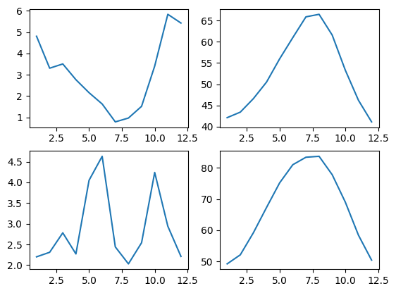


## Small multiples with shared y axis

When creating small multiples, it is often preferable to make sure that the different plots are displayed with the same scale used on the y-axis. 

This can be configured by setting the sharey key-word to True.

## Small multiples with shared y axis

In this exercise, you will create a Figure with two Axes objects that share their y-axis. 

As before, the data is provided in seattle_weather and austin_weather DataFrames.

## Small multiples with shared y axis

\AddToHookNext{env/Highlighting/begin}{\tiny}

```python
# Create a figure and an array of axes: 2 rows, 1 column with shared y axis
fig, ax = plt.subplots(2, 1, sharey=True)

# Plot Seattle precipitation in the top axes
ax[0].plot(seattle_weather["MONTH"], seattle_weather["MLY-PRCP-NORMAL"], color='b')
ax[0].plot(seattle_weather["MONTH"], seattle_weather["MLY-PRCP-25PCTL"], color='b', linestyle='--')
ax[0].plot(seattle_weather["MONTH"], seattle_weather["MLY-PRCP-75PCTL"], color='b', linestyle='--')
```


## Small multiples with shared y axis

\AddToHookNext{env/Highlighting/begin}{\tiny}

```python
# Plot Austin precipitation in the bottom axes
ax[1].plot(austin_weather["MONTH"], austin_weather["MLY-PRCP-NORMAL"], color='r')
ax[1].plot(austin_weather["MONTH"], austin_weather["MLY-PRCP-25PCTL"], color='r', linestyle='--')
ax[1].plot(austin_weather["MONTH"], austin_weather["MLY-PRCP-75PCTL"], color='r', linestyle='--')

plt.show()
```


## Small multiples with shared y axis

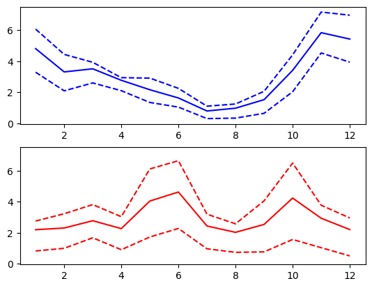


# Plotting time-series

## Read data with a time index

**pandas DataFrame** objects can have an index denoting time, this recognized by Matplotlib for axis labeling.

This exercise involves reading data from climate_change.csv, containing CO2 levels and temperatures recorded on the 6th of each month from 1958 to 2016, using pandas’ read_csv function. 


## Read data with a time index

The parse_dates and index_col arguments help set a DateTimeIndex.

Don’t forget to check out the Matplotlib Cheat Sheet for a quick overview of essential concepts and methods.


## Read data with a time index

\AddToHookNext{env/Highlighting/begin}{\tiny}

```python
# Import pandas
import pandas as pd
```

## Read data with a time index

\AddToHookNext{env/Highlighting/begin}{\tiny}

```python
# Read the data from file using read_csv
import pandas as pd
import matplotlib.pyplot as plt
# URLs for the datasets
climate_url = "https://raw.githubusercontent.com/endri81/DataVisualization/refs/heads/main/data/climate_change.csv"
# Load datasets
climate_change = pd.read_csv(climate_url, parse_dates=["date"], index_col="date")
```


## Plot time-series data

To plot time-series data, we use the Axes object plot command. 

The first argument to this method are the values for the x-axis and the second argument are the values for the y-axis.


## Plot time-series data

This exercise provides data stored in a DataFrame called climate_change. 

This variable has a time-index with the dates of measurements and two data columns: "co2" and "relative_temp".


## Plot time-series data

In this case, the index of the DataFrame would be used as the x-axis values and we will plot the values stored in the "relative_temp" column as the y-axis values. 

We will also properly label the x-axis and y-axis.


## Plot time-series data

\AddToHookNext{env/Highlighting/begin}{\tiny}

```python
import matplotlib.pyplot as plt
fig, ax = plt.subplots()

# Add the time-series for "relative_temp" to the plot
ax.plot(climate_change.index, climate_change['relative_temp'])
```

## Plot time-series data

\AddToHookNext{env/Highlighting/begin}{\tiny}

```python
# Set the x-axis label
ax.set_xlabel('Time')

# Set the y-axis label 
ax.set_ylabel('Relative temperature (Celsius)')

# Show the figure
plt.show()
```

## Plot time-series data

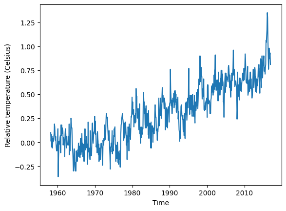

## Using a time index to zoom in

When a time-series is represented with a time index, we can use this index for the x-axis when plotting. 

We can also select a range of dates to zoom in on a particular period within the time-series using pandas’ indexing facilities. 

## Using a time index to zoom in

In this exercise, you will select a portion of a time-series dataset and you will plot that period.

The data to use is stored in a DataFrame called climate_change, which has a time-index with dates of measurements and two data columns: "co2" and "relative_temp".


## Using a time index to zoom in

\AddToHookNext{env/Highlighting/begin}{\tiny}

```python
import matplotlib.pyplot as plt

# Use plt.subplots to create fig and ax
fig, ax = plt.subplots()

# Create variable seventies with data from "1970-01-01" to "1979-12-31"
seventies = climate_change["1970-01-01":"1979-12-31"]
```


## Using a time index to zoom in

\AddToHookNext{env/Highlighting/begin}{\tiny}

```python
# Add the time-series for "co2" data from seventies to the plot
ax.plot(seventies.index, seventies["co2"])

# Show the figure
plt.show()
```

## Using a time index to zoom in

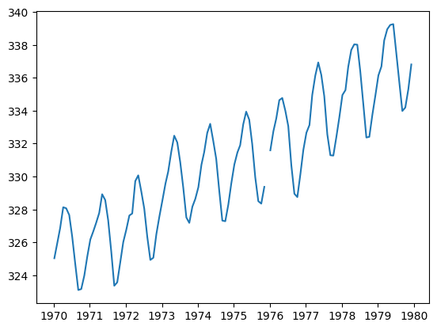

## Plotting two variables

If you want to plot two time-series variables that were recorded at the same times, you can add both of them to the same subplot.

If the variables have very different scales, you’ll want to make sure that you plot them in different twin Axes objects. 


## Plotting two variables

These objects can share one axis (for example, the time, or x-axis) while not sharing the other (the y-axis).

To create a twin Axes object that shares the x-axis, we use the twinx method.


## Plotting two variables

In this exercise, you’ll have access to a DataFrame that has the climate_change data loaded into it. 

This DataFrame was loaded with the "date" column set as a DateTimeIndex, and it has a column called "co2" with carbon dioxide measurements and a column called "relative_temp" with temperature measurements.


## Plotting two variables

\AddToHookNext{env/Highlighting/begin}{\tiny}

```python
import matplotlib.pyplot as plt

# Initalize a Figure and Axes
fig, ax = plt.subplots()

# Plot the CO2 variable in blue
ax.plot(climate_change.index, climate_change["co2"], color='blue')
```


## Plotting two variables

\AddToHookNext{env/Highlighting/begin}{\tiny}

```python
# Create a twin Axes that shares the x-axis
ax2 = ax.twinx()

# Plot the relative temperature in red
ax2.plot(climate_change.index, climate_change["relative_temp"], color='red')

plt.show()
```

## Plotting two variables

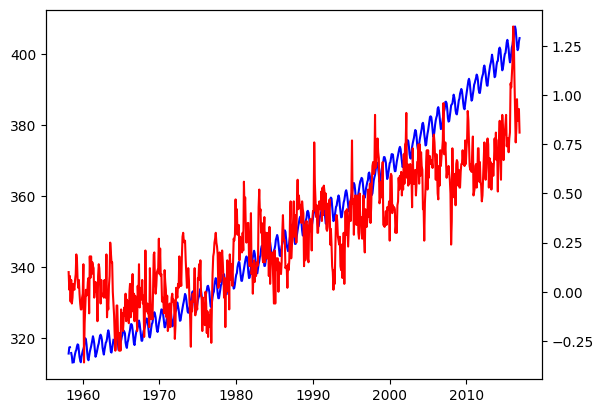


## Defining a function that plots time-series data

Once you realize that a particular section of code that you have written is useful, it is a good idea to define a function that saves that section of code for you, rather than copying it to other parts of your program where you would like to use this code.


## Defining a function that plots time-series data

Here, we will define a function that takes inputs such as a time variable and some other variable and plots them as x and y inputs. 

Then, it sets the labels on the x- and y-axis and sets the colors of the y-axis label, the y-axis ticks and the tick labels.

## Defining a function that plots time-series data


\AddToHookNext{env/Highlighting/begin}{\tiny}

```python
# Define a function called plot_timeseries
def plot_timeseries(axes, x, y, color, xlabel, ylabel):

  # Plot the inputs x,y in the provided color
  axes.plot(x, y, color=color)

  # Set the x-axis label
  axes.set_xlabel(xlabel)
```


## Defining a function that plots time-series data


\AddToHookNext{env/Highlighting/begin}{\tiny}

```python

  # Set the y-axis label
  axes.set_ylabel(ylabel, color=color)

  # Set the colors tick params for y-axis
  axes.tick_params('y', colors=color)
```


## Using a plotting function

Defining functions allows us to reuse the same code without having to repeat all of it. Programmers sometimes say “Don’t repeat yourself”.


## Using a plotting function

In the previous exercise, you defined a function called plot_timeseries:

\AddToHookNext{env/Highlighting/begin}{\tiny}

```python
plot_timeseries(axes, x, y, color, xlabel, ylabel)
```

that takes an Axes object (as the argument axes), time-series data (as x and y arguments) the name of a color (as a string, provided as the color argument) and x-axis and y-axis labels (as xlabel and ylabel arguments). 


## Using a plotting function

In this exercise, the function plot_timeseries is already defined and provided to you.

Use this function to plot the climate_change time-series data, provided as a pandas DataFrame object that has a DateTimeIndex with the dates of the measurements and co2 and relative_temp columns.

## Using a plotting function

\AddToHookNext{env/Highlighting/begin}{\tiny}

```python
fig, ax = plt.subplots()

# Plot the CO2 levels time-series in blue
plot_timeseries(ax, climate_change.index, climate_change["co2"], 'blue', "Time (years)", "CO2 levels")

# Create a twin Axes object that shares the x-axis
ax2 = ax.twinx()
```


## Using a plotting function

\AddToHookNext{env/Highlighting/begin}{\tiny}

```python
# Plot the relative temperature data in red
plot_timeseries(ax2, climate_change.index, climate_change['relative_temp'], 'red', "Time (years)", "Relative temperature (Celsius)")

plt.show()
```


## Using a plotting function

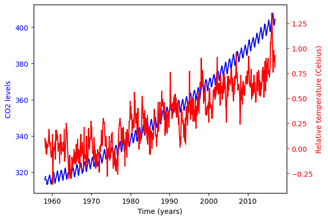

## Annotating a plot of time-series data

Annotating a plot allows us to highlight interesting information in the plot. 

For example, in describing the climate change dataset, we might want to point to the date at which the relative temperature first exceeded 1 degree Celsius.


## Annotating a plot of time-series data

For this, we will use the annotate method of the Axes object. 

In this exercise, you will have the DataFrame called climate_change loaded into memory. 

Using the Axes methods, plot only the relative temperature column as a function of dates, and annotate the data.

## Annotating a plot of time-series data

\AddToHookNext{env/Highlighting/begin}{\tiny}

```python
fig, ax = plt.subplots()

# Plot the relative temperature data
ax.plot(climate_change.index, climate_change['relative_temp'])

# Annotate the date at which temperatures exceeded 1 degree
ax.annotate(">1 degree", xy=(pd.Timestamp('2015-10-06'), 1))

plt.show()
```


## Annotating a plot of time-series data

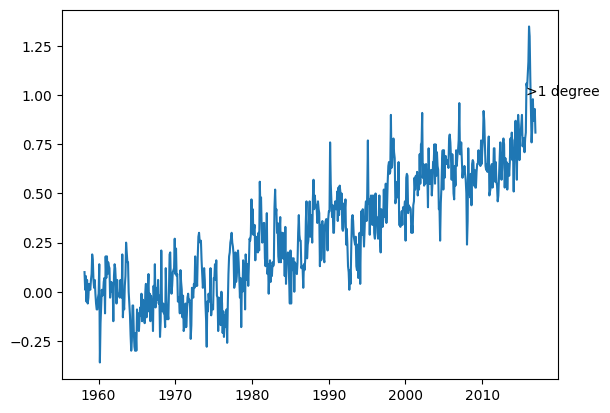


## Plotting time-series: putting it all together

In this exercise, you will plot two time-series with different scales on the same Axes, and annotate the data from one of these series.

The CO2/temperatures data is provided as a DataFrame called climate_change. 


## Plotting time-series: putting it all together

You should also use the function that we have defined before, called plot_timeseries, which takes an Axes object (as the axes argument) plots a time-series (provided as x and y arguments), sets the labels for the x-axis and y-axis and sets the color for the data, and for the y tick/axis labels:


## Plotting time-series: putting it all together

\AddToHookNext{env/Highlighting/begin}{\tiny}

```python
plot_timeseries(axes, x, y, color, xlabel, ylabel)
```


## Plotting time-series: putting it all together

Then, you will annotate with text an important time-point in the data: on 2015-10-06, when the temperature first rose to above 1 degree over the average.

## Plotting time-series: putting it all together

\AddToHookNext{env/Highlighting/begin}{\tiny}

```python

fig, ax = plt.subplots()

# Plot the CO2 levels time-series in blue
plot_timeseries(ax, climate_change.index, climate_change["co2"], 'blue', "Time (years)", "CO2 levels")

# Create an Axes object that shares the x-axis
ax2 = ax.twinx()
```

## Plotting time-series: putting it all together

\AddToHookNext{env/Highlighting/begin}{\tiny}

```python

# Plot the relative temperature data in red
plot_timeseries(ax2, climate_change.index, climate_change['relative_temp'], 'red', "Time (years)", "Relative temp (Celsius)")

# Annotate the point with relative temperature >1 degree
ax2.annotate(">1 degree", xy=(pd.Timestamp('2015-10-06'), 1), xytext=(pd.Timestamp('2008-10-06'), -0.2), arrowprops={'arrowstyle':'->', 'color':'gray'})

plt.show()
```

## Plotting time-series: putting it all together

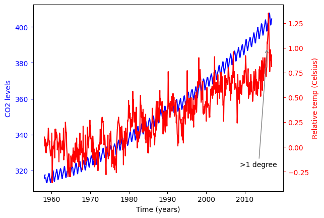


# Quantitative comparisons and statistical visualizations

## Bar chart

Bar charts visualize data that is organized according to categories as a series of bars, where the height of each bar represents the values of the data in this category.


## Bar chart

For example, in this exercise, you will visualize the number of gold medals won by each country in the provided medals DataFrame. 

The DataFrame contains the countries as the index, and a column called "Gold" that contains the number of gold medals won by each country, according to their rows.

## Bar chart

\AddToHookNext{env/Highlighting/begin}{\tiny}

```python
import pandas as pd
import matplotlib.pyplot as plt

# URL for the dataset
medals_url = "https://raw.githubusercontent.com/endri81/DataVisualization/refs/heads/main/data/medals_by_country_2016.csv"

# Load dataset
medals = pd.read_csv(medals_url)

# Set 'Country' as index if it's not already
if "Country" in medals.columns:
    medals.set_index("Country", inplace=True)


```

## Bar chart

\AddToHookNext{env/Highlighting/begin}{\tiny}

```python
# Create figure and axis
fig, ax = plt.subplots()

# Plot a bar chart of gold medals as a function of country
ax.bar(medals.index, medals["Gold"])

# Set the x-axis tick labels to the country names
ax.set_xticks(range(len(medals.index)))  # Set tick positions
ax.set_xticklabels(medals.index, rotation=90)  # Set tick labels

# Set the y-axis label
ax.set_ylabel("Number of Gold Medals")

# Display the plot
plt.show()
```

## Bar chart


## Stacked bar chart

A stacked bar chart contains bars, where the height of each bar represents values. 

In addition, stacked on top of the first variable may be another variable. 

## Stacked bar chart

The additional height of this bar represents the value of this variable. And you can add more bars on top of that.

In this exercise, you will have access to a DataFrame called medals that contains an index that holds the names of different countries, and three columns: "Gold", "Silver" and "Bronze". 


## Stacked bar chart

You will also have a Figure, fig, and Axes, ax, that you can add data to.

You will create a stacked bar chart that shows the number of gold, silver, and bronze medals won by each country, and you will add labels and create a legend that indicates which bars represent which medals.

## Stacked bar chart


\AddToHookNext{env/Highlighting/begin}{\tiny}

```python
fig, ax = plt.subplots()

# Add bars for "Gold" with the label "Gold"
ax.bar(medals.index, medals["Gold"], label="Gold")

# Stack bars for "Silver" on top with label "Silver"
ax.bar(medals.index, medals["Silver"], bottom=medals["Gold"], label="Silver")
```


## Stacked bar chart


\AddToHookNext{env/Highlighting/begin}{\tiny}

```python
# Stack bars for "Bronze" on top of that with label "Bronze"
ax.bar(medals.index, medals["Bronze"], bottom=medals["Gold"] + medals["Silver"], label="Bronze")

# Display the legend
ax.legend()

plt.show()
```


## Stacked bar chart


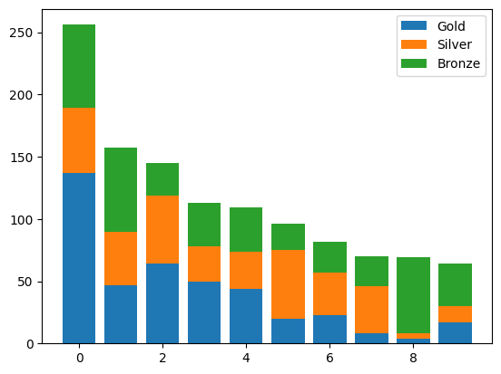

## Creating histograms

Histograms show the full distribution of a variable. 

In this exercise, we will display the distribution of weights of medalists in gymnastics and in rowing in the 2016 Olympic games for a comparison between them.


## Creating histograms

You will have two DataFrames to use. 

The first is called mens_rowing and includes information about the medalists in the men’s rowing events. 

The other is called mens_gymnastics and includes information about medalists in all of the Gymnastics events.

## Creating histograms

\AddToHookNext{env/Highlighting/begin}{\tiny}

```python
import pandas as pd
import matplotlib.pyplot as plt

# URL for the dataset
summer_medals_url = "https://raw.githubusercontent.com/endri81/DataVisualization/refs/heads/main/data/summer2016.csv"

# Load dataset
summer_2016_medals = pd.read_csv(summer_medals_url)

# Set 'Country' as index if it's not already
if "Country" in medals.columns:
    medals.set_index("Country", inplace=True)

```


\AddToHookNext{env/Highlighting/begin}{\tiny}

```python
mens_rowing = summer_2016_medals[(summer_2016_medals['Sport'] == 'Rowing') & (summer_2016_medals['Sex'] == 'M')]
mens_gymnastics = summer_2016_medals[(summer_2016_medals['Sport'] == 'Gymnastics') & (summer_2016_medals['Sex'] == 'M')]
fig, ax = plt.subplots()
# Plot a histogram of "Weight" for mens_rowing
ax.hist(mens_rowing["Weight"])
```


## Creating histograms

\AddToHookNext{env/Highlighting/begin}{\tiny}

```python
# Compare to histogram of "Weight" for mens_gymnastics
ax.hist(mens_gymnastics["Weight"])

# Set the x-axis label to "Weight (kg)"
ax.set_xlabel("Weight (kg)")

# Set the y-axis label to "# of observations"
ax.set_ylabel("# of observations")

plt.show()
```

## Creating histograms

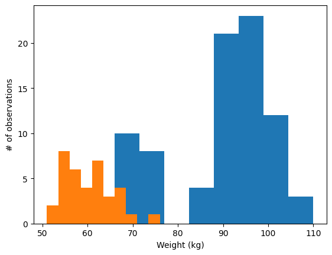


## “Step” histogram

Histograms allow us to see the distributions of the data in different groups in our data. 

In this exercise, you will select groups from the Summer 2016 Olympic Games medalist dataset to compare the height of medalist athletes in two different sports.


## “Step” histogram

The data is stored in a pandas DataFrame object called summer_2016_medals that has a column “Height”. 

In addition, you are provided a pandas GroupBy object that has been grouped by the sport.


## “Step” histogram

In this exercise, you will visualize and label the histograms of two sports: “Gymnastics” and “Rowing” and see the marked difference between medalists in these two sports.

## “Step” histogram

\AddToHookNext{env/Highlighting/begin}{\tiny}

```python
fig, ax = plt.subplots()

# Plot a histogram of "Weight" for mens_rowing
ax.hist(mens_rowing["Weight"], histtype='step', label="Rowing", bins=5)
## (array([ 3., 18.,  4., 44., 15.]), array([ 55.,  66.,  77.,  88.,  99., 110.]), [<matplotlib.patches.Polygon object at 0x73f36d1f8d70>])
```

## “Step” histogram

\AddToHookNext{env/Highlighting/begin}{\tiny}

```python
# Compare to histogram of "Weight" for mens_gymnastics
ax.hist(mens_gymnastics["Weight"], histtype='step', label="Gymnastics", bins=5)
## (array([10., 10., 10.,  5.,  1.]), array([51., 56., 61., 66., 71., 76.]), [<matplotlib.patches.Polygon object at 0x73f36d21b1a0>])
ax.set_xlabel("Weight (kg)")
ax.set_ylabel("# of observations")

# Add the legend and show the Figure
ax.legend()
plt.show()
```

## “Step” histogram

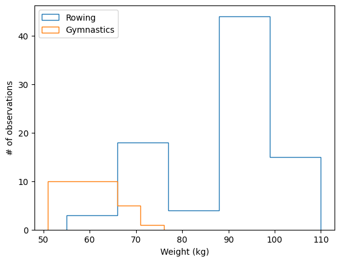


## Adding error-bars to a bar chart

Statistical plotting techniques add quantitative information for comparisons into the visualization. 

For example, in this exercise, we will add error bars that quantify not only the difference in the means of the height of medalists in the 2016 Olympic Games, but also the standard deviation of each of these groups, as a way to assess whether the difference is substantial relative to the variability within each group.

## Adding error-bars to a bar chart

For the purpose of this exercise, you will have two DataFrames: mens_rowing holds data about the medalists in the rowing events and mens_gymnastics will hold information about the medalists in the gymnastics events.

## Adding error-bars to a bar chart

\AddToHookNext{env/Highlighting/begin}{\tiny}

```python
fig, ax = plt.subplots()

# Add a bar for the rowing "Height" column mean/std
ax.bar("Rowing", mens_rowing["Height"].mean(), yerr=mens_rowing["Height"].std())

# Add a bar for the gymnastics "Height" column mean/std
ax.bar("Gymnastics", mens_gymnastics["Height"].mean(), yerr=mens_gymnastics["Height"].std())

# Label the y-axis
ax.set_ylabel("Height (cm)")

plt.show()
```

## Adding error-bars to a bar chart

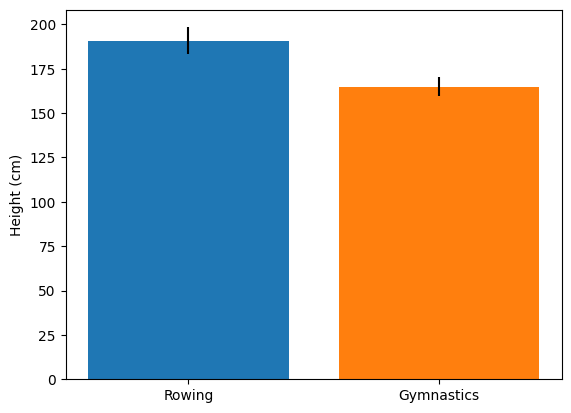


## Adding error-bars to a plot

Adding error-bars to a plot is done by using the errorbar method of the Axes object.

## Adding error-bars to a plot

Here, you have two DataFrames loaded: seattle_weather has data about the weather in Seattle and austin_weather has data about the weather in Austin. 

Each DataFrame has a column "MONTH" that has the names of the months, a column "MLY-TAVG-NORMAL" that has the average temperature in each month and a column "MLY-TAVG-STDDEV" that has the standard deviation of the temperatures across years.


## Adding error-bars to a plot

In the exercise, you will plot the mean temperature across months and add the standard deviation at each point as y errorbars.

## Adding error-bars to a plot

\AddToHookNext{env/Highlighting/begin}{\tiny}

```python
fig, ax = plt.subplots()

# Add the Seattle temperature data in each month with standard deviation error bars
ax.errorbar(seattle_weather["MONTH"], seattle_weather["MLY-TAVG-NORMAL"], yerr=seattle_weather["MLY-TAVG-STDDEV"])

# Add the Austin temperature data in each month with standard deviation error bars
ax.errorbar(austin_weather["MONTH"], austin_weather["MLY-TAVG-NORMAL"], yerr=austin_weather["MLY-TAVG-STDDEV"])

# Set the y-axis label
ax.set_ylabel("Temperature (Fahrenheit)")

plt.show()
```


## Creating boxplots

Boxplots provide additional information about the distribution of the data that they represent. 

They tell us what the median of the distribution is, what the inter-quartile range is and also what the expected range of approximately 99% of the data should be. Outliers beyond this range are particularly highlighted.


## Creating boxplots

In this exercise, you will use the data about medalist heights that you previously visualized as histograms, and as bar charts with error bars, and you will visualize it as boxplots.

## Creating boxplots

Again, you will have the mens_rowing and mens_gymnastics DataFrames available to you, and both of these DataFrames have columns called "Height" that you will compare.

## Creating boxplots

\AddToHookNext{env/Highlighting/begin}{\tiny}

```python
fig, ax = plt.subplots()

# Add a boxplot for the "Height" column in the DataFrames
ax.boxplot([mens_rowing["Height"], mens_gymnastics["Height"]])

# Add x-axis tick labels:
ax.set_xticklabels(["Rowing", "Gymnastics"])

# Add a y-axis label
ax.set_ylabel("Height (cm)")

plt.show()
```

## Creating boxplots

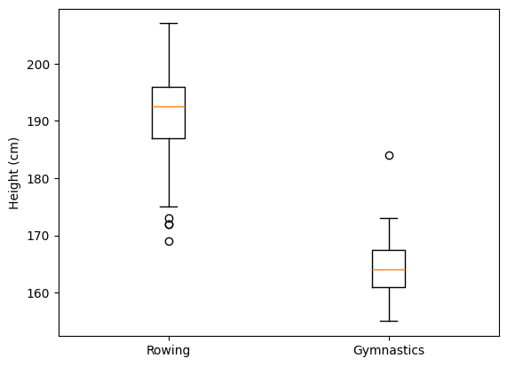


## Simple scatter plot

Scatter are a bi-variate visualization technique. They plot each record in the data as a point. 

The location of each point is determined by the value of two variables: the first variable determines the distance along the x-axis and the second variable determines the height along the y-axis.

## Simple scatter plot

In this exercise, you will create a scatter plot of the climate_change data. 

This DataFrame, which is already loaded, has a column "co2" that indicates the measurements of carbon dioxide every month and another column, "relative_temp" that indicates the temperature measured at the same time.

## Simple scatter plot

\AddToHookNext{env/Highlighting/begin}{\tiny}

```python
fig, ax = plt.subplots()

# Add data: "co2" on x-axis, "relative_temp" on y-axis
ax.scatter(climate_change["co2"], climate_change["relative_temp"])

# Set the x-axis label to "CO2 (ppm)"
ax.set_xlabel("CO2 (ppm)")

# Set the y-axis label to "Relative temperature (C)"
ax.set_ylabel("Relative temperature (C)")

plt.show()
```

## Simple scatter plot

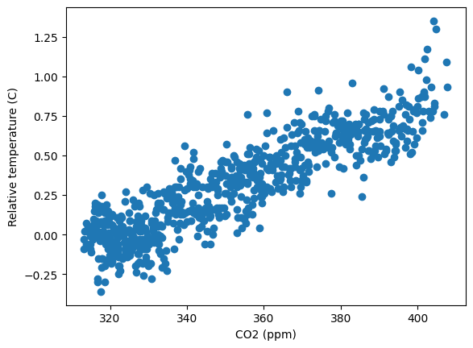


## Encoding time by color

The screen only has two dimensions, but we can encode another dimension in the scatter plot using color. 

Here, we will visualize the climate_change dataset, plotting a scatter plot of the "co2" column, on the x-axis, against the "relative_temp" column, on the y-axis. 


## Encoding time by color

We will encode time using the color dimension, with earlier times appearing as darker shades of blue and later times appearing as brighter shades of yellow.

## Encoding time by color

\AddToHookNext{env/Highlighting/begin}{\tiny}

```python
fig, ax = plt.subplots()

# Add data: "co2", "relative_temp" as x-y, index as color
ax.scatter(climate_change["co2"], climate_change["relative_temp"], c=climate_change.index)

# Set the x-axis label to "CO2 (ppm)"
ax.set_xlabel("CO2 (ppm)")

# Set the y-axis label to "Relative temperature (C)"
ax.set_ylabel("Relative temperature (C)")

plt.show()
```

## Encoding time by color


# Sharing visualizations with others

## Switching between styles

Selecting a style to use affects all of the visualizations that are created after this style is selected.

Here, you will practice plotting data in two different styles. 

## Switching between styles

The data you will use is the same weather data we used in the first lesson: you will have available to you the DataFrame seattle_weather and the DataFrame austin_weather, both with records of the average temperature in every month.

## Switching between styles

\AddToHookNext{env/Highlighting/begin}{\tiny}

```python
# Use the "ggplot" style and create new Figure/Axes
plt.style.use('ggplot')
fig, ax = plt.subplots()
ax.plot(seattle_weather["MONTH"], seattle_weather["MLY-TAVG-NORMAL"])
plt.show()
```

## Switching between styles

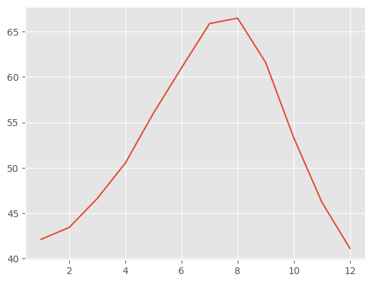

## Switching between styles

\AddToHookNext{env/Highlighting/begin}{\tiny}

```python
# Use the "Solarize_Light2" style and create new Figure/Axes
plt.style.use('Solarize_Light2')
fig, ax = plt.subplots()
ax.plot(austin_weather["MONTH"], austin_weather["MLY-TAVG-NORMAL"])
plt.show()
```


## Switching between styles

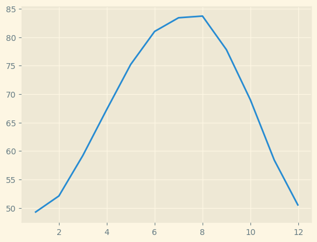

## Saving a file several times

If you want to share your visualizations with others, you will need to save them into files. Matplotlib provides as way to do that, through the savefig method of the Figure object. 

## Saving a file several times

In this exercise, you will save a figure several times. 

Each time setting the parameters to something slightly different. 


## Saving a file several times

\AddToHookNext{env/Highlighting/begin}{\tiny}

```python
plt.style.use("default")
fig, ax = plt.subplots()
ax.bar(medals.index, medals["Gold"])
ax.set_xticklabels(medals.index, rotation=90)
ax.set_ylabel("Number of medals")

# Show the figure
plt.show()
```

## Saving a file several times

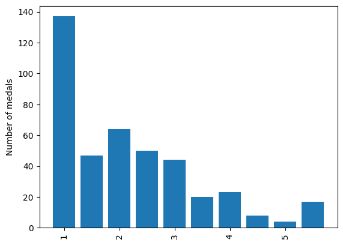


# Save as a PNG file

## Save as a PNG file

\AddToHookNext{env/Highlighting/begin}{\tiny}

```python
fig.savefig('my_figure.png')

# Save as a PNG file with 300 dpi
fig.savefig('my_figure_300dpi.png', dpi=300)
```


## Save a figure with different sizes

Before saving your visualization, you might want to also set the size that the figure will have on the page. 

To do so, you can use the Figure object’s set_size_inches method. This method takes a sequence of two values. 


## Save a figure with different sizes


The first sets the width and the second sets the height of the figure.

Here, you will again have a Figure object called fig already provided (you can run plt.show if you want to see its contents). 


## Save a figure with different sizes

\AddToHookNext{env/Highlighting/begin}{\tiny}

```python
# Set figure dimensions and save as a PNG
fig.set_size_inches([3, 5])
fig.savefig('figure_3_5.png')
# Set figure dimensions and save as a PNG
fig.set_size_inches([5, 3])
fig.savefig('figure_5_3.png')
```


## Unique values of a column

One of the main strengths of Matplotlib is that it can be automated to adapt to the data that it receives as input.

For example, if you receive data that has an unknown number of categories, you can still create a bar plot that has bars for each category.


## Unique values of a column

In this exercise and the next, you will be visualizing the weight of athletes in the 2016 summer Olympic Games again, from a dataset that has some unknown number of branches of sports in it. 


## Unique values of a column

This will be loaded into memory as a pandas DataFrame object called summer_2016_medals, which has a column called "Sport" that tells you to which branch of sport each row corresponds. 

There is also a "Weight" column that tells you the weight of each athlete.

In this exercise, we will extract the unique values of the "Sport" column

## Unique values of a column

\AddToHookNext{env/Highlighting/begin}{\tiny}

```python
# Extract the "Sport" column
sports_column = summer_2016_medals["Sport"]

# Find the unique values of the "Sport" column
sports = sports_column.unique()

# Print out the unique sports values
print(sports)
```


## Automate your visualization

One of the main strengths of Matplotlib is that it can be automated to adapt to the data that it receives as input. 

For example, if you receive data that has an unknown number of categories, you can still create a bar plot that has bars for each category.


## Automate your visualization

This is what you will do in this exercise. 

You will be visualizing data about medal winners in the 2016 summer Olympic Games again, but this time you will have a dataset that has some unknown number of branches of sports in it. 

## Automate your visualization

This will be loaded into memory as a pandas DataFrame object called summer_2016_medals, which has a column called "Sport" that tells you to which branch of sport each row corresponds. 

There is also a "Weight" column that tells you the weight of each athlete.

## Automate your visualization


\AddToHookNext{env/Highlighting/begin}{\tiny}

```python
fig, ax = plt.subplots()

# Loop over the different sports branches
for sport in sports:
  # Extract the rows only for this sport
  sport_df = summer_2016_medals[summer_2016_medals["Sport"] == sport]
  # Add a bar for the "Weight" mean with std y error bar
  ax.bar(sport, sport_df["Weight"].mean(), yerr=sport_df["Weight"].std())
```

## Automate your visualization

\AddToHookNext{env/Highlighting/begin}{\tiny}

```python
ax.set_ylabel("Weight")
ax.set_xticklabels(sports, rotation=90)

# Save the figure to file
fig.savefig("sports_weights.png")
```


## Automate your visualization


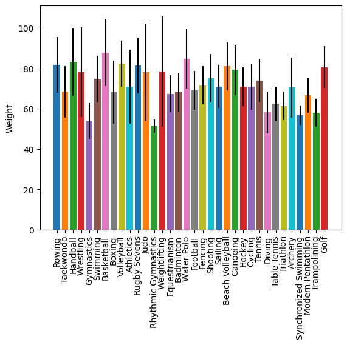
