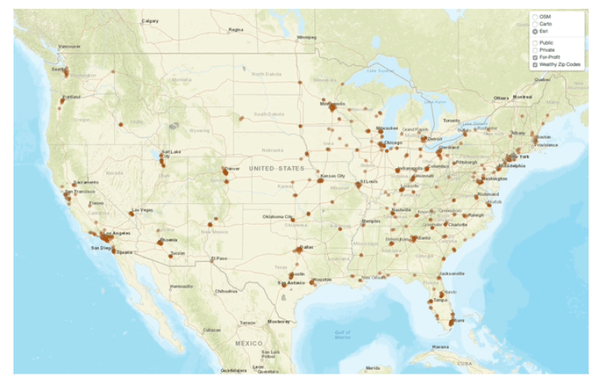
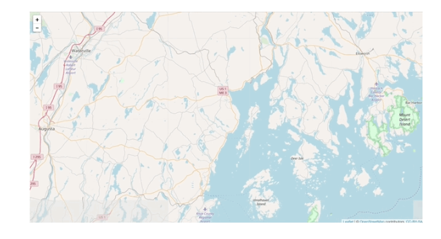
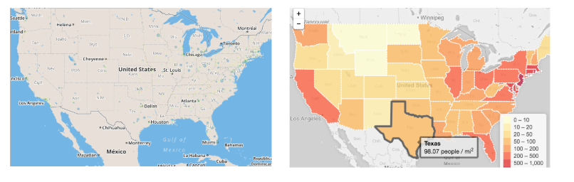
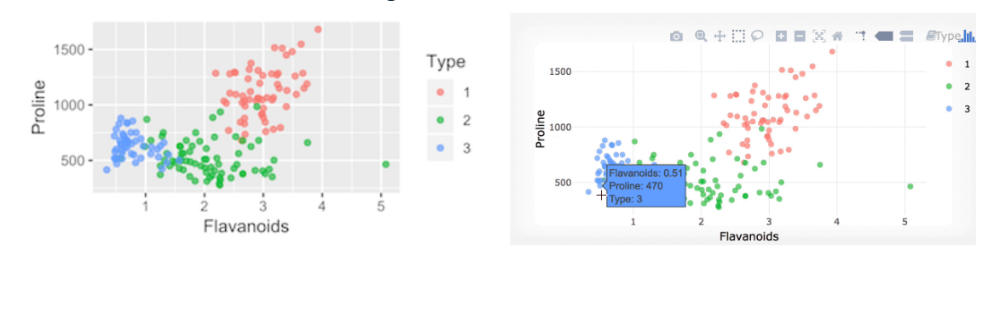

```{r setup, include=FALSE}
library(knitr)
library(tidyverse)
library(leaflet)  # Enables interactive maps
library(kableExtra)
knitr::opts_chunk$set(
  fig.width=8,   # Optimized for HTML slides
  fig.height=6,
  out.width="100%",  # Ensures proper rendering
  comment=NA,
  error=FALSE, 
  warning=FALSE,
  tidy=TRUE, 
  fig.align = 'center',
  message=FALSE, 
  tidy.opts=list(width.cutoff=80))
```


# Introduction

##  Introduction to leaflet

Welcome to this course on creating interactive maps using the **leaflet** package. 

## leaflet

  - Leaflet is a popular open-source JavaScript library for creating mobile-friendly, interactive maps. 
  
  - Thanks to the work of many leading R developers, we can create interactive maps with just a few lines of R code. 
  
  - You may already be familiar with leaflet maps, as they are used by leading technology companies, nonprofits, and government organizations to create informative and interactive maps.

## leaflet Example: National Parks Service

  - For example, the National Parks Service uses leaflet to create an interactive map of America's National Parks. 
  
  

## leaflet Example: National Parks Service

  - This map enables users to explore parks and monuments by state. 
  
  - For example, Maine, has one National Park, one International Park, and one National Monument. Clicking on any of these locations reveals a pop-up with additional information.

## What We are Working Toward

  - In this lecture, we will work towards building an interactive map like the one shown on this slide. 
  
   

## What We are Working Toward

  - This leaflet map plots all four-year colleges in America and color codes these institutions by sector to indicate if they are public, private, or            for-profit. 
  
  - Using the control panel in the upper right-hand corner, we can toggle the map between different base maps and we can select which sectors of colleges        appear on the map. 
  
## What We are Working Toward

  Later in the lecture, we will add a few pieces of flair to this map, such as labels that appear when hovering and the ability to search for a particular     college.

## Creating our First leaflet Map

  - But first we will learn about the core features of the leaflet library by mapping locations in Belgium and New York. 
  
  
## Creating our First leaflet Map  
  
  - **leaflet** builds maps using tiles. 
  
  - Tiled web maps join many map images together and when a user zooms or pans your interactive leaflet map, new tiles are fetched as needed to provide the     requested view of the map. 

## Creating our First leaflet Map  
  
Let's take a look at how this works in R. 
  
\AddToHookNext{env/Highlighting/begin}{\tiny}

```{r, cache=TRUE} 
library(leaflet)

leaflet() %>%
  addTiles()
```  
  
  First, we load the leaflet library. 
  

## Creating our First leaflet Map  
  
Then we initialize an html widget with the leaflet() function call. 
  
\AddToHookNext{env/Highlighting/begin}{\tiny}

```{r, cache=TRUE} 
library(leaflet)

leaflet() %>%
  addTiles()
```  
  
## Creating our First leaflet Map    

- You'll notice that leaflet leverages the pipe operator that is common in the tidyverse. 
   
   - This allows us to chain a series of functions together. 
   
   
## Creating our First leaflet Map

   For example, we can pipe the result of our 'leaflet(); call into the 'addTiles()' function to create an interactive map with just two-lines of R code!
  
     

## Where We are Going 

- For now, you will practice using different map tiles while working towards creating an interactive map that displays two of college's locations. 

  - Similar to adding a provider tile, you can add another layer to your map using the pipe operator to include markers that identify specific locations.


## Practice : Creating a Basic Web Map in R

We will use the leaflet package to initialize an HTML widget and add a map tile using addTiles().

**Steps:**

  - Load the leaflet library.

  - Call the leaflet() function to initialize the map.

  - Pipe the output into addTiles() to add default map tiles.

  - Run and explore the interactive map.


## Practice : Using Pipe Operators for Data Manipulation


\AddToHookNext{env/Highlighting/begin}{\tiny}

```{r, cache=TRUE} 
# Load the leaflet library
library(leaflet)

# Create a leaflet map with a default map tile using addTiles()
leaflet() %>%
  addTiles()
```

## Interactive Map Features

  - Zooming: Scroll or use buttons to zoom in/out.
  - Panning: Click and drag to move the map.
  - Customization: You can add markers, polygons, and popups.
  
## Provider Tiles

  - The leaflet package comes with over 100 base maps you can use. 
  
     
  
  - Now, we will start to explore the various tiles that we can use as the foundation of our web maps.

## Selecting a Base Map

  - As you work through the exercises, I encourage you to experiment with different base maps to expand your awareness of the available options. 
  
  - When you are selecting a base map there are several important questions to consider.
  
## Selecting a Base Map

  - Perhaps, primary among them is "Why are you making this map in the first place?" 
  
  - Is this map just for your use or is it part of a larger project that should fit within an existing design framework? 
  
  
## Selecting a Base Map

  - Secondly, "what type of data will you be plotting?" 
  
  - Will the geographic and topographic features of the base map add to the information you are presenting or confuse your users?

## Selecting a Base Map

  - In my work, I tend to prefer grayscale maps when plotting data. 
  
  - I find that these maps make it easier for me to distinguish between the data that I am plotting and the data included with the base map. 
  
## Selecting a Base Map

  - For example, in the map on the left the points are similar in color to features of base map, like the lakes, whereas in the map on the right the data we are plotting is easily distinguishable from the features of the base map.

## leaflet Provider List

  - There are over 100 provider tiles included in the leaflet package.
  
  - Most of these tiles you can use by calling the $addProviderTiles()$ function. 
  
## leaflet Provider List  
  
  - However, there are a few, like mapbox, that you will need to register for prior to using them. 
  
  - You can access the names of the provider tiles included in the leaflet package by calling the **names()** function on the providers list.
  
  
## leaflet Provider List  
  
  For example, to see the first five provider tiles, we call names() on the providers list followed by 1 colon 5 in brackets.

\AddToHookNext{env/Highlighting/begin}{\tiny}
```{r, cache=TRUE} 
names(providers)[1:5]
```

## Exploring leaflet Provider Tiles

The first five tiles are all OpenStreetMap tiles, so it might be more useful to print all of the tiles provided by OpenStreetMap, which you can do by using the $str\_detect()$ function from the **stringr** package.

\AddToHookNext{env/Highlighting/begin}{\tiny}

```{r, cache=TRUE} 
names(providers)[str_detect(names(providers), "OpenStreetMap")]
```

## addProviderTiles()

  - We can swap the default base map out for any of the included provider tiles using the **addProviderTiles()** function. 
  

For example, to create a leaflet map that uses the black and white OpenStreetMap, we replace the $addTiles()$ with $addProviderTiles()$ and pass in the name of the desired tile to the function.

\AddToHookNext{env/Highlighting/begin}{\tiny}

```{r, cache=TRUE} 
leaflet() %>% 
  addProviderTiles("OpenStreetMap.BlackAndWhite")
```


## Practice : Provider Tiles in Leaflet

- In previous exercises, we used `addTiles()` to add the default OpenStreetMap (OSM) tile.
- Leaflet provides **more than 100** provider tiles stored in the `providers` list.
- These can be used with `addProviderTiles()` instead of `addTiles()`.


## View all available map tiles

\AddToHookNext{env/Highlighting/begin}{\tiny}

```{r, cache=TRUE} 
# Print the providers list included in the leaflet library
providers
```

## Print only provider tile names

\AddToHookNext{env/Highlighting/begin}{\tiny}

```{r, cache=TRUE}
# Print only the names of the map tiles in the providers list
names(providers)
```

## Filtering Provider Tiles

\AddToHookNext{env/Highlighting/begin}{\tiny}

```{r, cache=TRUE}
library(stringr)

# Use str_detect() to find provider names containing "CartoDB"
str_detect(names(providers), "CartoDB")
```


## Print the actual provider names

\AddToHookNext{env/Highlighting/begin}{\tiny}

```{r, cache=TRUE}
library(stringr)
# Display provider tile names that include "CartoDB"
names(providers)[str_detect(names(providers), "CartoDB")]
```


## Adding a Custom Map Tile

Instead of the default OSM tile, we can use CartoDB or other tiles.

The function addProviderTiles() allows us to specify a provider from the list.

\AddToHookNext{env/Highlighting/begin}{\tiny}

```{r, cache=TRUE}
library(stringr)
library(leaflet)
# Change addTiles() to addProviderTiles() and set provider to "CartoDB"
leaflet() %>%
  addProviderTiles(provider = "CartoDB")
```


## Adding a Custom Map Tile

Now, that we have got the different providers, let’s try one of them and see how it’s different than the default one.

The first argument to addProviderTiles() is your leaflet map, which allows us to pipe leaflet() output directly into addProviderTiles(). 


## Adding a Custom Map Tile

The second argument is provider, which accepts any of the map tiles included in the providers list.


\AddToHookNext{env/Highlighting/begin}{\tiny}

```{r, cache=TRUE}
leaflet() %>% 
    addProviderTiles(provider = "CartoDB.DarkMatterNoLabels")
```

I’ve used the ‘CartoDB.DarkMatterNoLabels’ provider. And it has turned the map into dark mode actually!

## A Map with a View

You may have noticed that, by default, maps are zoomed out to the farthest level. 

Rather than manually zooming and panning, we can load the map centered on a particular point using the setView() function.

## A Map with a View

The default zoom level is 0 and can reach upto 19. 0 being the zoomed out stage.

\AddToHookNext{env/Highlighting/begin}{\tiny}

```{r, cache=TRUE}
leaflet()  %>% 
    addProviderTiles("CartoDB")  %>% 
    setView(lat = 27.1751, lng = 78.0421, zoom = 16)
```

## A Map with a Narrower View

We can limit users’ ability to pan away from the map’s focus using the options argument in the leaflet() function. 

By setting minZoom and dragging, we can create an interactive web map that will always be focused on a specific area. 

Although, user can zoom out using controls.


## A Map with a Narrower View


\AddToHookNext{env/Highlighting/begin}{\tiny}

```{r, cache=TRUE}
leaflet(options = 
        leafletOptions(minZoom = 14, dragging = FALSE))  %>% 
  addProviderTiles("CartoDB")  %>% 
  setView(lng = 78.0421, lat = 27.1751, zoom = 16) 
```

## A Map with a Narrower View

Alternatively, if we want our users to be able to drag the map while ensuring that they do not stray too far, we can set the maps maximum boundaries by specifying two diagonal corners of a rectangle.


## A Map with a Narrower View

\AddToHookNext{env/Highlighting/begin}{\tiny}

```{r, cache=TRUE}
library(tibble)
## Warning: package 'tibble' was built under R version 4.0.5
#R package that provides easy to use functions for creating tibbles, which is a modern rethinking of data frames. 

wonders <- tibble(
  place = c("Taj Mahal - India", "Petra - Jordan", "Christ the Redeemer - Brazil", "Colosseum - Italy"),
  lon = c(78.0421, 35.4444, 43.2105, 12.4922),
  lat = c(27.1751, 30.3285, 22.9519, 41.8902))
```


## A Map with a Narrower View

\AddToHookNext{env/Highlighting/begin}{\tiny}

```{r, cache=TRUE}
leaflet(options = leafletOptions(
                    # Set minZoom and dragging 
                    minZoom = 12, dragging = TRUE))  %>% 
  addProviderTiles("CartoDB")  %>% 
  
  # Set default zoom level 
  setView(lng = wonders$lon[2], lat = wonders$lat[2], zoom = 10) %>% 
  
  # Set max bounds of map 
  setMaxBounds(lng1 = wonders$lon[2] + .05, 
               lat1 = wonders$lat[2] + .05, 
               lng2 = wonders$lon[2] - .05, 
               lat2 = wonders$lat[2] - .05) 
```


## A Map with a Narrower View

Try, dragging this map. What do you notice. 

It cannot be dragged more than the max bounds we have set i.e. 0.05. 

So, the map stays in the focused mode and cannot be dragged further than set limits.

## Adding Markers

So far we have been creating maps with a single layer: a base map. 

We can add layers to this base map similar to how you add layers to a plot in ggplot2. 


## Adding Markers

One of the most common layers to add to a leaflet map is location markers, which you can add by piping the result of addTiles() or addProviderTiles() into the add markers function.

## Adding Markers

For example, if we plot Taj Mahal by passing the coordinates to addMarkers() as numeric vectors with one element, our web map will place a blue drop pin at the coordinate.


## Adding Markers

\AddToHookNext{env/Highlighting/begin}{\tiny}

```{r, cache=TRUE}
leaflet() %>%
  addProviderTiles("OpenStreetMap") %>%
  addMarkers(lng = wonders$lon[2], lat = wonders$lat[2])
```

## Add maps and store map as a R object

To make our map more informative we can add popups. 

To add popups that appear when a marker is clicked we need to specify the popup argument in the addMarkers() function. 

## Add maps and store map as a R object

Once we have a map we would like to preserve, we can store it in an object. 

Then we can pipe this object into functions to add or edit the map’s layers.


## Add maps and store map as a R object

\AddToHookNext{env/Highlighting/begin}{\tiny}

```{r, cache=TRUE}
wondersMap <- leaflet() %>%
  addTiles() %>%
  addMarkers(lng = wonders$lon, lat = wonders$lat,
             popup = wonders$place)
```


## Add maps and store map as a R object

We can add layers to the existing leaflet R object


\AddToHookNext{env/Highlighting/begin}{\tiny}

```{r, cache=TRUE}
map_zoom <- wondersMap %>%
  setView(lng = wonders$lon[4], lat = wonders$lat[4], zoom = 2)

map_zoom
```

## Cleaning up the Base Map

If you are storing leaflet maps in objects, there will come a time when you need to remove markers or reset the view. 

You can accomplish these tasks with the following functions.

  - clearMarkers()- Remove one or more features from a map

  - clearBounds()- Clear bounds and automatically determine bounds based on map elements

## Cleaning up the Base Map

To remove the markers and to reset the bounds of our m map we would:

\AddToHookNext{env/Highlighting/begin}{\tiny}

```{r, cache=TRUE}
map_zoom <- map_zoom %>% 
  addMarkers(lng = wonders$lon, lat = wonders$lat) %>%
  setView(lng = 20.6843, lat = 88.5678, zoom = 5)

map_zoom %>%
  clearMarkers() %>%
  clearBounds()
```


## Adding Markers

\AddToHookNext{env/Highlighting/begin}{\tiny}

```{r, cache=TRUE}
library(leaflet)
my_map <- leaflet() %>% 
  addTiles()  %>%
  addMarkers(lat=39.2980803, lng=-76.5898801, 
             popup="Jeff Leek's Office")
my_map
```


## Adding Many Markers

Adding one marker at a time is often not practical if you want to display many markers. 

If you have a data frame with columns lat and lng you can pipe that data frame into leaflet() to add all the points at once.


## Adding Many Markers

\AddToHookNext{env/Highlighting/begin}{\tiny}

```{r, cache=TRUE}
set.seed(2016-04-25)
df <- data.frame(lat = runif(20, min = 39.2, max = 39.3),
                 lng = runif(20, min = -76.6, max = -76.5))
df %>% 
  leaflet() %>%
  addTiles() %>%
  addMarkers()
```


## Making Custom Markers

The blue markers that leaflet comes packaged with may not be enough depending on what you’re mapping. 

Thankfully you can make your own markers from .png files.


## Making Custom Markers

\AddToHookNext{env/Highlighting/begin}{\tiny}

```{r, cache=TRUE}
unytIcon <- makeIcon(
  iconUrl = "https://upload.wikimedia.org/wikipedia/en/thumb/8/85/Logo_of_the_University_of_New_York%E2%80%93Tirana.svg/150px-Logo_of_the_University_of_New_York%E2%80%93Tirana.svg.png",
  iconWidth = 31*215/230, iconHeight = 31,
  iconAnchorX = 31*215/230/2, iconAnchorY = 16
)
```


## Making Custom Markers

\AddToHookNext{env/Highlighting/begin}{\tiny}

```{r, cache=TRUE}

unytLatLong <- data.frame(
  lat = c(41.3275),  # Latitude of UNYT
  lng = c(19.8189)   # Longitude of UNYT
)

unytLatLong %>% 
  leaflet() %>%
  addTiles() %>%
  addMarkers(icon = unytIcon)

```


## Adding Multiple Popups

When adding multiple markers to a map, you may want to add popups for each marker. 

You can specify a string of plain text for each popup, or you can provide HTML which will be rendered inside of each popup.


## Adding Multiple Popups

\AddToHookNext{env/Highlighting/begin}{\tiny}

```{r, cache=TRUE}
unytSites <- c(
  "<a href='https://unyt.edu.al/'>University of New York Tirana</a>",
  "<a href='https://unyt.edu.al/academics/'>UNYT Academics</a>",
  "<a href='https://unyt.edu.al/research/'>UNYT Research Center</a>",
  "<a href='https://unyt.edu.al/admissions/'>UNYT Admissions</a>",
  "<a href='https://unyt.edu.al/contact/'>UNYT Contact</a>"
)
```

## Adding Multiple Popups

\AddToHookNext{env/Highlighting/begin}{\tiny}

```{r, cache=TRUE}
unytLatLong <- data.frame(
  lat = c(41.3275, 41.3280, 41.3268, 41.3272, 41.3282),  # Approximate locations
  lng = c(19.8189, 19.8195, 19.8178, 19.8201, 19.8182)   # Adjusted for different locations
)
```

## Adding Multiple Popups

\AddToHookNext{env/Highlighting/begin}{\tiny}

```{r, cache=TRUE}
unytIcon <- makeIcon(
  iconUrl = "https://upload.wikimedia.org/wikipedia/en/thumb/8/85/Logo_of_the_University_of_New_York%E2%80%93Tirana.svg/150px-Logo_of_the_University_of_New_York%E2%80%93Tirana.svg.png",
  iconWidth = 31*215/230, iconHeight = 31,
  iconAnchorX = 31*215/230/2, iconAnchorY = 16
)
```

## Adding Multiple Popups

\AddToHookNext{env/Highlighting/begin}{\tiny}

```{r, cache=TRUE}

unytLatLong %>% 
  leaflet() %>%
  addTiles() %>%
  addMarkers(icon = unytIcon, popup = unytSites)


```


## Mapping Clusters

Sometimes you might have so many points on a map that it doesn’t make sense to plot every marker. 

In these situations leaflet allows you to plot clusters of markers using addMarkers(clusterOptions = markerClusterOptions()). 

When you zoom in to each cluster, the clusters will separate until you can see the individual markers.


## Mapping Clusters

\AddToHookNext{env/Highlighting/begin}{\tiny}

```{r, cache=TRUE}

# Generate 20 random points around the University of New York Tirana
df <- data.frame(
  lat = runif(20, min = 41.315, max = 41.335),  # Latitude range for Tirana
  lng = runif(20, min = 19.805, max = 19.830)   # Longitude range for Tirana
)
```


## Mapping Clusters

\AddToHookNext{env/Highlighting/begin}{\tiny}

```{r, cache=TRUE}

# Create a leaflet map with circle markers
df %>% 
  leaflet() %>%
  addTiles() %>%
  addCircleMarkers(
    radius = 5,  # Size of the circles
    color = "blue",  # Outline color
    fillColor = "lightblue",  # Fill color
    fillOpacity = 0.5,  # Transparency level
    stroke = TRUE
  )


```

## Mapping Clusters

Instead of adding markers or clusters you can easily add circle markers using addCircleMarkers().


## Mapping Clusters

\AddToHookNext{env/Highlighting/begin}{\tiny}

```{r, cache=TRUE}
# Generate 500 random points around Tirana, Albania
df <- data.frame(
  lat = runif(500, min = 41.315, max = 41.335),  # Latitude range for Tirana
  lng = runif(500, min = 19.805, max = 19.830)   # Longitude range for Tirana
)
```

## Mapping Clusters

\AddToHookNext{env/Highlighting/begin}{\tiny}

```{r, cache=TRUE}
# Create a leaflet map with clustered markers
df %>% 
  leaflet() %>%
  addTiles() %>%
  addMarkers(clusterOptions = markerClusterOptions())


```


## Drawing Circles

You can draw arbitrary shapes on the maps you create, including circles and squares. 

The code below draws a map where the circle on each city is proportional to the population of that city.


## Drawing Circles

\AddToHookNext{env/Highlighting/begin}{\tiny}

```{r, cache=TRUE}
# Data for major cities in Albania with estimated population
albania_cities <- data.frame(
  name = c("Tirana", "Durres", "Vlore", "Shkoder", "Fier",
           "Korce", "Berat", "Elbasan", "Lushnje", "Gjirokaster"),
  pop = c(418495, 201110, 130827, 135612, 120655,
          75694, 60331, 141714, 83274, 25000),  # Approximate population values
  lat = c(41.3275, 41.3167, 40.4667, 42.0667, 40.7250,
          40.6167, 40.7050, 41.1125, 40.9333, 40.0783),
  lng = c(19.8189, 19.4500, 19.4897, 19.5156, 19.5561,
          20.7667, 19.9522, 20.0822, 19.7050, 20.1333)
)
```

## Drawing Circles

\AddToHookNext{env/Highlighting/begin}{\tiny}

```{r, cache=TRUE}
# Create a leaflet map with circle sizes representing city population
albania_cities %>%
  leaflet() %>%
  addTiles() %>%
  addCircles(
    weight = 1,
    radius = sqrt(albania_cities$pop) * 30,  # Adjusted radius to scale with population
    color = "blue",  # Outline color
    fillColor = "lightblue",  # Fill color
    fillOpacity = 0.5,  # Transparency
    popup = ~paste0("<b>", name, "</b><br>Population: ", pop)  # Popup with city name & population
  )
```


## Drawing Rectangles

You can add rectangles on leaflet maps as well:


## Drawing Rectangles

\AddToHookNext{env/Highlighting/begin}{\tiny}

```{r, cache=TRUE}
# Create a leaflet map with a rectangle in Tirana
leaflet() %>%
  addTiles() %>%
  addRectangles(
    lat1 = 41.3220, lng1 = 19.8100,  # Bottom-left corner of rectangle
    lat2 = 41.3300, lng2 = 19.8250,  # Top-right corner of rectangle
    color = "black", weight = 2, fillOpacity = 0.3
  )
```


## Drawing Rectangles

\AddToHookNext{env/Highlighting/begin}{\tiny}

```{r, cache=TRUE}
# Generate 20 random points around Tirana with different colors
df <- data.frame(
  lat = runif(20, min = 41.315, max = 41.335),  # Latitude range for Tirana
  lng = runif(20, min = 19.805, max = 19.830),  # Longitude range for Tirana
  col = sample(c("red", "blue", "green"), 20, replace = TRUE),
  stringsAsFactors = FALSE
)
```

## Drawing Rectangles

\AddToHookNext{env/Highlighting/begin}{\tiny}

```{r, cache=TRUE}
# Create a leaflet map with circle markers and a legend
df %>%
  leaflet() %>%
  addTiles() %>%
  addCircleMarkers(color = df$col, fillOpacity = 0.7, radius = 5) %>%
  addLegend(position = "bottomright",
            labels = c("Category A", "Category B", "Category C"),
            colors = c("blue", "red", "green"),
            title = "Legend for Categories")

```


## Adding Legends


Adding a legend can be useful if you have markers on your map with different colors:


## Adding Legends


\AddToHookNext{env/Highlighting/begin}{\tiny}

```{r, cache=TRUE}
# Generate 20 random points around Tirana with different colors
df <- data.frame(
  lat = runif(20, min = 41.315, max = 41.335),  # Latitude range for Tirana
  lng = runif(20, min = 19.805, max = 19.830),  # Longitude range for Tirana
  col = sample(c("red", "blue", "green"), 20, replace = TRUE),
  stringsAsFactors = FALSE
)
```


## Adding Legends

\AddToHookNext{env/Highlighting/begin}{\tiny}

```{r, cache=TRUE}
# Create a leaflet map with circle markers and a legend
df %>%
  leaflet() %>%
  addTiles() %>%
  addCircleMarkers(
    color = df$col,
    fillOpacity = 0.7,
    radius = 5
  ) %>%
  addLegend(
    position = "bottomright",
    labels = c("Category A", "Category B", "Category C"),
    colors = c("blue", "red", "green"),
    title = "Legend for Categories"
  )

```


# Plotly

## plotly

The plotly R package provides an interface to the plotly JavaScript graphing library, allowing you to create interactive web-based graphics entirely in R.

## plotly

plotly is a great choice for creating interactive graphics because you can create a wide variety of interactive graphics in multiple formats. 

For example, you can execute your code in the console and interact with your graphic entirely in the viewer pane, or you could deploy your graphic to the web as a shiny app. 

## plotly

plotly is also backed by a strong community and is still under heavy development, making it a great time to learn how to harness its power. 

As of November 2018, plotly downloads were an order of magnitude higher than its competitors like rbokeh and highcharter.

## Static vs. Interactive graphics

Before you start creating graphics, it's important to think carefully about what type of graphic best suits your purpose: a static graphic, or an interactive graphic. 

## Static vs. Interactive graphics

To highlight features of each type of graphic, let's consider a scatterplot of proline against flavonoids, two chemicals found in wine. 




## Static vs. Interactive graphics

A static plot, such as one rendered in ggplot2, remains permanently fixed. 

This format is useful for printed materials such as reports, but can only display what you, the creator, have highlighted. 


## Static vs. Interactive graphics

On the other hand, the user can update an interactive graphic. 

For example, you can drill down to specific observations using hover info, or focus on subsets of your data by selecting or deselecting groups. 

Simple interactions can improve your ability to explore your data, and throughout this course, you'll learn how to add these to your graphics toolkit.

## Wine data
To begin, consider the wine dataset from the UCI Machine Learning Repository, containing the results of a chemical analysis of 178 wines all grown in the same region in Italy, but derived from three different cultivars.


## ggplot2 scatterplot

We'll begin by converting the static scatterplot of proline against flavanoids we saw earlier to a plotly interactive graphic. 

\AddToHookNext{env/Highlighting/begin}{\tiny}

```{r, cache=TRUE}
# Install and load the rattle package
#install.packages("rattle")
library(rattle)
# Load the wine dataset
data(wine)
# Display the first few rows of the dataset
glimpse(wine)

```


## ggplot2 scatterplot

Remember that there are three parts to a ggplot graphic: First, we have the dataset. 

\AddToHookNext{env/Highlighting/begin}{\tiny}

```{r, cache=TRUE}
static <- wine %>% 
  ggplot(aes(x = Flavanoids, y = Proline, color = Type)) + 
  geom_point()
static
```


## ggplotly()

The command ggplotly() allows you to convert a ggplot graphic to a plotly interactive graphic in a single line of code. 

\AddToHookNext{env/Highlighting/begin}{\tiny}

```{r, cache=TRUE}
library(plotly)
ggplotly(static)
```


## ggplotly()

After loading the plotly package, pass the static ggplot object to the ggplotly() command, and an interactive version is created.


## Plotting a single variable

You learned how to convert your static ggplot2 plots into interactive plotly charts. 

Not all ggplot objects can be converted to plotly objects, and sometimes you want more control over how your graphics are rendered. 


## Plotting a single variable

In this lesson, we'll explore how to create histograms and bar charts using plotly.

## Exploring the wine data

As first examples of univariate graphics, we'll explore the distribution of the wine types and phenols using the wine dataset.

\AddToHookNext{env/Highlighting/begin}{\tiny}

```{r, cache=TRUE}
# Install and load the rattle package
#install.packages("rattle")
library(rattle)
# Load the wine dataset
data(wine)
# Display the first few rows of the dataset
glimpse(wine)

```

## Bar charts with plotly

To explore the distribution of wine type, a categorical variable, we use a bar chart displaying the number of wines of each type. 

\AddToHookNext{env/Highlighting/begin}{\tiny}

```{r, cache=TRUE}
# Install and load the rattle package
#install.packages("rattle")
library(plotly)
wine %>% 
  count(Type) %>%
  plot_ly(x = ~Type, y = ~n) %>%
  add_bars()
```


## Bar charts with plotly

There are three fundamental parts to a plotly graphic: First, we have the dataset. Here we calculate a frequency table giving the number of wines of each type using the count() command. 


## Bar charts with plotly

We then pass this summarized dataset to the plot underscore ly command, which creates our base layer, similar to the ggplot() function. 


## Bar charts with plotly

The second piece is the mapping of the variables in the dataset to aesthetics in the graph. 

Here, we specify the mappings using tildes, x = ~Type, y = ~n, telling the plot which variable defines each aesthetic. 


## Bar charts with plotly

Third, we specify the plot type by adding a trace, similar to how we add a geometry in ggplot2. 

To create a bar chart we add the pipe operator, %>%, after the plot underscore ly base layer and specify add underscore bars.

## Reordering the bars

With only three wine types our bar chart was easy enough to read; however, with more categories bar charts can become difficult to read unless the bars are sorted. 

For example, we may wish to rearrange the bars in descending order. 


## Reordering the bars

To do this we use the fct underscore reorder command found in the forcats package. 

## Reordering the bars

\AddToHookNext{env/Highlighting/begin}{\tiny}

```{r, cache=TRUE}
library(forcats)
wine %>%
  count(Type) %>%
  mutate(Type = fct_reorder(Type, n, .desc = TRUE)) %>%
  plot_ly(x = ~Type, y = ~n) %>%
  add_bars()
```


## Reordering the bars

To sort the bars in descending order we add a single line of code to our data-plot pipeline: Mutate creates a new variable, Type, and fct underscore reorder reorders the levels of Type by the values in n. 

To organize the levels in descending order, we add the argument dot-desc = TRUE.

## Histograms with plotly

To explore the distribution of phenols, a numeric variable, we use a histogram displaying the number of wines with **phenols** falling into equal-width bins. 

## Histograms with plotly

We again need to specify three parts: First, we pipe the wine dataset into the plot underscore ly command. 

\AddToHookNext{env/Highlighting/begin}{\tiny}

```{r, cache=TRUE}
wine %>%
  plot_ly(x = ~Phenols) %>%
  add_histogram()
```


## Histograms with plotly

Next, we specify $x = \sim Phenols$, indicating that Phenols should be plotted on the x-axis. 

Finally, we add the histogram trace using the add underscore histogram command. 

## Histograms with plotly

Notice that we do not need to specify a variable for the y-axis here since plotly calculates the frequency for each bin in the background.

## Adjusting the number of bins

Whenever you create a histogram, it's important to explore different binning schemes, since bins that are too wide may mask interesting features of the data, and bins that are too small provide little insight. 

## Adjusting the number of bins

There are two ways to adjust the binning scheme in plotly. 

The first is to change the number of bins displayed by adding the nbinsx argument to the add_histogram() command. 

Here we specify that 10 bins should be displayed.


## Adjusting the number of bins

\AddToHookNext{env/Highlighting/begin}{\tiny}

```{r, cache=TRUE}
wine %>%
  plot_ly(x = ~Phenols) %>%
  add_histogram(nbinsx = 10)
```


## Adjusting the bin width

The second way to change the binning is to specify the exact values for the bins. 

Here, we specify xbins equals list parenthesis start = point-8 , end = 4, and size = point-25, resulting in bins of width 0-point-25 spanning from 0-point-8 to 4. 

## Adjusting the bin width

\AddToHookNext{env/Highlighting/begin}{\tiny}

```{r, cache=TRUE}
wine %>%
  plot_ly(x = ~Phenols) %>%
  add_histogram(xbins = list(start = 0.8, end = 4, size = 0.25))
```

## Adjusting the bin width

If you specify the exact values for the bins, be sure to look at a summary of the variable first so that you choose a logical start and end value.


## Bivariate graphics

Now, we extend your plotly toolkit to include bivariate graphics. 

Specifically, you will learn how to explore associations using scatterplots, stacked bar charts, and boxplots.


## Scatterplots with plotly

Scatterplots allow us to explore the relationship between two numeric variables, such as the residual sugar and fixed acidity in wine. 

As before, we begin by piping our dataset into the plot_ly() command. 


## Scatterplots with plotly

Data we will use:

\AddToHookNext{env/Highlighting/begin}{\tiny}

```{r, cache=TRUE}
winequality <- read.csv("https://raw.githubusercontent.com/endri81/DataVisualization/refs/heads/main/data/winequality.csv", sep = ",")
wine <- read.csv("https://raw.githubusercontent.com/endri81/DataVisualization/refs/heads/main/data/wine.csv", sep = ",")
```


## Scatterplots with plotly

\AddToHookNext{env/Highlighting/begin}{\tiny}

```{r, cache=TRUE}
winequality %>%
  plot_ly(x = ~residual_sugar, y = ~fixed_acidity) %>%
  add_markers()
```


## Scatterplots with plotly

Next, we specify that residual sugar should be mapped to the x-axis and fixed acidity should be mapped to the y-axis. 

Finally, we add a markers trace to plot a point for each ordered pair.

## Stacked bar charts with plotly

Stacked bar charts allow you to explore associations between two categorical variables. 

For example, we can explore how the type of wine is related to the quality label. 


## Stacked bar charts with plotly

To begin, we count the number of wines for each combination of type and quality label. 

Next, we map variables to the x-axis, y-axis, and color of the segments. 


## Stacked bar charts with plotly

In this example, we map type to the x-axis, n to the y-axis, and quality label to color. 

\AddToHookNext{env/Highlighting/begin}{\tiny}

```{r, cache=TRUE}
winequality %>%
  count(type, quality_label) %>%  
  plot_ly(x = ~type, y = ~n, color = ~quality_label) %>%  
  add_bars() %>% 
  layout(barmode = "stack")
```


## Stacked bar charts with plotly

We add the bars trace as before, but we have to refine the layout in order to create a stacked bar chart since the bars plot side-by-side by default. 

To stack the bars, we modify the layout of the bar chart by specifying barmode = "stack".

## From counts to proportions

The stacked bar chart of the counts we just created is useful for comparing the total number of high, medium, and low-quality wines across type. 

If, however, we are interested in comparing the distribution of quality between red and white wines, it may be more useful to plot proportions on the y-axis. 

## From counts to proportions

Changing from a stacked bar chart of counts to a stacked bar chart of proportions is a data manipulation problem, which is solved in two lines of code. 

First, we group the table of counts by the x-variable, which is type in our example. 

Next, we use mutate to calculate the proportions within each group, and store it in the prop column.

## From counts to proportions

\AddToHookNext{env/Highlighting/begin}{\tiny}

```{r, cache=TRUE}
winequality %>%
  count(type, quality_label) %>%  
  group_by(type) %>%  
  mutate(prop = n / sum(n)) %>%  
  plot_ly(x = ~type, y = ~prop, color = ~quality_label) %>% 
  add_bars() %>% 
  layout(barmode = "stack")
```

## Boxplots with plotly

So far we've talked about exploring associations between either two numeric or two categorical variables. 

Boxplots are one way to explore how the distribution of a numeric variable may change based on the level of a categorical variable. 

## Boxplots with plotly

For example, here we see that the distribution of alcohol content is positively associated with wine quality: higher quality wines tend to have higher alcohol content. Of course, there is substantial variability. 

To create this set of side-by-side boxplots we map the quality label to the x-axis, alcohol to the y-axis, and add a boxplot trace.

## Boxplots with plotly


\AddToHookNext{env/Highlighting/begin}{\tiny}

```{r, cache=TRUE}
winequality %>%
  plot_ly(x = ~quality_label, y = ~alcohol) %>%
  add_boxplot()
```


# Styling and customizing your graphics


## Customize your traces

You've seen how to create a variety of common graphics using plotly. 

Now, you'll learn how to style and customize your graphics so that they are ready to publish. To begin, you'll learn how to style traces.


## Color

First, let's consider how to change the color of the markers placed on the canvas when you add a trace. 

As an example, let's create a histogram of fixed acidity. 

By default, the bars are blue, but what if you don't like blue, or if you want to match the theme of your website or organization?

## Color

To change the color of all markers placed in a trace, such as all of the bars in this histogram, we add the color argument to the trace. 

For example, to create a red histogram we add the argument color equals I("red"). 


## Color

\AddToHookNext{env/Highlighting/begin}{\tiny}

```{r, cache=TRUE}
winequality %>% 
  plot_ly(x = ~fixed_acidity) %>%   
  add_histogram()
```

## Color

Here we use the as is function, I(), to set the color of the histogram. 


\AddToHookNext{env/Highlighting/begin}{\tiny}

```{r, cache=TRUE}
winequality %>% 
  plot_ly(x = ~fixed_acidity) %>%   
  add_histogram(color = I("red"))
```

Without this function, plotly assumes that you are mapping a variable to the color.

## Opacity

Another way to customize your graphics is to adjust the opacity of the markers. 

For example, on this scatterplot of $fixed\_acidity$ against $residual\_sugar$ many points are overlapping or close together, making the data appear as a blob on the left side. 

This is an issue called overplotting. 

## Adjusting opacity

One approach to overcome overplotting is to increase the transparency of the points, or said another way, to decrease the opacity of the points.

\AddToHookNext{env/Highlighting/begin}{\tiny}

```{r, cache=TRUE}
winequality %>% 
  plot_ly(x = ~residual_sugar, y = ~fixed_acidity) %>% 
  add_markers()
```

## Adjusting opacity

Here is the scatterplot where points are only $20\%$ opaque; that is, they are $80\%$ transparent. 

This effect allows us to see the density of points on the scatterplot: high-density regions appear darker than low-density regions. 


## Adjusting opacity

Only one change is made to the code: we pass a list with opacity equals 0-point-2 to the marker argument to add underscore markers.

\AddToHookNext{env/Highlighting/begin}{\tiny}

```{r, cache=TRUE}
winequality %>% 
  plot_ly(x = ~residual_sugar, y = ~fixed_acidity) %>% 
  add_markers(marker = list(opacity = 0.2))
```


## Symbols

Another way to address the issue of overplotting is to change the plotting symbol from a filled glyph to an open glyph. 

For example, an open circle is drawn for each point on this version of the scatterplot. 

## Symbols

\AddToHookNext{env/Highlighting/begin}{\tiny}

```{r, cache=TRUE}
winequality %>% 
  plot_ly(x = ~residual_sugar, y = ~fixed_acidity) %>% 
  add_markers(marker = list(symbol = "circle-open"))
```

## Symbols

To change the plotting symbol to an open circle, we pass a list with element symbol equals "circle-open" to the marker argument of the trace.

Notice that we certainly get more of a sense of point density than the original version, but adjusting the opacity is probably preferred.


## Marker options

There are other marker options that we haven't discussed here, but they are intuitive to add. 

For example, we can change the size of the points on our scatterplot by adding a size argument to the list. 

Or we can specify the width of the lines dividing bars on histograms and bar charts.

## Marker options

\AddToHookNext{env/Highlighting/begin}{\tiny}

```{r, cache=TRUE}
winequality %>% 
  plot_ly(x = ~residual_sugar, y = ~fixed_acidity) %>% 
	add_markers(marker = list(symbol = "diamond", size = 4))
```


## Thoughtful use of color

You learned how to style your traces.

Now, you'll learn how to use color to thoughtfully represent the values of a variable in your dataset.

## A nonlinear relationship?

To begin, consider this scatterplot of alcohol against flavonoids in wine. 

A scatterplot with a smoother reveals a possibly nonlinear relationship between the variables. 

However, the plot doesn't consider how this relationship might be explained by a third variable, such as the wine type.

## Adding a third variable

Once we add color representing wine type to this scatterplot, the nonlinear relationship is explained.

\AddToHookNext{env/Highlighting/begin}{\tiny}

```{r, cache=TRUE}
wine %>% 
  plot_ly(x = ~Flavanoids, y = ~Alcohol, color = ~Type) %>% 
  add_markers()
```


## Adding a third variable

The overall trend appears nonlinear since the relationship between alcohol and flavanoids differs by wine type. 

As always, we begin by piping in the data and specifying our aesthetic mappings. 

To add color to the plot we specified that Type should be mapped to color, in addition to mapping Flavanoids and Alcohol to the x- and y-axes. 

Then, we add the markers trace to create the scatterplot.

## Adding a quantitative variable

In the previous example, we used color to represent a factor, but color can also be used to add a third numeric variable to a scatterplot.

For example, here we use color to represent the color intensity of the wine. 


## Adding a quantitative variable

\AddToHookNext{env/Highlighting/begin}{\tiny}

```{r, cache=TRUE}
wine %>% 
  plot_ly(x = ~Flavanoids, y = ~Alcohol, color = ~Color) %>% 
  add_markers()
```

## Adding a quantitative variable

It appears that wines with higher alcohol content tend to have higher color intensities. 

Notice that plotly is using a color gradient to represent this numeric variable. 


## Adding a quantitative variable


We again only need to add an aesthetic mapping for color and plotly determines the method to display the variable as well as the default color palette. 

This is important to keep in mind in case factors have been recorded and loaded as numbers. 


## Adding a quantitative variable

In this situation, you may wish to convert the variable to a factor so that discrete colors are chosen.

## RColorBrewer palettes

The default color palettes chosen by plotly are often sensible, but there are times that you may wish or need to change them. 

For example, you may wish to make your graphic more colorblind safe or match the theme of the website where you plan to host the graphic. 


## RColorBrewer palettes

Let's change the palette of this scatterplot coded by wine type. 

\AddToHookNext{env/Highlighting/begin}{\tiny}

```{r, cache=TRUE}
wine %>% 
  plot_ly(x = ~Flavanoids, y = ~Alcohol, color = ~Type) %>% 
  add_markers(colors = "Dark2")
```


## RColorBrewer palettes

To change the colors used in the scatterplot, we add the colors argument to the markers trace. 

There are numerous palettes available in plotly, such as those provided in the RColorBrewer package. 

Here, we specify colors equal "Dark2" to change the palette.

## Manual palettes

If you are trying to style your graph according to a specific theme, it's unlikely that the palette is already defined in the RColorBrewer package.

Luckily, the colors argument accepts vectors of valid R color code. 

## Manual palettes

For example, we can pass colors the character vector "orange", "black", "skyblue" to change the palette. 


\AddToHookNext{env/Highlighting/begin}{\tiny}

```{r, cache=TRUE}
wine %>% 
  plot_ly(x = ~Flavanoids, y = ~Alcohol, color = ~Type) %>% 
  add_markers(colors = c("orange", "black", "skyblue"))
```

## Manual palettes

In addition to named colors, you can also use numerous formats including rgb and hex to define your palette. 

At this point, it's important to note the difference in syntax between changing a palette and setting the value of all points using the as is function.


## Manual palettes

When you change a palette, you have already mapped a variable, such as wine type, to the color aesthetic; thus, the color argument in add_markers() knows that the vector of colors is referring to the palette and not the individual observations.


## Labeling your data

Now that you know how to customize the appearance of your traces, you'll learn how to customize a key interactive tool: the hover information. By default, plotly will add hover information to your chart. Let's see what information appears by default.

## Hover info

First, let's consider the scatterplot of alcohol content against flavanoids. 

\AddToHookNext{env/Highlighting/begin}{\tiny}

```{r, cache=TRUE}
wine %>% 
  plot_ly(x = ~Flavanoids, y = ~Alcohol, hoverinfo = "text", 
          text = ~paste("Flavanoids:", Flavanoids, "<br>", "Alcohol:", Alcohol)) %>% 
  add_markers()

```

As we hover our mouse above specific points the coordinates appear; however, they are displayed only as coordinate pairs, without variable names.

## Hover info

Next, let's consider a bar chart of wine type. 

\AddToHookNext{env/Highlighting/begin}{\tiny}

```{r, cache=TRUE}
wine %>% 
  count(Type) %>%   
  plot_ly(x = ~Type, y = ~n, hoverinfo = "y") %>% 
  add_bars()

```

The hover info again reveals the coordinates of the top of each bar but lacks variable names.

## Hover info

As another example, consider boxplots of alcohol content by wine quality. 


Here, the hover information gives the category name, high, medium, or low, as well as summary statistics, including the minimum, first quartile, median, third quartile, and maximum. 

## Hover info

By now you see the pattern. By default, plotly shows the coordinates in the hover info, but the default settings can be improved.

## Changing the default

In some situations, a simple change to the hover info, such as only displaying the y coordinate may make your chart more intuitive. 

\AddToHookNext{env/Highlighting/begin}{\tiny}

```{r, cache=TRUE}
winequality %>% 
  plot_ly(x = ~free_so2, y = ~total_so2) %>% 
  add_markers(marker = list(opacity = 0.2))
```

For example, on a bar chart, each bar is clearly labeled with the level of a factor. 

## Changing the default

Let's take a look at the code. The only change necessary is to add the hoverinfo argument to $plot\_ly()$. 

The hoverinfo argument allows you to choose what information is displayed. 

## Changing the default

By default hoverinfo is set to "all", displaying information about all elements of a trace. 

To restrict the amount of information, you can set hoverinfo to "x" or "y", or you can remove it altogether by setting hoverinfo to "none". 

For multivariate displays "$x + y$" and "$x + y + z$" are additional options.

## Custom hover text

Let's return to the scatterplot of alcohol content against flavanoids. 

\AddToHookNext{env/Highlighting/begin}{\tiny}

```{r, cache=TRUE}
winequality %>% 
  plot_ly(x = ~free_so2, y = ~total_so2) %>% 
  add_markers(marker = list(opacity = 0.2)) %>% 
  layout(xaxis = list(title = "Free SO2 (ppm)"), 
         yaxis = list(title = "Total SO2 (ppm)"))
```

Here, we want to customize the hover information to include the variable names, rather than simply displaying an ordered pair. 


## Custom hover text

To customize the hover info there are two key arguments that are passed to the $plot\_ly()$ function: hoverinfo and text. 

\AddToHookNext{env/Highlighting/begin}{\tiny}

```{r, cache=TRUE}
winequality %>% 
  plot_ly(x = ~free_so2, y = ~total_so2) %>% 
  add_markers(marker = list(opacity = 0.2)) %>% 
  layout(title = "Does free SO2 predict total SO2 in wine?",
         xaxis = list(title = "Free SO2 (ppm, log scale)", type = "log"), 
         yaxis = list(title = "Total SO2 (ppm, log scale)", type = "log"))
```

We set hoverinfo equal to "text" to indicate that we will be manually defining the information.

## Custom hover text

The text argument expects a character string, so we use the paste() function to string together the information we want to display.

\AddToHookNext{env/Highlighting/begin}{\tiny}

```{r, cache=TRUE}
winequality %>% 
  plot_ly(x = ~free_so2, y = ~total_so2) %>% 
  add_markers(marker = list(opacity = 0.5)) %>% 
  layout(xaxis = list(title = "Free SO2 (ppm)", zeroline = FALSE), 
         yaxis = list(title = "Total SO2 (ppm)", zeroline = FALSE, showgrid = FALSE))
```

Here, we type polished variable labels as character strings and use the variable without quotes to specify the value. 


## Custom hover text

To start a new line use the HTML line-break, br, wrapped in angled brackets. 

\AddToHookNext{env/Highlighting/begin}{\tiny}

```{r, cache=TRUE}
winequality %>% 
  plot_ly(x = ~free_so2, y = ~total_so2) %>% 
  add_markers(marker = list(opacity = 0.5)) %>% 
  layout(xaxis = list(title = "Free SO2 (ppm)"), 
         yaxis = list(title = "Total SO2 (ppm)"),
         plot_bgcolor = toRGB("gray90"),  
         paper_bgcolor = toRGB("skyblue"))
```

Finally, notice that we use the tilde operator to specify the hover info text. 


## Custom hover text

Remember that the tilde operator is used to map columns to aesthetic parameters. 

Here, we map the variables Flavanoids and Alcohol to the hover info. Without this tilde, plotly would return an error, since these objects are not in the global environment, but are stored as columns in our dataset.


# Advanced Charts

## Adding layers

Previously, you have focused on creating a plotly chart based on a single trace. 

Now, you will learn how to layer traces to create more complex charts. 


## Adding layers

Specifically, you'll learn how to add smoothers to scatterplots and overlay density plots. 

While complex charts often look impressive, it's important to remember that the simplest chart that conveys your message is usually the best choice. So layer cautiously.


## Adding a smoother

As a first example, consider adding a LOESS smoother to the scatterplot of alcohol content against flavonoids to highlight the nonlinear structure. 


## Adding a smoother


We begin by fitting the LOESS model and storing it as the object m. 

\AddToHookNext{env/Highlighting/begin}{\tiny}

```{r, cache=TRUE}
m <- loess(Alcohol ~ Flavanoids, data = wine, span = 1.5)  
wine %>% 
  plot_ly(x = ~Flavanoids, y = ~Alcohol) %>% 
  add_markers() %>%  
  add_lines(y = ~fitted(m)) %>%  
  layout(showlegend = FALSE)
```

## Adding a smoother

Next, we construct a scatterplot with Flavonoids on the x-axis and Alcohol on the y-axis. 

To add another layer, we pipe the plot into another trace layer. 

## Adding a smoother

Here, we wish to add a line for representing the fitted model, so we add the lines trace. 

\AddToHookNext{env/Highlighting/begin}{\tiny}

```{r, cache=TRUE}
m2 <- lm(Alcohol ~ poly(Flavanoids, 2), data = wine)  
wine %>% 
  plot_ly(x = ~Flavanoids, y = ~Alcohol) %>% 
  add_markers(showlegend = FALSE) %>% 
  add_lines(y = ~fitted(m))
```

To plot the fitted values we need to map Flavonoids to the x-axis and the fitted values to the y-axis. 


## Adding a smoother

Notice here that we only need to explicitly map fitted(m) to the y aesthetic because the x aesthetic will be inherited from the base layer. 

Finally, we specify showlegend equals FALSE to remove the legend. 

\AddToHookNext{env/Highlighting/begin}{\tiny}

```{r, cache=TRUE}
m2 <- lm(Alcohol ~ poly(Flavanoids, 2), data = wine)  
wine %>% 
  plot_ly(x = ~Flavanoids, y = ~Alcohol) %>% 
  add_markers(showlegend = FALSE) %>% 
  add_lines(y = ~fitted(m)) %>%
  layout(showlegend = FALSE)
```


If we retained the legend, then each trace would be represented, and it seems silly to have a legend differentiating the observed points from the fitted values.

## Adding a second smoother

To compare two models we can add multiple layers to the chart. For example, we may wish to compare how a second-order polynomial fits the data compared to the LOESS fit. 

\AddToHookNext{env/Highlighting/begin}{\tiny}

```{r, cache=TRUE}
m2 <- lm(Alcohol ~ poly(Flavanoids, 2), data = wine)  
wine %>% 
  plot_ly(x = ~Flavanoids, y = ~Alcohol) %>% 
  add_markers(showlegend = FALSE) %>% 
  add_lines(y = ~fitted(m), name = "LOESS") %>% 
  add_lines(y = ~fitted(m2), name = "Polynomial")
```

We begin by fitting the polynomial model using the lm() function and storing it as the object m2. 


## Adding a second smoother

The LOESS model is still stored in the object m. The code to create the chart is nearly identical to the previous slide, but we now have three layers with different traces: we add the points using $add\_markers()$, the LOESS fit using the first $add\_lines()$ trace, and the polynomial fit using the second $add\_lines()$ trace. 


## Adding a second smoother

The key differences in the code relate to the creation of the legend, which is necessary to differentiate the two models. 

We can name each trace by adding the name argument. Here, we have added name equals "LOESS" and name equals "Polynomial". 


## Adding a second smoother


In the markers trace, we specify showlegend equals FALSE to remove this trace from the legend since it is obvious that the points represent observed data.

## Layering densities

Layering is also a useful tool when comparing distributions. 


## Layering densities

For example, here we layer density plots to compare the distribution of Flavanoids between wine types. 


\AddToHookNext{env/Highlighting/begin}{\tiny}

```{r, cache=TRUE}
d1 <- filter(wine, Type == 1) 
d2 <- filter(wine, Type == 2) 
d3 <- filter(wine, Type == 3)  

density1 <- density(d1$Flavanoids) 
density2 <- density(d2$Flavanoids) 
density3 <- density(d3$Flavanoids)  
```


## Layering densities

If you're not familiar with density plots, you can think of them as smoothed histograms.

## Layering densities

Layering density plots requires three steps: 

First, we create subsets for each wine type using filter(). 

Next, we use the density() command to calculate the x, y coordinates needed for the smoothers. 


## Layering densities

We then add three layers to our chart using $add\_lines()$, mapping x and y to the appropriate aesthetics, and setting the name of the trace to the wine type. 

\AddToHookNext{env/Highlighting/begin}{\tiny}

```{r, cache=TRUE}
plot_ly(opacity = 0.5) %>% 
  add_lines(x = ~density1$x, y = ~density1$y, name = "Type 1") %>% 
  add_lines(x = ~density2$x, y = ~density2$y, name = "Type 2") %>% 
  add_lines(x = ~density3$x, y = ~density3$y, name = "Type 3") %>% 
  layout(xaxis = list(title = 'Flavonoids'), 
         yaxis = list(title = 'Density'))
```


We also polish the axis labels.


##  Faceting plotly graphics

Creating a series of subplots is another powerful way to explore the impact of additional variables.

## 2016 video game sales

We'll use subplots to explore the vgsales2016 dataset, which contains information about video games released in 2016, including sales and ratings. 


\AddToHookNext{env/Highlighting/begin}{\tiny}

```{r, cache=TRUE}
vgsales2016 <- read.csv("https://raw.githubusercontent.com/endri81/DataVisualization/refs/heads/main/data/vgsales2016.csv", sep = ",")
glimpse(vgsales2016)
```


## Representing many categories

You created a scatterplot exploring the relationship between user and critic scores, where color represented genre. 

\AddToHookNext{env/Highlighting/begin}{\tiny}

```{r, cache=TRUE}
vgsales2016 %>% 
  plot_ly(x = ~Critic_Score, y = ~User_Score, color = ~Genre) %>% 
  add_markers()
```


There are 11 video game genres in 2016, making it difficult to choose a color palette that makes visual comparison easy. 


## Representing many categories

In fact, if you run this code in your console, you'll receive a warning message that the default palette only has 8 colors. 

To overcome this difficulty we can create multiple graphs of the dataset — one for each category — arranged in a series. 

These are often called small multiples, trellis graphics, faceted graphics, or subplots.

## A single subplot

To understand how subplots are constructed, let’s create a plot for only the action genre. 


## A single subplot

First, we extract the rows corresponding to action games using $filter(Genre == "Action")$. 

\AddToHookNext{env/Highlighting/begin}{\tiny}

```{r, cache=TRUE}
action_df <- vgsales2016 %>% 
  filter(Genre == "Action")  
```


This new data frame, action_df, only contains 178 observations.

## A single subplot

Next, we pipe $action\_df$ into our scatterplot code to plot the 178 observations.

\AddToHookNext{env/Highlighting/begin}{\tiny}

```{r, cache=TRUE}
action_df %>% 
  plot_ly(x = ~Critic_Score, y = ~User_Score) %>% 
  add_markers()
```


## Two subplots

Now, let's consider how to create a series of subplots. 

When there are a small number of subplots this can be done manually by storing each plot as an object and combining them using the subplot() function. 


## Two subplots

For example, we can store the action scatterplot we just created as p1 and create another scatterplot for adventure games, storing this plot as p2. 

\AddToHookNext{env/Highlighting/begin}{\tiny}

```{r, cache=TRUE}
# Two Subplots
p1 <- action_df %>% 
  plot_ly(x = ~Critic_Score, y = ~User_Score) %>% 
  add_markers()  
p2 <- vgsales2016 %>% 
  filter(Genre == "Adventure") %>% 
  plot_ly(x = ~Critic_Score, y = ~User_Score) %>% 
  add_markers()  
subplot(p1, p2, nrows = 1)
```

Finally, we use the subplot function to combine p1 and p2 into a grid of plots. Here we specify $nrows = 1$ to produce a single row of plots. 


## Two subplots

Notice that when we create subplots, the default legend simply gives numeric labels to the traces, which is extremely uninformative.

## Legends

To add an informative legend to the subplot, we map genre to the name of the trace. 

\AddToHookNext{env/Highlighting/begin}{\tiny}

```{r, cache=TRUE}
p1 <- vgsales2016 %>%
  plot_ly(x = ~Critic_Score, y = ~User_Score, color = ~Genre) %>%
  add_markers()


p2 <- vgsales2016 %>% 
  filter(Genre == "Adventure") %>% 
  plot_ly(x = ~Critic_Score, y = ~User_Score) %>% 
  add_markers(name = ~Genre)  

subplot(p1, p2, nrows = 1)
```

Now we have Action and Adventure in the legend, providing far more information.

## Axis labels

Now that we have an informative legend, it's time to add informative axis labels. 

\AddToHookNext{env/Highlighting/begin}{\tiny}

```{r, cache=TRUE}
subplot(p1, p2, nrows = 1, shareY = TRUE, shareX = TRUE)
```

If the subplots share the same x- and y-axes, as they do in faceted plots, then adding $shareX = TRUE$ and $shareY = TRUE$ to the subplot() command will add axis labels for the variable names. 


## Axis labels

Additionally, sharing an axis allows interactivity to be linked. 

For example, if we zoom in on the y-axis on the left plot, the y-axis will be restricted on both plots. 

If this isn't the desired behavior, then you use the titleX and titleY arguments to specify axis titles instead of setting shareX and shareY to TRUE.

## Iterate to automate

Manually creating facets is tedious and, as with all copy-and-paste solutions, is error-prone. 

A better approach is to automate this split and plot procedure. 

Let's see how to create this faceted scatterplot of user score against critic score for all genres using tidyverse tools.

## Iterate to automate

To begin, we load the tidyverse because we need tools from the dplyr, tidyr, and purrr packages. 

Then, we pipe the data set into `group_by()` to create subsets for each region and `nest()` the results. 

This produces a tibble with a column for Genre and a column called data that houses the remaining data for each genre.

## Iterate to automate

Next, we add a plot column to store the plotly objects for each Genre using mutate.

To create a plotly object for each Genre, we use the `map2()` function from the purrr package. Map2 allows us to iterate over two arguments. 

In our example it iterates over the elements of the Genre and data columns in the tibble. 

## Iterate to automate

\AddToHookNext{env/Highlighting/begin}{\tiny}

```{r, cache=TRUE}
vgsales2016 %>% 
  group_by(Genre) %>% 
  nest() %>%  
  mutate( 
    plot = map2(data, Genre, 
                \(data, Genre)  
                plot_ly(data = data,  
                        x = ~Critic_Score,  
                        y = ~User_Score) %>% 
                  add_markers(name = ~Genre) 
    ))
```


## Iterate to automate

For each genre-data pair, it then creates a plotly object. 

\AddToHookNext{env/Highlighting/begin}{\tiny}

```{r, cache=TRUE}
vgsales2016 %>% 
  group_by(Genre) %>% 
  nest() %>% 
  mutate( 
    plot = map2( 
      data, Genre, 
      \(data, Genre)  
      plot_ly(data = data,  
              x = ~Critic_Score,  
              y = ~User_Score) %>% 
        add_markers(name = ~Genre) 
    )) %>%  
  subplot(nrows = 2)
```


To create this plotly object, we write an anonymous function that takes genre and data as inputs. 

## Iterate to automate


As of R 4.1, we can write such an anonymous function in shorthand which you see here. \(data, Genre) begins the definition of the anonymous function and we then use our typical plotly code as the body of the function. 

To be more verbose you can write the word function in place of the slash, but I show the slash usage here to align with the help files.

## Iterate to automate


\AddToHookNext{env/Highlighting/begin}{\tiny}

```{r, cache=TRUE}
wine %>% 
  plot_ly() %>% 
  add_trace( 
    type = 'splom', 
    dimensions = list( 
      list(label='Alcohol', values=~Alcohol), 
      list(label='Flavonoids', values=~Flavanoids), 
      list(label='Color', values=~Color) 
    ) 
  )
```


## Iterate to automate

Finally, we pipe the results into subplot() to produce the graphic, specifying nrows = 2 to produce a grid of subplots with two rows.


