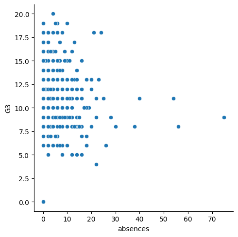
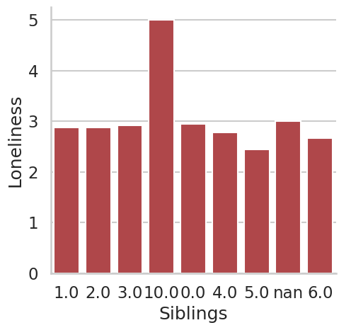

```{r setup, include=FALSE}
library(knitr)
library(tidyverse)
library(formatR)
library(kableExtra)
library(corrplot)
library(GGally)

knitr::opts_chunk$set(
  fig.width=2,   # Set width (in inches)
  fig.height=2,  # Set height (in inches)
  out.width="50%",  # Scale output width
  comment=NA,
  error=TRUE, 
  warning=TRUE,
  tidy=TRUE, 
  fig.align = 'center',
  message=FALSE, 
  warning=FALSE,
  tidy.opts=list(width.cutoff=60),
  fig.path='Figs/')
```


# Introduction to Data Visualization with Seaborn

# Introduction to Seaborn

## Making a scatter plot with lists

In this exercise, we’ll use a dataset that contains information about 227 countries. 

\AddToHookNext{env/Highlighting/begin}{\tiny}

```python
import pandas as pd
import matplotlib.pyplot as plt

# URL for the dataset
url = "https://raw.githubusercontent.com/endri81/DataVisualization/refs/heads/main/data/countries-of-the-world.csv"
```


## Making a scatter plot with lists


\AddToHookNext{env/Highlighting/begin}{\tiny}

```python
# Load the dataset into a DataFrame
df = pd.read_csv(url)
# Process columns by replacing commas with periods and converting to float
gdp = list(map(float, [word.replace(",", ".") for word in df["GDP ($ per capita)"].astype(str)]))
phones = list(map(float, [word.replace(",", ".") for word in df["Phones (per 1000)"].astype(str)]))
percent_literate = list(map(float, [word.replace(",", ".") for word in df["Literacy (%)"].astype(str)]))
```


## Making a scatter plot with lists

This dataset has lots of interesting information on each country, such as the country’s birth rates, death rates, and its gross domestic product (GDP). 

GDP is the value of all the goods and services produced in a year, expressed as dollars per person.


## Making a scatter plot with lists

We’ve created three lists of data from this dataset to get you started. 

gdp is a list that contains the value of GDP per country, expressed as dollars per person. 

phones is a list of the number of mobile phones per 1,000 people in that country. 


## Making a scatter plot with lists

Finally, percent_literate is a list that contains the percent of each country’s population that can read and write.

## Making a scatter plot with lists

\AddToHookNext{env/Highlighting/begin}{\tiny}

```python
import pandas as pd
import matplotlib.pyplot as plt
# URL for the dataset
url = "https://raw.githubusercontent.com/endri81/DataVisualization/refs/heads/main/data/countries-of-the-world.csv"
# Load the dataset into a DataFrame
df = pd.read_csv(url)
# Process columns by replacing commas with periods and converting to float
gdp = list(map(float, [word.replace(",", ".") for word in df["GDP ($ per capita)"].astype(str)]))
phones = list(map(float, [word.replace(",", ".") for word in df["Phones (per 1000)"].astype(str)]))
percent_literate = list(map(float, [word.replace(",", ".") for word in df["Literacy (%)"].astype(str)]))
```


## Making a scatter plot with lists

\AddToHookNext{env/Highlighting/begin}{\tiny}

```python
# Import Matplotlib and Seaborn
import matplotlib.pyplot as plt
import seaborn as sns
# Create scatter plot with GDP on the x-axis and number of phones on the y-axis
sns.scatterplot(x=gdp, y=phones)
# Show plot
plt.show()
```


## Making a scatter plot with lists


## Making a scatter plot with lists

\AddToHookNext{env/Highlighting/begin}{\tiny}

```python
# Change this scatter plot to have percent literate on the y-axis
sns.scatterplot(x=gdp, y=percent_literate)

# Show plot
plt.show()
```

## Making a scatter plot with lists


## Making a count plot with a list

In the last exercise, we explored a dataset that contains information about 227 countries. 

Let’s do more exploration of this data - specifically, how many countries are in each region of the world?


## Making a count plot with a list

To do this, we’ll need to use a count plot. 

Count plots take in a categorical list and return bars that represent the number of list entries per category. 

## Making a count plot with a list

You can create one here using a list of regions for each country, which is a variable named region.

## Making a count plot with a list

\AddToHookNext{env/Highlighting/begin}{\tiny}

```python
region = countries["Region"]
# Import Matplotlib and Seaborn
import matplotlib.pyplot as plt
import seaborn as sns

# Create count plot with region on the y-axis
sns.countplot(y=region)

# Show plot
plt.show()
```


## Making a count plot with a list


## “Tidy” vs. “untidy” data

Here, we have a sample dataset from a survey of children about their favorite animals. 

But can we use this dataset as-is with Seaborn? Let’s use pandas to import the csv file with the data collected from the survey and determine whether it is tidy, which is essential to having it work well with Seaborn.


## “Tidy” vs. “untidy” data

To get you started, the filepath to the csv file has been assigned to the variable csv_filepath.

Note that because csv_filepath is a Python variable, you will not need to put quotation marks around it when you read the csv.

## “Tidy” vs. “untidy” data

Read the csv file located at csv_filepath into a DataFrame named df.

\AddToHookNext{env/Highlighting/begin}{\tiny}

```python
import pandas as pd
import seaborn as sns
import matplotlib.pyplot as plt

# URL for the dataset
url = "https://raw.githubusercontent.com/endri81/DataVisualization/refs/heads/main/data/example_csv.csv"

# Load the dataset
df = pd.read_csv(url)

# Rename columns for easier access (handling spaces and special characters)
df.columns = ["Name", "Age_or_Animal"]
# Print the head of df
print(df.head())
```

Print the head of df to show the first five rows.


## “Tidy” vs. “untidy” data


## “Tidy” vs. “untidy” data


\AddToHookNext{env/Highlighting/begin}{\tiny}

```python
# Convert age values to numeric, keeping non-numeric (animals) separate
df_numeric = df.copy()
df_numeric["Age_or_Animal"] = pd.to_numeric(df_numeric["Age_or_Animal"], errors="coerce")
```


## “Tidy” vs. “untidy” data

\AddToHookNext{env/Highlighting/begin}{\tiny}

```python
# Plot distribution of numeric values (ages)
plt.figure(figsize=(8, 5))
sns.histplot(df_numeric["Age_or_Animal"].dropna(), bins=10, kde=True)
plt.xlabel("Age")
plt.ylabel("Count")
plt.title("Distribution of Ages in Dataset")
plt.show()
```

## “Tidy” vs. “untidy” data


## Making a count plot with a DataFrame

In this exercise, we’ll look at the responses to a survey sent out to young people. 

Our primary question here is: how many young people surveyed report being scared of spiders? 

## Making a count plot with a DataFrame

Survey participants were asked to agree or disagree with the statement “I am afraid of spiders”. Responses vary from 1 to 5, where 1 is “Strongly disagree” and 5 is “Strongly agree”.


## Making a count plot with a DataFrame

Read the csv file located at csv_filepath into a DataFrame named df.

\AddToHookNext{env/Highlighting/begin}{\tiny}

```python
import pandas as pd
import seaborn as sns
import matplotlib.pyplot as plt

# URL for the dataset
url = "https://raw.githubusercontent.com/endri81/DataVisualization/main/data/spiders_data.csv"

# Load the dataset
df = pd.read_csv(url)
```

## Making a count plot with a DataFrame

\AddToHookNext{env/Highlighting/begin}{\tiny}

```python
# Create a count plot with "Spiders" on the x-axis
plt.figure(figsize=(8, 5))
ax = sns.countplot(x="Spiders", data=df, palette="Set2")

# Annotate bars with values
for p in ax.patches:
    ax.annotate(f'{p.get_height()}', 
                (p.get_x() + p.get_width() / 2., p.get_height()), 
                ha='center', va='center', fontsize=10, color='black', 
                xytext=(0, 5), textcoords='offset points')
```

## Making a count plot with a DataFrame

\AddToHookNext{env/Highlighting/begin}{\tiny}

```python

# Display the plot
plt.xlabel("Number of Spiders")
plt.ylabel("Count")
plt.title("Distribution of Spiders Count")
plt.grid(axis="y", linestyle="--", alpha=0.7)
plt.show()

```

## Making a count plot with a DataFrame


## Hue and scatter plots

Previosly, we learned how hue allows us to easily make subgroups within Seaborn plots. 

Let’s try it out by exploring data from students in secondary school. 

We have a lot of information about each student like their age, where they live, their study habits and their extracurricular activities.


## Hue and scatter plots

For now, we’ll look at the relationship between the number of absences they have in school and their final grade in the course, segmented by where the student lives (rural vs. urban area).

## Hue and scatter plots

Create a scatter plot with "absences" on the x-axis and final grade ("G3") on the y-axis using the DataFrame student_data. 

\AddToHookNext{env/Highlighting/begin}{\tiny}

```python
import pandas as pd
import seaborn as sns
import matplotlib.pyplot as plt

# URL for the dataset
url = "https://raw.githubusercontent.com/endri81/DataVisualization/refs/heads/main/data/student-alcohol-consumption.csv"

# Load the dataset
df = pd.read_csv(url)

```

## Hue and scatter plots


Color the plot points based on "location" (urban vs. rural).


\AddToHookNext{env/Highlighting/begin}{\tiny}

```python
# Import Matplotlib and Seaborn
import matplotlib.pyplot as plt
import seaborn as sns
# Create a scatter plot of absences vs. final grade
sns.scatterplot(x="absences", y="G3", 
                data=df, 
                hue="location")
# Show plot
plt.show()
```

## Hue and scatter plots

Make "Rural" appear before "Urban" in the plot legend.


\AddToHookNext{env/Highlighting/begin}{\tiny}

```python
# Change the legend order in the scatter plot
 sns.scatterplot(x="absences", y="G3", 
                data=df, 
                hue="location",
                hue_order=["Rural", "Urban"])

# Show plot
plt.show()
```

## Hue and scatter plots


## Hue and count plots

Let’s continue exploring our dataset from students in secondary school by looking at a new variable. 

The "school" column indicates the initials of which school the student attended - either “GP” or “MS”.


## Hue and count plots

In the last exercise, we created a scatter plot where the plot points were colored based on whether the student lived in an urban or rural area. 

How many students live in urban vs. rural areas, and does this vary based on what school the student attends? 


## Hue and count plots

Let’s make a count plot with subgroups to find out.

## Hue and count plots

Fill in the palette_colors dictionary to map the "Rural" location value to the color "green" and the "Urban" location value to the color "blue".

\AddToHookNext{env/Highlighting/begin}{\tiny}

```python
# Import Matplotlib and Seaborn
import matplotlib.pyplot as plt
import seaborn as sns

# Create a dictionary mapping subgroup values to colors
palette_colors = {"Rural": "green", "Urban": "blue"}
```
## Hue and count plots

Create a count plot with "school" on the x-axis using the student_data DataFrame.

\AddToHookNext{env/Highlighting/begin}{\tiny}

```python
# Create a count plot of school with location subgroups
sns.countplot(x="school", data=df,
              hue="location",
              palette=palette_colors)
```

## Hue and count plots

Add subgroups to the plot using "location" variable and use the palette_colors dictionary to make the location subgroups green and blue.

\AddToHookNext{env/Highlighting/begin}{\tiny}

```python
# Display plot
plt.show()
```

## Hue and count plots


# Visualizing Two Quantitative Variables

## Creating subplots with col and row

We’ve seen in prior exercises that students with more absences ("absences") tend to have lower final grades ("G3"). 

Does this relationship hold regardless of how much time students study each week?


## Creating subplots with col and row

To answer this, we’ll look at the relationship between the number of absences that a student has in school and their final grade in the course, creating separate subplots based on each student’s weekly study time ("study_time").


## Creating subplots with col and row

Seaborn has been imported as sns and matplotlib.pyplot has been imported as plt.

## Creating subplots with col and row

Modify the code to use relplot() instead of scatterplot().

\AddToHookNext{env/Highlighting/begin}{\tiny}

```python
# Change to use relplot() instead of scatterplot()
sns.relplot(x="absences", y="G3", 
            data=df,
            kind="scatter")


plt.close()
```

## Creating subplots with col and row




## Creating subplots with col and row

Modify the code to create one scatter plot for each level of the variable "study_time", arranged in columns.

\AddToHookNext{env/Highlighting/begin}{\tiny}

```python
# Change to make subplots based on study time
sns.relplot(x="absences", y="G3", 
            data=df,
            kind="scatter",
            col="study_time")
plt.show()
            
```

## Creating subplots with col and row


## Creating subplots with col and row

Adapt your code to create one scatter plot for each level of a student’s weekly study time, this time arranged in rows.

\AddToHookNext{env/Highlighting/begin}{\tiny}

```python
# Change this scatter plot to arrange the plots in rows instead of columns
sns.relplot(x="absences", y="G3", 
            data=student_data,
            kind="scatter", 
            row="study_time")
plt.show()
```

## Creating subplots with col and row


## Creating two-factor subplots

Let’s continue looking at the student_data dataset of students in secondary school. 

Here, we want to answer the following question: does a student’s first semester grade ("G1") tend to correlate with their final grade ("G3")?


## Creating two-factor subplots

There are many aspects of a student’s life that could result in a higher or lower final grade in the class. 

For example, some students receive extra educational support from their school ("schoolsup") or from their family ("famsup"), which could result in higher grades. 


## Creating two-factor subplots

Let’s try to control for these two factors by creating subplots based on whether the student received extra educational support from their school or family.


## Creating two-factor subplots

Use relplot() to create a scatter plot with "G1" on the x-axis and "G3" on the y-axis, using the student_data DataFrame.


\AddToHookNext{env/Highlighting/begin}{\tiny}

```python
# Create a scatter plot of G1 vs. G3
sns.relplot(x="G1", y="G3", 
            data=df,
            kind="scatter")
```


## Creating two-factor subplots


## Creating two-factor subplots

Create column subplots based on whether the student received support from the school ("schoolsup"), ordered so that “yes” comes before “no”.

\AddToHookNext{env/Highlighting/begin}{\tiny}

```python
# Adjust to add subplots based on school support
sns.relplot(x="G1", y="G3", 
            data=df,
            kind="scatter", 
            col="schoolsup",
            col_order=["yes", "no"])
```

## Creating two-factor subplots


## Creating two-factor subplots

Add row subplots based on whether the student received support from the family ("famsup"), ordered so that “yes” comes before “no”. This will result in subplots based on two factors.

\AddToHookNext{env/Highlighting/begin}{\tiny}

```python
# Adjust further to add subplots based on family support
sns.relplot(x="G1", y="G3", 
            data=df,
            kind="scatter", 
            col="schoolsup",
            col_order=["yes", "no"],
            row="famsup",
            row_order=["yes", "no"])
```

## Creating two-factor subplots


## Changing the size of scatter plot points

In this exercise, we’ll explore Seaborn’s mpg dataset, which contains one row per car model and includes information such as the year the car was made, the number of miles per gallon (“M.P.G.”) it achieves, the power of its engine (measured in “horsepower”), and its country of origin.


## Changing the size of scatter plot points

What is the relationship between the power of a car’s engine ("horsepower") and its fuel efficiency ("mpg")? And how does this relationship vary by the number of cylinders ("cylinders") the car has? Let’s find out.


## Changing the size of scatter plot points


Let’s continue to use relplot() instead of scatterplot() since it offers more flexibility.


## Changing the size of scatter plot points

\AddToHookNext{env/Highlighting/begin}{\tiny}

```python
import pandas as pd
import seaborn as sns
import matplotlib.pyplot as plt

# URL for the dataset
url = "https://raw.githubusercontent.com/endri81/DataVisualization/refs/heads/main/data/mpg.csv"

# Load the dataset
mpg = pd.read_csv(url)
```

## Changing the size of scatter plot points

Use relplot() and the mpg DataFrame to create a scatter plot with "horsepower" on the x-axis and "mpg" on the y-axis. Vary the size of the points by the number of cylinders in the car ("cylinders").


\AddToHookNext{env/Highlighting/begin}{\tiny}

```python
# Import Matplotlib and Seaborn
import matplotlib.pyplot as plt
import seaborn as sns
```


## Changing the size of scatter plot points

To make this plot easier to read, use hue to vary the color of the points by the number of cylinders in the car ("cylinders").


\AddToHookNext{env/Highlighting/begin}{\tiny}

```python
# Create scatter plot of horsepower vs. mpg
sns.relplot(x="horsepower", y="mpg", 
            data=mpg, kind="scatter", 
            size="cylinders")
```

## Changing the size of scatter plot points


## Changing the size of scatter plot points

\AddToHookNext{env/Highlighting/begin}{\tiny}

```python
# Create scatter plot of horsepower vs. mpg
sns.relplot(x="horsepower", y="mpg", 
            data=mpg, kind="scatter", 
            size="cylinders", hue="cylinders")
```


## Changing the size of scatter plot points


## Changing the style of scatter plot points

Let’s continue exploring Seaborn’s mpg dataset by looking at the relationship between how fast a car can accelerate ("acceleration") and its fuel efficiency ("mpg"). 

Do these properties vary by country of origin ("origin")?


## Changing the style of scatter plot points

Note that the "acceleration" variable is the time to accelerate from 0 to 60 miles per hour, in seconds. Higher values indicate slower acceleration.

## Changing the style of scatter plot points

Use relplot() and the mpg DataFrame to create a scatter plot with "acceleration" on the x-axis and "mpg" on the y-axis. 

## Changing the style of scatter plot points

\AddToHookNext{env/Highlighting/begin}{\tiny}

```python
# Import Matplotlib and Seaborn
import matplotlib.pyplot as plt
import seaborn as sns
```


## Changing the style of scatter plot points

Vary the style and color of the plot points by country of origin ("origin").


## Changing the style of scatter plot points

\AddToHookNext{env/Highlighting/begin}{\tiny}

```python
# Create a scatter plot of acceleration vs. mpg
sns.relplot(x="acceleration", y="mpg", 
            data=mpg, kind="scatter", 
            style="origin", hue="origin")
```


## Changing the style of scatter plot points


##  Interpreting line plots

In this exercise, we’ll continue to explore Seaborn’s mpg dataset, which contains one row per car model and includes information such as the year the car was made, its fuel efficiency (measured in “miles per gallon” or “M.P.G”), and its country of origin (USA, Europe, or Japan).

How has the average miles per gallon achieved by these cars changed over time? Let’s use line plots to find out!

##  Interpreting line plots

Use relplot() and the mpg DataFrame to create a line plot with "model_year" on the x-axis and "mpg" on the y-axis.


\AddToHookNext{env/Highlighting/begin}{\tiny}

```python
# Import Matplotlib and Seaborn
import matplotlib.pyplot as plt
import seaborn as sns

# Create line plot
sns.relplot(x="model_year", y="mpg",
            data=mpg, kind="line")
```


##  Interpreting line plots


## Visualizing standard deviation with line plots


In the last exercise, we looked at how the average miles per gallon achieved by cars has changed over time. 

Now let’s use a line plot to visualize how the distribution of miles per gallon has changed over time.

Seaborn has been imported as sns and matplotlib.pyplot has been imported as plt.

## Visualizing standard deviation with line plots

Change the plot so the shaded area shows the standard deviation instead of the confidence interval for the mean.

\AddToHookNext{env/Highlighting/begin}{\tiny}

```python
# Make the shaded area show the standard deviation
sns.relplot(x="model_year", y="mpg",
            data=mpg, kind="line",
            ci="sd")
```


## Visualizing standard deviation with line plots


## Plotting subgroups in line plots

Let’s continue to look at the mpg dataset. We’ve seen that the average miles per gallon for cars has increased over time, but how has the average horsepower for cars changed over time? 

And does this trend differ by country of origin?

## Plotting subgroups in line plots

Use relplot() and the mpg DataFrame to create a line plot with "model_year" on the x-axis and "horsepower" on the y-axis. Turn off the confidence intervals on the plot.


\AddToHookNext{env/Highlighting/begin}{\tiny}

```python
# Import Matplotlib and Seaborn
import matplotlib.pyplot as plt
import seaborn as sns

# Create line plot of model year vs. horsepower
sns.relplot(x="model_year", y="horsepower", 
            data=mpg, kind="line", 
            ci=None)
```


## Plotting subgroups in line plots


## Plotting subgroups in line plots

Create different lines for each country of origin ("origin") that vary in both line style and color.


\AddToHookNext{env/Highlighting/begin}{\tiny}

```python

```


## Plotting subgroups in line plots


## Plotting subgroups in line plots

Add markers for each data point to the lines.

\AddToHookNext{env/Highlighting/begin}{\tiny}

```python
# Change to create subgroups for country of origin
sns.relplot(x="model_year", y="horsepower", 
            data=mpg, kind="line", 
            ci=None, style="origin", 
            hue="origin")
```


## Plotting subgroups in line plots


## Plotting subgroups in line plots

Use the dashes parameter to use solid lines for all countries, while still allowing for different marker styles for each line.


\AddToHookNext{env/Highlighting/begin}{\tiny}

```python
# Add markers and make each line have the same style
sns.relplot(x="model_year", y="horsepower", 
            data=mpg, kind="line", 
            ci=None, style="origin", 
            hue="origin", markers=True,
            dashes=False)
```


## Plotting subgroups in line plots


# Visualizing a Categorical and a Quantitative Variable

## Count plots

In this exercise, we’ll return to exploring our dataset that contains the responses to a survey sent out to young people. We might suspect that young people spend a lot of time on the internet, but how much do they report using the internet each day? 

## Count plots

Let’s use a count plot to break down the number of survey responses in each category and then explore whether it changes based on age.


## Count plots

As a reminder, to create a count plot, we’ll use the catplot() function and specify the name of the categorical variable to count (x=____), the pandas DataFrame to use (data=____), and the type of plot (kind="count").


\AddToHookNext{env/Highlighting/begin}{\tiny}

```python
import pandas as pd
import seaborn as sns
import matplotlib.pyplot as plt

# URL for the dataset
url = "https://raw.githubusercontent.com/endri81/DataVisualization/refs/heads/main/data/young-people-survey-responses.csv"

# Load the dataset
survey_data = pd.read_csv(url)
```


## Count plots

Use sns.catplot() to create a count plot using the survey_data DataFrame with "Internet usage" on the x-axis.


\AddToHookNext{env/Highlighting/begin}{\tiny}

```python
## Count plots
sns.set_context("paper", font_scale=0.8)
import numpy as np
survey_data = pd.read_csv("young-people-survey-responses.csv")
survey_data["Age Category"] = np.where(survey_data["Age"]<21, "Less than 21", "21+")
# Create count plot of internet usage
sns.catplot(x="Internet usage", data=survey_data,
            kind="count")
```


## Count plots


## Count plots

Make the bars horizontal instead of vertical.

\AddToHookNext{env/Highlighting/begin}{\tiny}

```python
# Change the orientation of the plot
sns.catplot(y="Internet usage", data=survey_data,
            kind="count")
```


## Count plots


## Count plots

Separate this plot into two side-by-side column subplots based on "Age Category", which separates respondents into those that are younger than 21 vs. 21 and older.


\AddToHookNext{env/Highlighting/begin}{\tiny}

```python
# Separate into column subplots based on age category
sns.catplot(y="Internet usage", data=survey_data,
            kind="count", col="Age Category")
```


## Count plots


##  Bar plots with percentages

Let’s continue exploring the responses to a survey sent out to young people. 

The variable "Interested in Math" is True if the person reported being interested or very interested in mathematics, and False otherwise. 

##  Bar plots with percentages

What percentage of young people report being interested in math, and does this vary based on gender? Let’s use a bar plot to find out.


##  Bar plots with percentages

As a reminder, we’ll create a bar plot using the catplot() function, providing the name of categorical variable to put on the x-axis (x=____), the name of the quantitative variable to summarize on the y-axis (y=____), the pandas DataFrame to use (data=____), and the type of categorical plot (kind="bar").

##  Bar plots with percentages

Use the survey_data DataFrame and sns.catplot() to create a bar plot with "Gender" on the x-axis and "Interested in Math" on the y-axis.


##  Bar plots with percentages


\AddToHookNext{env/Highlighting/begin}{\tiny}

```python
sns.reset_defaults()
# Ensure the column names match exactly
gender_col = "Gender"
math_interest_col = "Interested in Math"
```


##  Bar plots with percentages


\AddToHookNext{env/Highlighting/begin}{\tiny}

```python
# Drop missing values if necessary
survey_data = survey_data.dropna(subset=[math_interest_col])
# Convert to numeric if needed
survey_data[math_interest_col] = pd.to_numeric(survey_data[math_interest_col], errors="coerce")
# Create the bar plot
sns.catplot(x=gender_col, y=math_interest_col, data=survey_data, kind="bar")
```


##  Bar plots with percentages


## Customizing bar plots

In this exercise, we’ll explore data from students in secondary school. 

The "study_time" variable records each student’s reported weekly study time as one of the following categories: "<2 hours", "2 to 5 hours", "5 to 10 hours", or ">10 hours". 


## Customizing bar plots

Do students who report higher amounts of studying tend to get better final grades? 

\AddToHookNext{env/Highlighting/begin}{\tiny}

```python
import pandas as pd
import seaborn as sns
import matplotlib.pyplot as plt

# URL for the dataset
url = "https://raw.githubusercontent.com/endri81/DataVisualization/refs/heads/main/data/student-alcohol-consumption.csv"

# Load the dataset
student_data = pd.read_csv(url)
```

## Customizing bar plots

Let’s compare the average final grade among students in each category using a bar plot.

## Customizing bar plots

Use sns.catplot() to create a bar plot with "study_time" on the x-axis and final grade ("G3") on the y-axis, using the student_data DataFrame.

\AddToHookNext{env/Highlighting/begin}{\tiny}

```python
# Drop missing values in final grade
student_data = student_data.dropna(subset=[final_grade_col])

# Convert study_time to categorical if needed
student_data[study_time_col] = student_data[study_time_col].astype(str)

# Set seaborn context
sns.set_context("paper", font_scale=0.8)

# Create bar plot
sns.catplot(x=study_time_col, y=final_grade_col, 
            data=student_data, kind="bar")

# Show the plot
plt.show()
```


## Customizing bar plots


## Customizing bar plots

Using the order parameter and the category_order list that is provided, rearrange the bars so that they are in order from lowest study time to highest.

\AddToHookNext{env/Highlighting/begin}{\tiny}

```python
# List of categories from lowest to highest
category_order = ["<2 hours", 
                  "2 to 5 hours", 
                  "5 to 10 hours", 
                  ">10 hours"]

# Rearrange the categories
sns.catplot(x="study_time", y="G3",
            data=student_data,
            kind="bar",
            order=category_order)
```


## Customizing bar plots


## Customizing bar plots

Update the plot so that it no longer displays confidence intervals.


\AddToHookNext{env/Highlighting/begin}{\tiny}

```python
# List of categories from lowest to highest
category_order = ["<2 hours", 
                  "2 to 5 hours", 
                  "5 to 10 hours", 
                  ">10 hours"]

# Create bar plot with the correct parameter
sns.catplot(x=study_time_col, y=final_grade_col, 
            data=student_data, kind="bar", errorbar=None)

# Show the plot
plt.show()
```


## Customizing bar plots


## Create and interpret a box plot

Let’s continue using the student_data dataset. 

In an earlier exercise, we explored the relationship between studying and final grade by using a bar plot to compare the average final grade ("G3") among students in different categories of "study_time".


## Create and interpret a box plot

In this exercise, we’ll try using a box plot look at this relationship instead. 

As a reminder, to create a box plot you’ll need to use the catplot() function and specify the name of the categorical variable to put on the x-axis (x=____), the name of the quantitative variable to summarize on the y-axis (y=____), the pandas DataFrame to use (data=____), and the type of plot (kind="box").

## Create and interpret a box plot

Use sns.catplot() and the student_data DataFrame to create a box plot with "study_time" on the x-axis and "G3" on the y-axis. 

Set the ordering of the categories to study_time_order.


## Create and interpret a box plot

\AddToHookNext{env/Highlighting/begin}{\tiny}

```python
## Create and interpret a box plot

# Specify the category ordering
study_time_order = ["<2 hours", "2 to 5 hours", 
                    "5 to 10 hours", ">10 hours"]

# Create a box plot and set the order of the categories
sns.catplot(x="study_time", y="G3",
            data=student_data,
            kind="box",
            order=study_time_order)
```


## Create and interpret a box plot


## Omitting outliers

Now let’s use the student_data dataset to compare the distribution of final grades ("G3") between students who have internet access at home and those who don’t. 

To do this, we’ll use the "internet" variable, which is a binary (yes/no) indicator of whether the student has internet access at home.

## Omitting outliers

Since internet may be less accessible in rural areas, we’ll add subgroups based on where the student lives. 

For this, we can use the "location" variable, which is an indicator of whether a student lives in an urban (“Urban”) or rural (“Rural”) location.

## Omitting outliers

Use sns.catplot() to create a box plot with the student_data DataFrame, putting "internet" on the x-axis and "G3" on the y-axis.

Add subgroups so each box plot is colored based on "location".

Do not display the outliers.


## Omitting outliers

\AddToHookNext{env/Highlighting/begin}{\tiny}

```python
# Create a box plot with subgroups and omit the outliers
sns.catplot(x="internet", y="G3",
            data=student_data,
            kind="box",
            hue="location",
            flierprops={"marker": ""})  
```


## Omitting outliers


## Adjusting the whiskers

In the lesson we saw that there are multiple ways to define the whiskers in a box plot. 

In this set of exercises, we’ll continue to use the student_data dataset to compare the distribution of final grades ("G3") between students who are in a romantic relationship and those that are not. 


## Adjusting the whiskers

We’ll use the "romantic" variable, which is a yes/no indicator of whether the student is in a romantic relationship.

Let’s create a box plot to look at this relationship and try different ways to define the whiskers.


## Adjusting the whiskers

Adjust the code to make the box plot whiskers to extend to 0.5 * IQR. Recall: the IQR is the interquartile range.

Change the code to set the whiskers to extend to the 5th and 95th percentiles.

Change the code to set the whiskers to extend to the min and max values.

## Adjusting the whiskers

\AddToHookNext{env/Highlighting/begin}{\tiny}

```python
# Set the whiskers to 0.5 * IQR
sns.catplot(x="romantic", y="G3",
            data=student_data,
            kind="box",
            whis=0.5)
```


## Adjusting the whiskers


## Adjusting the whiskers

\AddToHookNext{env/Highlighting/begin}{\tiny}

```python
# Extend the whiskers to the 5th and 95th percentile
sns.catplot(x="romantic", y="G3",
            data=student_data,
            kind="box",
            whis=[5, 95])
```


## Adjusting the whiskers


## Adjusting the whiskers


\AddToHookNext{env/Highlighting/begin}{\tiny}

```python
# Set the whiskers at the min and max values
sns.catplot(x="romantic", y="G3",
            data=student_data,
            kind="box",
            whis=[0, 100])
```


## Adjusting the whiskers


## Customizing point plots

Let’s continue to look at data from students in secondary school, this time using a point plot to answer the question: does the quality of the student’s family relationship influence the number of absences the student has in school? 


## Customizing point plots

Here, we’ll use the "famrel" variable, which describes the quality of a student’s family relationship from 1 (very bad) to 5 (very good).


## Customizing point plots

As a reminder, to create a point plot, use the catplot() function and specify the name of the categorical variable to put on the x-axis (x=____), the name of the quantitative variable to summarize on the y-axis (y=____), the pandas DataFrame to use (data=____), and the type of categorical plot (kind="point").

## Customizing point plots

Use sns.catplot() and the student_data DataFrame to create a point plot with "famrel" on the x-axis and number of absences ("absences") on the y-axis.

Add “caps” to the end of the confidence intervals with size 0.2.

Remove the lines joining the points in each category.


## Customizing point plots

\AddToHookNext{env/Highlighting/begin}{\tiny}

```python
# Create a point plot of family relationship vs. absences
sns.catplot(x="famrel", y="absences",
            data=student_data,
            kind="point")
```


## Customizing point plots


## Customizing point plots

\AddToHookNext{env/Highlighting/begin}{\tiny}

```python
# Add caps to the confidence interval
sns.catplot(x="famrel", y="absences",
            data=student_data,
            kind="point",
            capsize=0.2)
```

## Customizing point plots


## Customizing point plots

\AddToHookNext{env/Highlighting/begin}{\tiny}

```python
# Remove the lines joining the points
sns.catplot(x="famrel", y="absences",
            data=student_data,
            kind="point",
            capsize=0.2,
            join=False)
```


## Customizing point plots


## Point plots with subgroups

Let’s continue exploring the dataset of students in secondary school. 

This time, we’ll ask the question: is being in a romantic relationship associated with higher or lower school attendance? 


## Point plots with subgroups


And does this association differ by which school the students attend? Let’s find out using a point plot.

## Point plots with subgroups

Use sns.catplot() and the student_data DataFrame to create a point plot with relationship status ("romantic") on the x-axis and number of absences ("absences") on the y-axis. 


## Point plots with subgroups

\AddToHookNext{env/Highlighting/begin}{\tiny}

```python

```


## Customizing point plots


## Point plots with subgroups

Color the points based on the school that they attend ("school").


## Point plots with subgroups

\AddToHookNext{env/Highlighting/begin}{\tiny}

```python
# Create a point plot that uses color to create subgroups
sns.catplot(x="romantic", y="absences",
            data=student_data,
            kind="point",
            hue="school")
```


## Customizing point plots


## Point plots with subgroups

Turn off the confidence intervals for the plot.

## Point plots with subgroups

\AddToHookNext{env/Highlighting/begin}{\tiny}

```python
# Turn off the confidence intervals for this plot
sns.catplot(x="romantic", y="absences",
            data=student_data,
            kind="point",
            hue="school",
            ci=None)
```


## Customizing point plots


## Point plots with subgroups

Since there may be outliers of students with many absences, use the median function that we’ve imported from numpy to display the median number of absences instead of the average.


## Point plots with subgroups

\AddToHookNext{env/Highlighting/begin}{\tiny}

```python
# Import median function from numpy
from numpy import median

# Plot the median number of absences instead of the mean
sns.catplot(x="romantic", y="absences",
            data=student_data,
            kind="point",
            hue="school",
            ci=None,
            estimator=median)
```


## Customizing point plots


# Customizing Seaborn Plots


## Changing style and palette

Let’s return to our dataset containing the results of a survey given to young people about their habits and preferences. 


## Changing style and palette

\AddToHookNext{env/Highlighting/begin}{\tiny}

```python
advice_mapping = {
    1.0: "Never",
    2.0: "Rarely",
    3.0: "Sometimes",
    4.0: "Often",
    5.0: "Always",
    np.nan: np.nan  # Keeping NaN as it is
}
survey_data["Parents Advice"] = survey_data["Parents' advice"].map(advice_mapping)
```


## Changing style and palette

Now let’s change the style and palette to make this plot easier to interpret.


## Changing style and palette

Set the style to "whitegrid" to help the audience determine the number of responses in each category.


## Changing style and palette

\AddToHookNext{env/Highlighting/begin}{\tiny}

```python
# Set the style to "whitegrid"
sns.set_style("whitegrid")

# Create a count plot of survey responses
category_order = ["Never", "Rarely", "Sometimes", 
                  "Often", "Always"]

sns.catplot(x="Parents Advice", 
            data=survey_data, 
            kind="count", 
            order=category_order)
```


## Changing style and palette


## Changing style and palette

Set the color palette to the sequential palette named "Purples".


\AddToHookNext{env/Highlighting/begin}{\tiny}

```python
# Set the color palette to "Purples"
sns.set_style("whitegrid")
sns.set_palette("Purples")

# Create a count plot of survey responses
category_order = ["Never", "Rarely", "Sometimes", 
                  "Often", "Always"]

sns.catplot(x="Parents Advice", 
            data=survey_data, 
            kind="count", 
            order=category_order)
```


## Changing style and palette


## Changing style and palette

Change the color palette to the diverging palette named "RdBu".


\AddToHookNext{env/Highlighting/begin}{\tiny}

```python
# Change the color palette to "RdBu"
sns.set_style("whitegrid")
sns.set_palette("RdBu")

# Create a count plot of survey responses
category_order = ["Never", "Rarely", "Sometimes", 
                  "Often", "Always"]

sns.catplot(x="Parents Advice", 
            data=survey_data, 
            kind="count", 
            order=category_order)
```


## Changing style and palette


##  Changing the scale

In this exercise, we’ll continue to look at the dataset containing responses from a survey of young people. 


##  Changing the scale


\AddToHookNext{env/Highlighting/begin}{\tiny}

```python
import pandas as pd
import seaborn as sns
import matplotlib.pyplot as plt

# Corrected dataset URL
url = "https://raw.githubusercontent.com/endri81/DataVisualization/main/data/young-people-survey-responses.csv"

# Load the dataset
survey_data = pd.read_csv(url)


# Define correct column names
siblings_col = "Siblings"  # Matches dataset
lonely_col = "Loneliness"  # Corrected from "Feels Lonely"

```


##  Changing the scale


\AddToHookNext{env/Highlighting/begin}{\tiny}

```python
# Drop missing values in Loneliness
survey_data = survey_data.dropna(subset=[lonely_col])

# Convert Loneliness to numeric if necessary
survey_data[lonely_col] = pd.to_numeric(survey_data[lonely_col], errors="coerce")

# Convert Siblings to categorical if necessary
survey_data[siblings_col] = survey_data[siblings_col].astype(str)
```


##  Changing the scale

Does the percentage of people reporting that they feel lonely vary depending on how many siblings they have? 


##  Changing the scale

Let’s find out using a bar plot, while also exploring Seaborn’s four different plot scales (“contexts”).

##  Changing the scale

Set the scale (“context”) to "paper", which is the smallest of the scale options.

##  Changing the scale


\AddToHookNext{env/Highlighting/begin}{\tiny}

```python
# Set seaborn context
sns.set_context("paper")

# Create bar plot using the correct column name
sns.catplot(x=siblings_col, y=lonely_col, 
            data=survey_data, kind="bar", errorbar=None)

# Show the plot
plt.show()

```

##  Changing the scale


##  Changing the scale

Change the context to "notebook" to increase the scale.


##  Changing the scale


\AddToHookNext{env/Highlighting/begin}{\tiny}

```python
# Set seaborn context
sns.set_context("notebook")

# Create bar plot using the correct column name
sns.catplot(x=siblings_col, y=lonely_col, 
            data=survey_data, kind="bar", errorbar=None)

# Show the plot
plt.show()

```

##  Changing the scale


##  Changing the scale

Change the context to "talk" to increase the scale.


##  Changing the scale


\AddToHookNext{env/Highlighting/begin}{\tiny}

```python
# Set seaborn context
sns.set_context("talk")

# Create bar plot using the correct column name
sns.catplot(x=siblings_col, y=lonely_col, 
            data=survey_data, kind="bar", errorbar=None)

# Show the plot
plt.show()

```

##  Changing the scale



##  Changing the scale


Change the context to "poster", which is the largest scale available.


##  Changing the scale


\AddToHookNext{env/Highlighting/begin}{\tiny}

```python
# Set seaborn context
sns.set_context("poster")

# Create bar plot using the correct column name
sns.catplot(x=siblings_col, y=lonely_col, 
            data=survey_data, kind="bar", errorbar=None)

# Show the plot
plt.show()

```

##  Changing the scale


## Using a custom palette

So far, we’ve looked at several things in the dataset of survey responses from young people, including their internet usage, how often they listen to their parents, and how many of them report feeling lonely. 


## Using a custom palette

However, one thing we haven’t done is a basic summary of the type of people answering this survey, including their age and gender. 

Providing these basic summaries is always a good practice when dealing with an unfamiliar dataset.


## Using a custom palette

The code provided will create a box plot showing the distribution of ages for male versus female respondents. Let’s adjust the code to customize the appearance, this time using a custom color palette.


## Using a custom palette

Set the style to "darkgrid".

Set a custom color palette with the hex color codes "#39A7D0" and "#36ADA4".


## Using a custom palette

\AddToHookNext{env/Highlighting/begin}{\tiny}

```python
# Set the style to "darkgrid"
sns.set_style("darkgrid")

# Set a custom color palette
sns.set_palette(["#39A7D0", "#36ADA4"])

# Create the box plot of age distribution by gender
sns.catplot(x="Gender", y="Age", 
            data=survey_data, kind="box")

```

## Using a custom palette


## FacetGrids vs. AxesSubplots

In the recent lesson, we learned that Seaborn plot functions create two different types of objects: FacetGrid objects and AxesSubplot objects. 

## FacetGrids vs. AxesSubplots

The method for adding a title to your plot will differ depending on the type of object it is.

## FacetGrids vs. AxesSubplots

In the code provided, we’ve used relplot() with the miles per gallon dataset to create a scatter plot showing the relationship between a car’s weight and its horsepower. 

This scatter plot is assigned to the variable name g. Let’s identify which type of object it is.

## FacetGrids vs. AxesSubplots


\AddToHookNext{env/Highlighting/begin}{\tiny}

```python
# Create scatter plot
g = sns.relplot(x="weight", 
                y="horsepower", 
                data=mpg,
                kind="scatter")

# Identify plot type
type_of_g = type(g)

# Print type
plt.close()  # added/edited
print(type_of_g)

```

## FacetGrids vs. AxesSubplots


## Adding a title to a FacetGrid object

In the previous exercise, we used relplot() with the miles per gallon dataset to create a scatter plot showing the relationship between a car’s weight and its horsepower. 

This created a FacetGrid object. Now that we know what type of object it is, let’s add a title to this plot.

## Adding a title to a FacetGrid object

Add the following title to this plot: "Car Weight vs. Horsepower".


## Adding a title to a FacetGrid object

\AddToHookNext{env/Highlighting/begin}{\tiny}

```python
# Create scatter plot
g = sns.relplot(x="weight", 
                y="horsepower", 
                data=mpg,
                kind="scatter")

# Add a title "Car Weight vs. Horsepower"
g.fig.suptitle("Car Weight vs. Horsepower")

# Show plot
plt.show()

```

## Adding a title to a FacetGrid object


## Adding a title and axis labels

Let’s continue to look at the miles per gallon dataset. 

This time we’ll create a line plot to answer the question: 

## Adding a title and axis labels

How does the average miles per gallon achieved by cars change over time for each of the three places of origin? 

To improve the readability of this plot, we’ll add a title and more informative axis labels.


## Adding a title and axis labels

In the code provided, we create the line plot using the lineplot() function. 

Note that lineplot() does not support the creation of subplots, so it returns an AxesSubplot object instead of an FacetGrid object.


## Adding a title and axis labels

\AddToHookNext{env/Highlighting/begin}{\tiny}

```python
mpg_mean = mpg.groupby(["model_year", "origin"]).agg(mpg_mean=("mpg", "mean")).reset_index()
# Create line plot
g = sns.lineplot(x="model_year", y="mpg_mean", 
                 data=mpg_mean,
                 hue="origin")

# Add a title "Average MPG Over Time"
g.set_title("Average MPG Over Time")

# Show plot
plt.show()
```

## Adding a title and axis labels


## Adding a title and axis labels

\AddToHookNext{env/Highlighting/begin}{\tiny}

```python
# Create line plot
g = sns.lineplot(x="model_year", y="mpg_mean", 
                 data=mpg_mean,
                 hue="origin")

# Add a title "Average MPG Over Time"
g.set_title("Average MPG Over Time")

# Add x-axis and y-axis labels
g.set(xlabel="Car Model Year", 
      ylabel="Average MPG")

# Show plot
plt.show()
```

## Adding a title and axis labels


## Rotating x-tick labels

In this exercise, we’ll continue looking at the miles per gallon dataset. 

In the code provided, we create a point plot that displays the average acceleration for cars in each of the three places of origin. 

## Rotating x-tick labels

Note that the "acceleration" variable is the time to accelerate from 0 to 60 miles per hour, in seconds. Higher values indicate slower acceleration.

Let’s use this plot to practice rotating the x-tick labels. 


## Rotating x-tick labels

Recall that the function to rotate x-tick labels is a standalone Matplotlib function and not a function applied to the plot object itself.

## Rotating x-tick labels

Rotate the x-tick labels 90 degrees.

\AddToHookNext{env/Highlighting/begin}{\tiny}

```python

# Create point plot
sns.catplot(x="origin", 
            y="acceleration", 
            data=mpg, 
            kind="point", 
            join=False, 
            capsize=0.1)

```

## Rotating x-tick labels

\AddToHookNext{env/Highlighting/begin}{\tiny}

```python
# Rotate x-tick labels
plt.xticks(rotation=90)
## ([0, 1, 2], [Text(0, 0, 'usa'), Text(1, 0, 'japan'), Text(2, 0, 'europe')])
# Show plot
plt.show()
```

## Rotating x-tick labels


## Box plot with subgroups

In this exercise, we’ll look at the dataset containing responses from a survey given to young people. 

One of the questions asked of the young people was: “Are you interested in having pets?” 


## Box plot with subgroups

Let’s explore whether the distribution of ages of those answering “yes” tends to be higher or lower than those answering “no”, controlling for gender.

## Box plot with subgroups

Set the color palette to "Blues".


## Box plot with subgroups

\AddToHookNext{env/Highlighting/begin}{\tiny}

```python
survey_data = pd.read_csv("survey_data.csv")
# Set palette to "Blues"
sns.set_palette("Blues")
```


## Box plot with subgroups

Add subgroups to color the box plots based on "Interested in Pets".


## Box plot with subgroups

\AddToHookNext{env/Highlighting/begin}{\tiny}

```python
# Adjust to add subgroups based on "Interested in Pets"
g = sns.catplot(x="Gender",
                y="Age", data=survey_data, 
                kind="box", hue="Pets")
```

## Box plot with subgroups


## Box plot with subgroups

Set the title of the FacetGrid object g to "Age of Those Interested in Pets vs. Not".


## Box plot with subgroups

\AddToHookNext{env/Highlighting/begin}{\tiny}

```python
# Set title to "Age of Those Interested in Pets vs. Not"
g.fig.suptitle("Age of Those Interested in Pets vs. Not")

# Show plot
plt.show()
```

## Box plot with subgroups


## Bar plot with subgroups and subplots

In this exercise, we’ll return to our young people survey dataset and investigate whether the proportion of people who like techno music ("Likes Techno") varies by their gender ("Gender") or where they live ("Village - town"). 

## Bar plot with subgroups and subplots

This exercise will give us an opportunity to practice the many things we’ve learned throughout this course!

## Bar plot with subgroups and subplots

Set the figure style to "dark".

Adjust the bar plot code to add subplots based on "Gender", arranged in columns.

Add the title "Percentage of Young People Who Like Techno" to this FacetGrid plot.

Label the x-axis "Location of Residence" and y-axis "% Who Like Techno".


## Bar plot with subgroups and subplots

\AddToHookNext{env/Highlighting/begin}{\tiny}

```python
# Set the figure style to "dark"
sns.set_style("dark")

# Adjust to add subplots per gender
g = sns.catplot(x="Village - town", y="Likes Techno", 
                data=survey_data, kind="bar",
                col="Gender")

# Add title and axis labels
g.fig.suptitle("Percentage of Young People Who Like Techno", y=1.02)
g.set(xlabel="Location of Residence", 
      ylabel="% Who Like Techno")
```

## Box plot with subgroups

